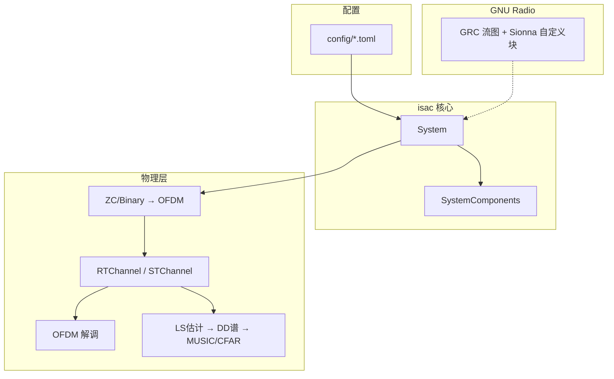

# ISAC — 通感一体化仿真平台

**ISAC**（Integrated Sensing and Communication）是基于 **Sionna OFDM + 射线追踪 / 点目标信道** 的仿真平台，在同一物理层链路上同时支持：

- **通信**：比特源 / QAM 映射 → OFDM 调制 / 解调 → BER 评估
- **感知**：LS 信道估计 → 时延–多普勒谱 → CFAR / MUSIC → 距离 / 速度估计与 RMSE

项目提供两条使用路径：

| 路径 | 入口 | 适用场景 |
|------|------|----------|
| **Python 脚本管线** | [`script/`](script/) | 批量仿真、指标评估、数据集采集 |
| **GNU Radio 流图** | [`gnuradio/`](gnuradio/) | GUI 可视化、硬件对接（USRP） |

---

## 架构概览



核心入口类为 [`src/isac/system.py`](src/isac/system.py) 中的 `System`：加载 TOML 配置 → 构建 `SystemParams` / `SystemComponents` → 提供 `transmit()`、`receive()`、`sensing()` 等统一 API。

信道模型有两条主线：

| 类型 | 说明 |
|------|------|
| **RT 射线追踪** | Sionna RT 场景（反射体、收发机、路径求解） |
| **RCS 点目标** | gr-radar 风格静态 / 移动点散射（`STChannel`），无 RT 几何 |

---

## 目录结构

| 路径 | 说明 |
|------|------|
| [`src/isac/`](src/isac/) | 核心包：`system`、`channel/`（RT 几何 [`rx_target_tx_geometric`](src/isac/channel/rt/rx_target_tx_geometric.py)、点目标 / AWGN）、`sensing/`、`data_collection/`（采集质量过滤）、`data_structures/`、`utils/`（含 [`metrics`](src/isac/utils/metrics.py)）、`datasets.py` |
| [`script/simulation/`](script/simulation/) | 通信 / 感知仿真入口脚本 |
| [`script/model_training/`](script/model_training/) | 蒙特卡洛数据集采集 |
| [`config/`](config/) | TOML 配置（`simulation/`、`data_collection/`） |
| [`gnuradio/`](gnuradio/) | GRC 流图、自定义 Sionna 块、验证工具 → 详见 [gnuradio/README.md](gnuradio/README.md) |
| [`docs/`](docs/) | 内部技术文档 |
| [`tests/`](tests/) | pytest 单元测试 |
| [`out/`](out/) | 运行输出（gitignore，按工作流分子目录） |

---

## 环境与安装

建议在 **ISAC conda 环境**中操作（需预装 Sionna、CUDA、GNU Radio 等）：

```bash
cd <repo-root>
pip install -e .
```

| 文件 | 用途 |
|------|------|
| [`pyproject.toml`](pyproject.toml) | pip 包元数据与基础依赖（torch、numpy、matplotlib 等） |
| [`requirements.txt`](requirements.txt) | 完整环境快照（含 `sionna==2.0.0`、`sionna-rt==1.2.2`、CUDA / PyTorch 等） |

**额外系统依赖**（需通过 conda 或系统包单独安装，此处不展开安装教程）：

- GNU Radio 3.10
- PyQt5（GRC GUI）
- 可选：USRP / UHD（硬件扩展）

**运行约定**：所有脚本与流图入口均在**仓库根目录**执行；GRC 入口脚本会自动 `chdir`。输出写入 `out/<workflow>/`。

---

## 工作流一览

### 通信

| 脚本 | 配置 | 输出 |
|------|------|------|
| [`script/simulation/communication/run_communication_baseline.py`](script/simulation/communication/run_communication_baseline.py) | [`config/simulation/communication/communication_baseline.toml`](config/simulation/communication/communication_baseline.toml) | `out/communication_baseline/` |

```bash
python script/simulation/communication/run_communication_baseline.py
```

### 感知（Python）

脚本均位于 [`script/simulation/sensing/`](script/simulation/sensing/)，配置位于 [`config/simulation/sensing/`](config/simulation/sensing/)。

| 脚本 | 配置 | 输出 | 特点 |
|------|------|------|------|
| `run_sensing_baseline.py` | `sensing_baseline.toml` | `out/sensing_baseline/` | RT 场景演示；`--domain frequency\|time` |
| `run_sensing_monostatic.py` | `sensing_monostatic.toml`（另有 `sensing_monostatic_canyon.toml`） | `out/sensing_monostatic/` | 单基地端到端 + MUSIC RMSE |
| `run_sensing_bistatic.py` | `sensing_bistatic.toml` | `out/sensing_bistatic/` | 双基地（分离 TX / RX 基站） |
| `run_sensing_cooperative.py` | `sensing_cooperative.toml` | `out/sensing_cooperative/` | 协同感知（多 TX + 单 RX） |
| `run_static_target_simulation.py` | `static_target_simulation.toml` | `out/static_target_simulation/` | gr-radar 风格点目标，无 RT → 见 [docs/STATIC_TARGET_SIMULATION.md](docs/STATIC_TARGET_SIMULATION.md) |

```bash
# 感知基线（RT 场景）
python script/simulation/sensing/run_sensing_baseline.py --domain frequency

# 单基地感知评估
python script/simulation/sensing/run_sensing_monostatic.py

# 双基地 / 协同 / 静态点目标
python script/simulation/sensing/run_sensing_bistatic.py
python script/simulation/sensing/run_sensing_cooperative.py
python script/simulation/sensing/run_static_target_simulation.py
```

### GNU Radio 流图

两条产品线，细节见 [gnuradio/README.md](gnuradio/README.md)。

| 流图 | 信道 | 配置 | 入口 |
|------|------|------|------|
| `sensing_baseline.grc` | RT 射线追踪（`SionnaRTChannel`） | `sensing_baseline.toml` | `python gnuradio/flowgraphs/run_sensing_baseline_grc.py` |
| `simulator_ofdm.grc` | 静态点目标（`SionnaStaticTarget`） | `sensing_monostatic.toml` | `python gnuradio/flowgraphs/run_simulator_ofdm.py` |

```bash
# 安装 / 更新 GRC 块定义
bash gnuradio/tools/install_grc_blocks.sh

# 带 GPU 预热与感知 UI 的入口
python gnuradio/flowgraphs/run_sensing_baseline_grc.py
python gnuradio/flowgraphs/run_simulator_ofdm.py
```

### 数据采集

| 脚本 | 配置 | 输出 |
|------|------|------|
| [`script/model_training/run_dataset_collection.py`](script/model_training/run_dataset_collection.py) | [`config/data_collection/data_collection.toml`](config/data_collection/data_collection.toml)、[`dataset_collection_cnn.toml`](config/data_collection/dataset_collection_cnn.toml) | `out/dataset_collection/` |

蒙特卡洛 ROI 采样 → RT 目标位姿 → CFR / CIR → 写出 CSV / HDF5。几何真值由 [`RxTargetTxGeometric`](src/isac/channel/rt/rx_target_tx_geometric.py) 提供；逐步感知与质量过滤已从此脚本移除，感知评估见 [`script/simulation/sensing/rt/`](script/simulation/sensing/rt/)。

运行逻辑详见 [docs/run_dataset_collection.md](docs/run_dataset_collection.md)。

```bash
python script/model_training/run_dataset_collection.py
```

### 测试

```bash
pytest tests/
```

---

## 配置说明

| 文件 | 用途 |
|------|------|
| [`config/system_params_example.toml`](config/system_params_example.toml) | 全参数模板（source / ofdm / channel / rt_scene / cfar / music 等） |
| `config/simulation/sensing/*.toml` | 各感知工作流默认配置 |
| `config/simulation/communication/*.toml` | 通信基线配置 |
| `config/data_collection/*.toml` | 数据集采集配置 |

- **加载方式**：`isac.utils.load_config()` 按 `config/<相对路径>` 或仓库根相对路径解析。
- **GRC 覆盖**：运行时 `gr_config.merge_config()` 将 GRC 变量（`fft_len`、`ofdm_symbols` 等）覆盖 TOML 同名字段。

---

## 技术栈

| 层级 | 技术 |
|------|------|
| PHY / 信道 | [Sionna 2.0](https://nvlabs.github.io/sionna/)、Sionna RT 1.2（射线追踪） |
| 深度学习 | PyTorch |
| SDR 框架 | GNU Radio 3.10、自定义 Sionna GR 块 |
| 硬件对接 | UHD burst tags（`uhd_burst_tags=True`） |
| 配置 | TOML |
| 数据 | HDF5、CSV |
| 可视化 | Matplotlib、PyQt5（GRC GUI） |
| 测试 | pytest |

USRP 对接参考：[docs/GNU_Radio_USRP_Source_Sink_总结.md](docs/GNU_Radio_USRP_Source_Sink_总结.md)。

---

## 文档索引

| 文档 | 内容 |
|------|------|
| [docs/run_dataset_collection.md](docs/run_dataset_collection.md) | 蒙特卡洛数据集采集脚本流程、CLI 与输出约定 |
| [docs/system-py-functions.md](docs/system-py-functions.md) | `System` 类 API、蒙特卡洛数据集、组件说明 |
| [docs/utils-functions.md](docs/utils-functions.md) | `isac.utils` 各函数及在脚本中的用法 |
| [docs/STATIC_TARGET_SIMULATION.md](docs/STATIC_TARGET_SIMULATION.md) | 静态点目标仿真端到端流程 |
| [docs/GNU_Radio_USRP_Source_Sink_总结.md](docs/GNU_Radio_USRP_Source_Sink_总结.md) | GNU Radio USRP Source/Sink 中文参考 |
| [docs/scene_fmcw_corner_reflector_flow.md](docs/scene_fmcw_corner_reflector_flow.md) | RadarSimPy FMCW + 角反射器示例 |
| [gnuradio/README.md](gnuradio/README.md) | GRC 块、流图、grcc、离线验证 |

---

## 快速上手

```bash
# 1. 安装可编辑包
cd <repo-root>
pip install -e .

# 2. Python 仿真（任选其一）
python script/simulation/communication/run_communication_baseline.py
python script/simulation/sensing/run_sensing_baseline.py --domain frequency
python script/simulation/sensing/run_sensing_monostatic.py

# 3. GNU Radio 流图
bash gnuradio/tools/install_grc_blocks.sh
python gnuradio/flowgraphs/run_sensing_baseline_grc.py   # RT 感知基线 + GPU 预热
python gnuradio/flowgraphs/run_simulator_ofdm.py           # 静态目标 OFDM 仿真器

# 4. 测试
pytest tests/
```
