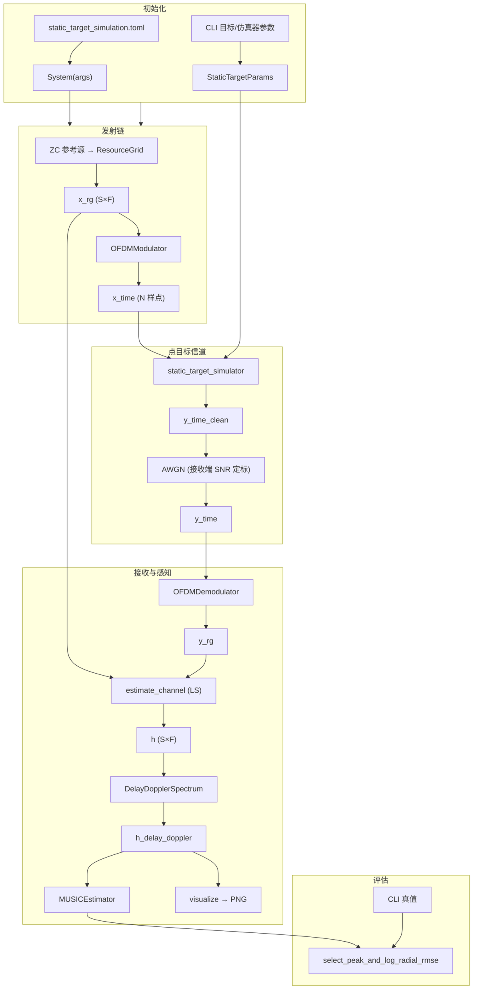

# 静态目标 ISAC 感知仿真流程

本文档说明 [`script/run_static_target_simulation.py`](script/run_static_target_simulation.py) 的端到端仿真管线：使用 gr-radar 风格**点目标时域信道**替代 Sionna 射线追踪（RT），完成 OFDM 发射、信道施加、接收解调、时延–多普勒谱估计与 MUSIC 测距测速，并与 CLI 几何真值对比 RMSE。

## 与单基地 RT 脚本的区别

| 项目 | `run_sensing_monostatic.py` | `run_static_target_simulation.py` |
|------|----------------------------|-----------------------------------|
| 信道 | Sionna RT 射线追踪（`system.components.channel`） | `static_target_simulator` 点散射 |
| 配置 | 含 `[rt_scene]` | 无 RT，[`config/simulation/sensing/static_target_simulation.toml`](config/simulation/sensing/static_target_simulation.toml) |
| 施加域 | 频域或时域（`--domain`） | **固定时域**（仿真器仅接受 IQ 样点流） |
| 真值 | `RTScene.rx_target_tx_geometric` | CLI `--range_m` / `--velocity_mps` |
| 场景渲染 | 有 | 无 |

「static」指**点散射物理模型**（对齐 gr-radar `static_target_simulator_cc`），目标仍可配置非零径向速度以产生多普勒。

---

## 整体数据流



---

## 分步说明

### 1. 初始化

1. 解析命令行（系统参数、目标参数、仿真器开关）。
2. `set_random_seed(seed)` 固定随机性（ZC 源、AWGN、随机相位等）。
3. `System(args)` 加载 TOML，构建 Sionna OFDM / 感知组件；**不构建 RT 场景**（配置中无 `[rt_scene]`）。
4. 将 `delay_doppler_spectrum.device` 与 `--device` 对齐，避免 CPU/CUDA 混用。
5. 打印 `sensing_performance.display_performance()`（距离/速度分辨率、最大探测范围等）。

### 2. 构建点目标参数

`StaticTargetParams` 由 CLI 与 OFDM 网格推导：

- `samp_rate = int(rg.bandwidth)`（默认 2048 × 15 kHz = **30.72 MHz**）
- `center_freq` 来自 TOML `carrier_frequency`（默认 **6 GHz**）
- 目标：`range_m`、`velocity_mps`、`rcs`、`azimuth_deg`
- 可选：`self_coupling`（默认 -10 dB 直达耦合）、`rndm_phaseshift`

实现见 [`src/isac/channel/static_target_simulator.py`](src/isac/channel/static_target_simulator.py)。

### 3. 发射参考信号

```
_, x_rg, x_time = system.transmit()
```

- 配置 [`sensing.source.type = "zc"`](config/simulation/sensing/static_target_simulation.toml)：Zadoff-Chu 序列映射到资源网格。
- `x_rg` 形状：`(batch, …, num_ofdm_symbols, fft_size)`，默认 **512 × 2048**。
- `x_time` 为 `modulator(x_rg)`；时域样点数 **N = 512 × (2048 + 512) = 1,310,720**。

### 4. 点目标信道（时域）

```
y_time_clean = static_target_simulator(x_time, params)
```

对每个目标回波：

1. **多普勒滤波**：时域逐样点相位旋转，\(f_d = 2 v f_c / c\)。
2. **FFT** → 频域分数时延（往返距离 + 方位）→ **IFFT**。
3. 可选随机相位；多 RX / 多目标累加；可选自耦合 `coupling · tx`。

```
sig_p = E[|y_clean|²]
no = sig_p / 10^(snr_db/10)
y_time = AWGN(y_time_clean, no)
```

- `snr_db` 来自 TOML（默认 10 dB），按**接收端信号功率**定标噪声（与 `run_sensing_baseline` 语义一致）。

### 5. 接收解调与信道估计

```
y_rg = demodulator(y_time)
h = estimate_channel(x_rg, y_rg)    # LS: h = y · conj(x) / (|x|² + ε)
```

得到频域信道响应 **CFR** `h`，形状 `(S, F)`。

### 6. 时延–多普勒谱

```
h_delay_doppler = delay_doppler_spectrum(h)
```

- 子载波 IFFT → 时延维；OFDM 符号 FFT → 多普勒维。
- 输出 `(多普勒 bin, 时延 bin)`，默认 **512 × 2048**。

谱图导出：

```
out/static_target_simulation/static_target_delay_doppler_spectrum.png
```

- `offset=50` 裁剪近场 ROI；`metric_mode` 控制坐标为距离–速度或时延–多普勒。

### 7. MUSIC 峰估计与 RMSE

```
est_ranges, est_velocities, _ = music_estimator(h_delay_doppler, metric_mode=...)
```

- 2D-MUSIC 在 DD 谱上检峰，经 `doppler_to_velocity` 转为径向速度（**传统雷达约定**：远离为正，\(v = f_d c / (2f_c)\)）。

真值来自 CLI，匈牙利算法一对一匹配后打印 RMSE：

```
select_peak_and_log_radial_rmse(
    est_ranges, est_velocities,
    true_ranges=[range_m], true_velocities=[velocity_mps],
    log_prefix="静态目标仿真",
)
```

---

## 默认 OFDM / 感知参数

来源：[`config/simulation/sensing/static_target_simulation.toml`](config/simulation/sensing/static_target_simulation.toml)

| 参数 | 默认值 | 说明 |
|------|--------|------|
| `carrier_frequency` | 6 GHz | 载波 |
| `snr_db` | 10 dB | 接收端 SNR |
| `num_symbols` | 512 | OFDM 符号数 |
| `num_subcarriers` | 2048 | FFT 点数 |
| `subcarrier_spacing` | 15 kHz | 子载波间隔 |
| `num_cyclic_prefix` | 512 | CP 长度 |
| `sensing.source` | ZC, root_index=1 | 感知参考波形 |

典型感知性能（由网格自动计算）：

- 距离分辨率 ≈ **4.88 m**
- 速度分辨率 ≈ **0.59 m/s**
- 最大探测距离 ≈ **9988 m**

---

## 命令行参数

### 系统

| 参数 | 默认 | 说明 |
|------|------|------|
| `--config_file` | `simulation/sensing/static_target_simulation.toml` | TOML 路径 |
| `--device` / `-d` | `cuda:0` | `cuda:0` 或 `cpu` |
| `--seed` | `42` | 随机种子 |
| `--batch_size` | `1` | 批大小 |
| `--metric_mode` | `range_velocity` | 谱图/MUSIC 坐标：`range_velocity` 或 `delay_doppler` |

### 目标与仿真器

| 参数 | 默认 | 说明 |
|------|------|------|
| `--range_m` | `100.0` | 径向距离 (m) |
| `--velocity_mps` | `5.0` | 径向速度 (m/s)，远离为正 |
| `--rcs` | `1e25` | 雷达散射截面 |
| `--azimuth_deg` | `0.0` | 方位角 (deg) |
| `--position_rx_m` | `0.0` | 接收天线位置 (m) |
| `--self_coupling_db` | `-10.0` | 自耦合幅度 (dB) |
| `--no_self_coupling` | — | 关闭自耦合 |
| `--no_rndm_phaseshift` | — | 关闭随机相位（便于复现） |

---

## 运行示例

```bash
# 默认参数
python script/run_static_target_simulation.py

# CPU + 固定相位，便于调试
python script/run_static_target_simulation.py --device cpu --seed 42 --no_rndm_phaseshift

# 关闭自耦合，减弱零多普勒直达径对 MUSIC 的干扰
python script/run_static_target_simulation.py --no_self_coupling

# 远距高速场景（可与 gnuradio/verify_dd_axis.py 对照）
python script/run_static_target_simulation.py --range_m 1110 --velocity_mps 88 --no_rndm_phaseshift
```

---

## 输出

| 类型 | 路径 / 内容 |
|------|-------------|
| 谱图 | `out/static_target_simulation/static_target_delay_doppler_spectrum.png` |
| 控制台 | 感知性能表、静态目标参数、MUSIC 峰表、距离/速度 RMSE |

---

## 相关源码

| 模块 | 路径 |
|------|------|
| 仿真脚本 | [`script/run_static_target_simulation.py`](script/run_static_target_simulation.py) |
| 点目标信道 | [`src/isac/channel/static_target_simulator.py`](src/isac/channel/static_target_simulator.py) |
| 系统编排 | [`src/isac/system.py`](src/isac/system.py) |
| 时延–多普勒谱 | [`src/isac/sensing/delay_doppler_spectrum.py`](src/isac/sensing/delay_doppler_spectrum.py) |
| MUSIC | [`src/isac/sensing/music_estimator.py`](src/isac/sensing/music_estimator.py) |
| 速度符号约定 | [`src/isac/sensing/utils.py`](src/isac/sensing/utils.py)（`doppler_to_velocity`） |
| 回归测试 | [`tests/test_static_target_simulator.py`](tests/test_static_target_simulator.py) |
| GNU Radio 对照 | [`gnuradio/verify_dd_axis.py`](gnuradio/verify_dd_axis.py) |

---

## 注意事项

1. **时域唯一路径**：`static_target_simulator` 不接受频域资源网格，必须经 modulator/demodulator。
2. **自耦合**：默认 -10 dB 直达径会在 DD 谱零多普勒附近产生强峰及十字旁瓣；调参时可加 `--no_self_coupling`。
3. **真值来源**：RMSE 对比的是 CLI 输入，不是 RT 几何；与谱图目视峰需在同一多普勒/速度切片上比较。
4. **设备一致**：使用 `--device cpu` 时脚本会同步 DD 谱组件设备；默认 `cuda:0` 需可用 GPU 环境。
