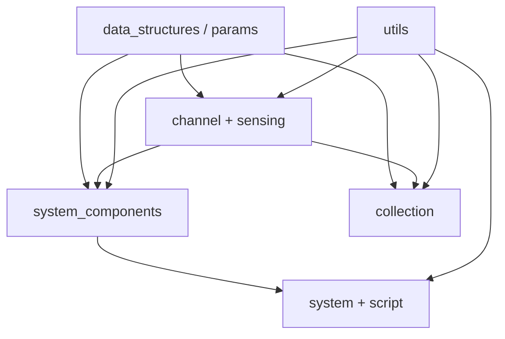

# ISAC 源码架构

本文档描述 `src/isac` 的分层约定与目录职责，便于新增功能时选择落点。

## 依赖方向

### 铁律

1. **`data_structures.params`** 仅含 TOML dataclass，不 import `channel` / `sensing`。
2. **`channel`** 与 **`sensing`** 互不依赖。
3. **`utils`** 不 import `channel`（采集相关逻辑在 **`collection`**）。
4. **`data_structures/system_components.py`** 负责将 `SystemParams` 实例化为运行时对象（`SystemComponents.build_from_params`）。
5. **`system`** 与 **`script/`** 通过 `SystemComponents` 获取组件，避免在脚本中直接 `new` 子模块。

## 目录职责

| 路径 | 职责 | 典型导入 |
|------|------|----------|
| `system.py` | 端到端编排：`transmit` / `receive` | `from isac.system import System` |
| `data_structures/` | 配置 dataclass + 组件工厂 | `from isac.data_structures import SystemParams, SystemComponents` |
| `data_structures/system_components.py` | `SystemParams` → 运行时对象 | `from isac.data_structures.system_components import SystemComponents` |
| `channel/` | 物理传播（RT / RCS / AWGN） | `from isac.channel import RTChannel` |
| `sensing/` | 感知 DSP | `from isac.sensing import MUSICEstimator` |
| `sensing/spectrum/` | DD 谱、感知性能、LS 估计 | `from isac.sensing.spectrum import DelayDopplerSpectrum` |
| `sensing/detection/` | CFAR、MUSIC | `from isac.sensing.detection import CFARDetector` |
| `sensing/clutter/` | MTI / MTD | `from isac.sensing.clutter import MovingTargetIndication` |
| `sensing/geometry.py` | 雷达几何与物理量换算（原 `sensing/utils.py`） | `from isac.sensing.geometry import delay_to_range` |
| `collection/` | 蒙特卡洛采集、HDF5、`RTDataset` | `from isac.collection import RTDataset` |
| `models/` | 深度学习模型与损失 | `from isac.models.model_design import ...` |
| `utils/` | 无状态横切工具 | `from isac.utils import load_config, convert` |

## 功能落点决策表

| 我要加… | 放在 |
|---------|------|
| 新的 TOML 配置段 | `data_structures/params/` |
| 新的信道模型 | `channel/` 子包 |
| 新的感知算法核 | `sensing/detection/` 或 `sensing/spectrum/` |
| 算法底层张量算子（无状态） | 同目录 `*_kernels.py` |
| 把配置变成可调用对象 | `data_structures/system_components.py` |
| 采集 / HDF5 / Dataset | `collection/` |
| 训练 CNN / 损失 | `models/` |
| 通用数值 / 窗函数 / 配置加载 | `utils/` |

## 术语（感知）

- **`sens_mode`**（`monostatic` / `bistatic`）：物理换算尺度。
- **`metric_mode`**（`delay_doppler` / `range_velocity`）：日志与可视化列，不改变 MUSIC 返回值。

## 公开 API

各子包 `__init__.py` 通过 `__all__` 声明稳定导出面。旧路径（如 `isac.datasets`、`isac.sensing.utils`）保留兼容 re-export，新代码请使用上表推荐路径。

## 与 `script/` 的边界

- **`src/isac`**：可复用库逻辑。
- **`script/`**：命令行入口、一次性实验；通过 `System` + `SystemComponents` 调用库，不反向被库 import。
