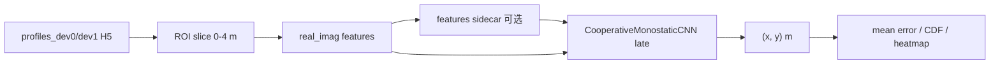
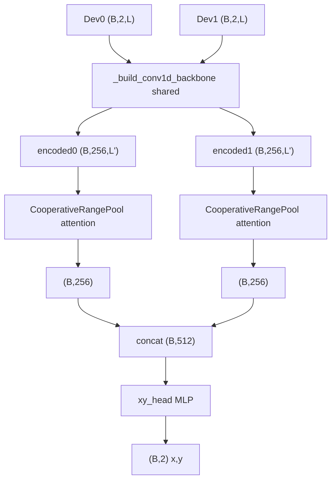

# Cooperative Monostatic CNN 模型说明

本文档说明协作双站单基地定位 CNN（`CooperativeMonostaticCNN`）的输入、网络结构、训练默认配方与评估对照。权威实现见 [`src/isac/models/model_design.py`](../src/isac/models/model_design.py)；训练入口见 [`script/model_training/run_train_cooperative_monostatic_cnn.py`](../script/model_training/run_train_cooperative_monostatic_cnn.py)。

**当前默认权重**（`methods_compare` 使用）：

`models/cnn_improve_next/aug_spec_only/best_model.pth`

---

## 1. 概述

### 模型职责

`CooperativeMonostaticCNN` 将 **两站 ROI 裁切后的复数距离谱** 回归为 **目标平面坐标 `(x, y)`**（单位 m）。

| 估计器      | 模块                         | 输出                           |
| ----------- | ---------------------------- | ------------------------------ |
| MUSIC       | 距离估计 → 双圆交会         | `(x, y)`                     |
| ESPRIT      | 同上                         | `(x, y)`                     |
| CNN（本文） | `CooperativeMonostaticCNN` | `(B, 2)` 直接回归 `(x, y)` |

与传统子空间方法不同，CNN **不显式**估计单站距离后再几何定位（当前默认配置下未启用 `geom_residual`），而是端到端从双站谱特征预测坐标。

### Checkpoint 配置摘要

从 `aug_spec_only/best_model.pth` 读取：

| 项                                                                 | 值                       |
| ------------------------------------------------------------------ | ------------------------ |
| `model_type`                                                     | `1d`                   |
| `feature_mode` / `feature_norm`                                | `real_imag` / `none` |
| `in_channels`                                                    | 4                        |
| `fusion_mode`                                                    | `late`                 |
| `pool_mode`                                                      | `attention`            |
| `base_channels` / `num_layers` / `dropout`                   | 64 / 3 / 0.3             |
| `geom_residual` / `aux_range` / `cross_attn` / `geom_only` | 均关                     |
| 约参数量                                                           | ~5.0×10⁵（503 939）   |

---

## 2. 端到端数据流

**训练路径**：cooperative monostatic H5（或 features sidecar）→ `real_imag` 特征 → CNN → 与真值 `(x, y)` 的加权 RMSE 损失。

**推理路径**：同一特征管线 → `best_model.pth` → `(x, y)` → 与 MUSIC/ESPRIT 在同一数据集上对比（[`run_cooperative_monostatic_methods_compare.py`](../script/experiment/run_cooperative_monostatic_methods_compare.py)）。

---

## 3. 模型输入

### 3.1 原始数据

| 项目 | 说明                                                       |
| ---- | ---------------------------------------------------------- |
| 来源 | `profiles_dev0` / `profiles_dev1`（复数距离谱 CPI）    |
| ROI  | 训练/评估默认`0.0–4.0` m（`TRAIN_DEFAULT_RANGE_ROI`） |
| 标签 | `target_position` 前两维 → `(true_x_m, true_y_m)`     |

离线特征缓存示例：

`data/experiment/cooperative_monostatic/cooperative_monostatic_dataset_features_roi0_4_real_imag.h5`

### 3.2 特征模式 `real_imag`

| 通道 | 内容                    |
| ---- | ----------------------- |
| 0–1 | Dev0 ROI 的 real / imag |
| 2–3 | Dev1 ROI 的 real / imag |

张量形状：`(B, 4, L)`（float），`L` 为 ROI 距离 bin 数。当前 `feature_norm=none`（不做按站 RMS 归一化）。

`late` 融合时网络将 4 通道拆成两站各 2 通道（`station_channels=2`），共享骨干分别编码。

特征构建见 [`src/isac/models/preprocess.py`](../src/isac/models/preprocess.py)（`dual_roi_to_real_imag_features` / `cooperative_feature_in_channels`）。

---

## 4. 网络结构（当前默认）

### 4.1 拓扑

要点：

1. **共享 1D 卷积骨干**：`stem` + `num_layers=3`，`base_channels=64`，末层通道 `final_ch=256`。
2. **晚融合**：两站分别编码与池化，再拼接。
3. **Attention 池化**：`CooperativeRangePool(pool_mode=attention)`，输出每站 `(B, 256)`。
4. **xy 头**：`_mlp_xy_head(512 → 128 → 2)`，含 ReLU 与 dropout `0.3`。

当前配置 **未** 使用：

- `geom_residual` / `geom_only`（几何交会 + 残差）
- `aux_range`（辅助距离头）
- `cross_attn`（站间交叉注意力）

### 4.2 前向接口

- 输入：float `(B, 4, L)`，或复数双站谱（内部转特征）
- 输出：`(B, 2)`，单位 m，对应全局目标坐标

---

## 5. 训练默认配方（`aug_spec_only`）

与 [`run_train_cooperative_monostatic_cnn.py`](../script/model_training/run_train_cooperative_monostatic_cnn.py) 顶部默认对齐：

| 项            | 默认                                                                                            |
| ------------- | ----------------------------------------------------------------------------------------------- |
| 输出目录      | `models/cnn_improve_next/aug_spec_only`                                                       |
| 结构          | `model_type=cnn`，`fusion=late`，`pool=attention`，`base_channels=64`，`num_layers=3` |
| 优化          | `lr=5e-5`，`batch_size=128`，`epochs=100`，`early_stop_patience=15`                     |
| dropout       | 0.3                                                                                             |
| ROI           | `0–4` m                                                                                      |
| 标签抖动      | `0.02` m                                                                                      |
| 三区损失权重  | center / side / corner =`1 / 3 / 3`                                                           |
| SpecAugment   | 概率`0.5`                                                                                     |
| feature noise | `0`                                                                                           |
| geom residual | 关                                                                                              |
| CPI 增强      | amp scale`0.2`，complex noise std `0.02`                                                    |

损失主项为目标位置 RMSE（可按九宫格归并的 center/side/corner 加权）；训练完成后默认触发 CNN RMSE 评估脚本。

---

## 6. 评估与三方法对照

一键评测：[`run_cooperative_monostatic_methods_compare.py`](../script/experiment/run_cooperative_monostatic_methods_compare.py)。

全量数据集（n=10752，`cuda:0`，计时范围 `algo_core`）一次运行摘要：

| method | global mean err (m) | inner mean err (m) | outer mean err (m) | mean ms/sample |
| ------ | ------------------- | ------------------ | ------------------ | -------------- |
| music  | 0.9371              | 0.5988             | 1.3625             | 1.8335         |
| esprit | 0.9656              | 0.6272             | 1.3912             | 2.5414         |
| cnn    | 0.5786              | 0.3549             | 0.8598             | 0.5904         |

指标为定位欧氏距离平均误差（汇总字段 `*_mean_err`）；CSV 列名仍可能为 `rmse_xy_m`。产物目录：

`out/cooperative_monostatic/methods_compare/`

---

## 7. 可选结构开关（非当前默认）

实现上仍支持，但与 `aug_spec_only` 权重无关：

| 开关                                 | 作用                                              |
| ------------------------------------ | ------------------------------------------------- |
| `fusion_mode=early`                | 四通道从 stem 起联合编码                          |
| `geom_residual`                    | late：预测`(r0,r1)` → 双圆交会 + `Δxy` 残差 |
| `geom_only`                        | late：仅距离头，xy 纯几何                         |
| `aux_range`                        | 额外距离辅助损失                                  |
| `cross_attn`                       | late：池化后双向站间注意力                        |
| `CooperativeMonostatic2DCNN`       | `range_slowtime_2d` 特征                        |
| `CooperativeMonostaticTransformer` | 轻量 range-bin Transformer                        |

---

## 8. 相关路径

| 用途            | 路径                                                                                                                                     |
| --------------- | ---------------------------------------------------------------------------------------------------------------------------------------- |
| 模型类          | [`src/isac/models/model_design.py`](../src/isac/models/model_design.py)                                                                 |
| 特征预处理      | [`src/isac/models/preprocess.py`](../src/isac/models/preprocess.py)                                                                     |
| 训练脚本        | [`script/model_training/run_train_cooperative_monostatic_cnn.py`](../script/model_training/run_train_cooperative_monostatic_cnn.py)     |
| CNN 评测        | [`script/experiment/run_cooperative_monostatic_cnn_rmse.py`](../script/experiment/run_cooperative_monostatic_cnn_rmse.py)               |
| 三方法对比      | [`script/experiment/run_cooperative_monostatic_methods_compare.py`](../script/experiment/run_cooperative_monostatic_methods_compare.py) |
| 默认 checkpoint | `models/cnn_improve_next/aug_spec_only/best_model.pth`                                                                                 |
| 评估输出        | `out/cooperative_monostatic/methods_compare/`                                                                                          |

单基地 DD 谱 `SensingCNN` 说明见 [`docs/monostatic_delay_doppler_cnn.md`](monostatic_delay_doppler_cnn.md)（任务与输入不同，勿混淆）。
