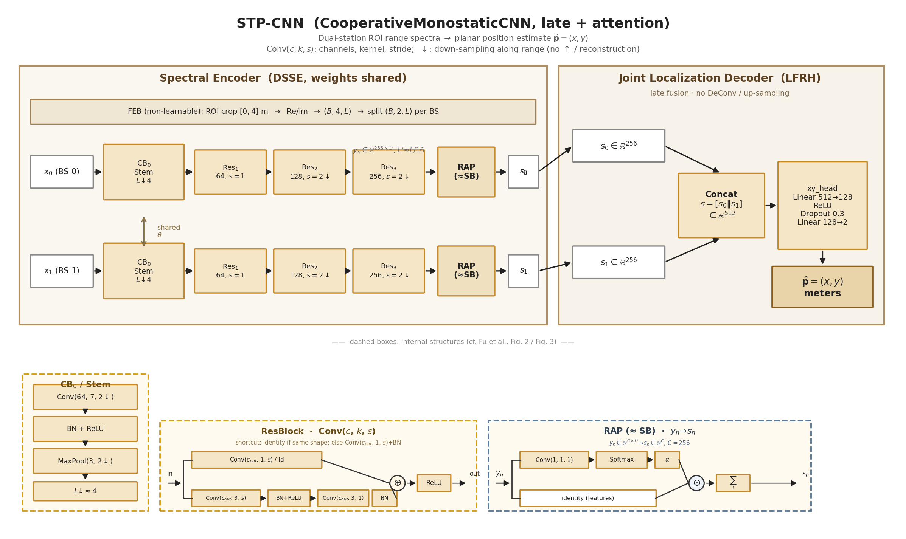
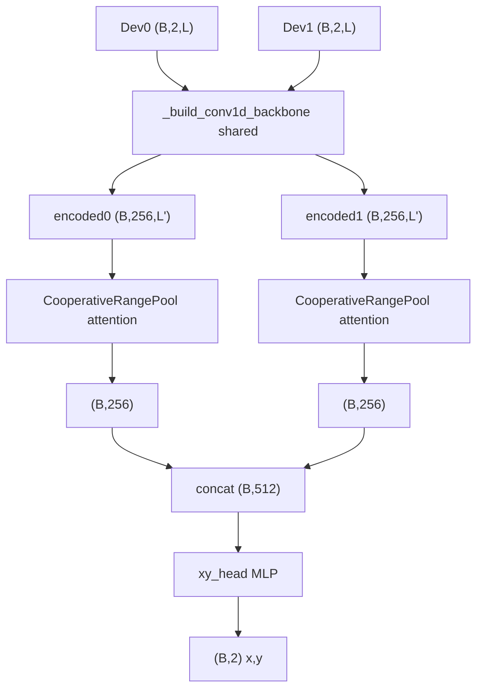

# Cooperative Monostatic STP-CNN 模型说明

本文档说明协作双站单基地定位 **STP-CNN**（实现类 `CooperativeMonostaticCNN`）的输入、网络结构、训练默认配方与评估对照。权威实现见 [`src/isac/models/model_design.py`](../src/isac/models/model_design.py)；训练入口见 [`script/model_training/run_train_cooperative_monostatic_cnn.py`](../script/model_training/run_train_cooperative_monostatic_cnn.py)。

**当前默认权重**（`methods_compare` 使用）：

`models/cnn_improve_next/aug_spec_only/best_model.pth`

架构示意图（对标 Fu *et al.* IEEE Commun. Lett. 2025 DMISC **Fig. 2** 读图惯例）：



生成命令：`python script/docs/plot_stp_cnn_architecture.py`

架构图逐块中文说明见 [`stp_cnn_architecture.md`](stp_cnn_architecture.md)。

---

## 1. 概述

### 模型职责

**STP-CNN**（`CooperativeMonostaticCNN`）将 **两站 ROI 裁切后的复数距离谱** 回归为 **目标平面坐标 `(x, y)`**（单位 m）。

| 估计器         | 模块                         | 输出                           |
| -------------- | ---------------------------- | ------------------------------ |
| MUSIC          | 距离估计 → 双圆交会         | `(x, y)`                       |
| ESPRIT         | 同上                         | `(x, y)`                       |
| STP-CNN（本文）| `CooperativeMonostaticCNN`   | `(B, 2)` 直接回归 `(x, y)`     |

与传统子空间方法不同，STP-CNN 端到端从双站谱特征直接回归 `(x, y)`，不做显式单站测距 + 双圆交会。

### Checkpoint 配置摘要

从 `aug_spec_only/best_model.pth` 读取：

| 项                                               | 值                       |
| ------------------------------------------------ | ------------------------ |
| `model_type`                                     | `1d`                     |
| `feature_mode` / `feature_norm`                  | `real_imag` / `none`     |
| `in_channels`                                    | 4                        |
| `fusion_mode`                                    | `late`                   |
| `pool_mode`                                      | `attention`              |
| `base_channels` / `num_layers` / `dropout`       | 64 / 3 / 0.3             |
| 约参数量                                         | ~5.0×10⁵（503 939）     |

---

## 2. 端到端数据流


**训练路径**：cooperative monostatic H5（或 features sidecar）→ `real_imag` 特征 → STP-CNN → 与真值 `(x, y)` 的加权 RMSE 损失。

**推理路径**：同一特征管线 → `best_model.pth` → `(x, y)` → 与 MUSIC/ESPRIT 在同一数据集上对比（[`run_cooperative_monostatic_methods_compare.py`](../script/experiment/run_cooperative_monostatic_methods_compare.py)）。

---

## 3. 模型输入

### 3.1 原始数据

| 项目 | 说明                                                       |
| ---- | ---------------------------------------------------------- |
| 来源 | `profiles_dev0` / `profiles_dev1`（复数距离谱 CPI）    |
| ROI  | 训练/评估默认`0.0–4.0` m（`TRAIN_DEFAULT_RANGE_ROI`） |
| 标签 | `target_position` 前两维 → `(true_x_m, true_y_m)`     |

离线特征缓存示例：

`data/experiment/cooperative_monostatic/cooperative_monostatic_dataset_features_roi0_4_real_imag.h5`

### 3.2 特征模式 `real_imag`

| 通道 | 内容                    |
| ---- | ----------------------- |
| 0–1 | Dev0 ROI 的 real / imag |
| 2–3 | Dev1 ROI 的 real / imag |

张量形状：`(B, 4, L)`（float），`L` 为 ROI 距离 bin 数。当前 `feature_norm=none`（不做按站 RMS 归一化）。

`late` 融合时网络将 4 通道拆成两站各 2 通道（`station_channels=2`），共享骨干分别编码。

特征构建见 [`src/isac/models/preprocess.py`](../src/isac/models/preprocess.py)（`dual_roi_to_real_imag_features` / `cooperative_feature_in_channels`）。

---

## 4. 网络结构（当前默认）

### 4.1 拓扑



要点：

1. **共享 1D 卷积骨干**：`stem` + `num_layers=3`，`base_channels=64`，末层通道 `final_ch=256`。
2. **晚融合**：两站分别编码与池化，再拼接。
3. **Attention 池化**：`CooperativeRangePool(pool_mode=attention)`，输出每站 `(B, 256)`。
4. **xy 头**：`_mlp_xy_head(512 → 128 → 2)`，含 ReLU 与 dropout `0.3`。

### 4.2 前向接口

- 输入：float `(B, 4, L)`，或复数双站谱（内部转特征）
- 输出：`(B, 2)`，单位 m，对应全局目标坐标

### 4.3 STP-CNN 结构图（对标 DMISC Fig. 2）

与参考多视图语义通信图（Fu *et al.*, Fig. 2）的对应关系：

| 参考图概念 | STP-CNN 对应 |
| --- | --- |
| 多视图输入 `x₁…x_N` | 双站距离谱 Dev0 / Dev1 |
| 各视图独立 Encoder | 共享权重的 1D 卷积编码器（两路并行） |
| Symbolization Block (SB) | Range Attention Pool（RAP，距离维压缩为向量） |
| Joint Multi-View Decoder + JCT | Late Fusion（拼接 + MLP 回归头） |
| 重建输出 `x̂_n` | 直接输出 `(x, y)`，无 Decoder |

#### Feature Extraction Block (FEB)

非可学习预处理：H5 复数距离谱 → ROI `0–4` m → `real_imag` → `(B, 4, L)`，再拆成两站各 `(B, 2, L)`。

#### Dual-Station Shared Spectral Encoder (DSSE)

每站输入 `x_n ∈ ℝ^{2×L}`（re, im），经共享 [`_build_conv1d_backbone`](../src/isac/models/model_design.py)：

```text
Stem (CB₀):
  Conv1d(2→64, k=7, stride=2, pad=3) + BN + ReLU
  MaxPool1d(k=3, stride=2, pad=1)          # 距离维约 ↓4

ResBlock (Conv1dResidualBlock)，记号 Conv(c,k,s)：
              ┌─ Conv(c_out,1,s)+BN  或  Identity ─┐
  in ─────────┤                                    ⊕ → ReLU → out
              └─ Conv(c_out,3,s) → BN+ReLU
                   → Conv(c_out,3,1) → BN ─────────┘

ResBlock₁: 64→64,  s=1  (捷径 Identity)
ResBlock₂: 64→128, s=2  (捷径 1×1, 距离维 ↓2)
ResBlock₃: 128→256,s=2  (捷径 1×1, 距离维 ↓2)

输出 per station: y_n ∈ ℝ^{256×L'} ，L' ≈ L/16
```

#### Range Attention Pool (RAP)

类比参考图 Symbolization Block；双分支读图（与架构图底部 RAP 内嵌一致）：

```text
                    ┌─ Conv(1, 1, 1) → Softmax → α ─┐
 y_n (C×L') ────────┤                                ⊙ ──→ Σ_ℓ ──→ s_n (C)
                    └──────── identity (features) ───┘
```

等价计算：`score=Conv1d(256→1)` → softmax → 加权和；\(s_n\in\mathbb{R}^{256}\)。

#### Late Fusion Regression Head (LFRH)

类比参考图 Joint Decoder + JCT（本模型无反卷积重建）：

```text
s = concat(s_0, s_1) ∈ ℝ^{512}

xy_head (MLP):
  Linear(512 → 128)
  ReLU
  Dropout(p=0.3)
  Linear(128 → 2)

输出: (x, y) ∈ ℝ²  [单位: m]
```

完整结构图见文首 [`figures/stp_cnn_architecture.png`](figures/stp_cnn_architecture.png)。

---

## 5. 训练默认配方（`aug_spec_only`）

与 [`run_train_cooperative_monostatic_cnn.py`](../script/model_training/run_train_cooperative_monostatic_cnn.py) 顶部默认对齐：

| 项            | 默认                                                                                            |
| ------------- | ----------------------------------------------------------------------------------------------- |
| 输出目录      | `models/cnn_improve_next/aug_spec_only`                                                       |
| 结构          | `model_type=cnn`，`fusion=late`，`pool=attention`，`base_channels=64`，`num_layers=3` |
| 优化          | `lr=5e-5`，`batch_size=128`，`epochs=100`，`early_stop_patience=15`                     |
| dropout       | 0.3                                                                                             |
| ROI           | `0–4` m                                                                                      |
| 标签抖动      | `0.02` m                                                                                      |
| 三区损失权重  | center / side / corner =`1 / 3 / 3`                                                           |
| SpecAugment   | 概率`0.5`                                                                                     |
| feature noise | `0`                                                                                           |
| CPI 增强      | amp scale`0.2`，complex noise std `0.02`                                                    |

损失主项为目标位置 RMSE（可按九宫格归并的 center/side/corner 加权）；训练完成后默认触发 STP-CNN RMSE 评估脚本。

---

## 6. 评估与三方法对照

一键评测：[`run_cooperative_monostatic_methods_compare.py`](../script/experiment/run_cooperative_monostatic_methods_compare.py)。

全量数据集（n=10752，`cuda:0`，计时范围 `algo_core`）一次运行摘要：

| method   | global mean err (m) | inner mean err (m) | outer mean err (m) | mean ms/sample |
| -------- | ------------------- | ------------------ | ------------------ | -------------- |
| music    | 0.9371              | 0.5988             | 1.3625             | 1.8335         |
| esprit   | 0.9656              | 0.6272             | 1.3912             | 2.5414         |
| STP-CNN  | 0.5786              | 0.3549             | 0.8598             | 0.5904         |

指标为定位欧氏距离平均误差（汇总字段 `*_mean_err`）；CSV 列名仍可能为 `rmse_xy_m`；图例标签为 **STP-CNN**（内部 method key 仍为 `cnn`）。产物目录：

`out/cooperative_monostatic/methods_compare/`

---

## 7. 相关路径

| 用途            | 路径                                                                                                                                     |
| --------------- | ---------------------------------------------------------------------------------------------------------------------------------------- |
| 模型类          | [`src/isac/models/model_design.py`](../src/isac/models/model_design.py)                                                                 |
| 特征预处理      | [`src/isac/models/preprocess.py`](../src/isac/models/preprocess.py)                                                                     |
| 训练脚本        | [`script/model_training/run_train_cooperative_monostatic_cnn.py`](../script/model_training/run_train_cooperative_monostatic_cnn.py)     |
| STP-CNN 评测    | [`script/experiment/run_cooperative_monostatic_cnn_rmse.py`](../script/experiment/run_cooperative_monostatic_cnn_rmse.py)               |
| 三方法对比      | [`script/experiment/run_cooperative_monostatic_methods_compare.py`](../script/experiment/run_cooperative_monostatic_methods_compare.py) |
| 架构图中文说明  | [`docs/stp_cnn_architecture.md`](stp_cnn_architecture.md)                                                                               |
| 架构图脚本      | [`script/docs/plot_stp_cnn_architecture.py`](../script/docs/plot_stp_cnn_architecture.py)                                               |
| 架构图产物      | [`docs/figures/stp_cnn_architecture.png`](figures/stp_cnn_architecture.png)                                                             |
| 默认 checkpoint | `models/cnn_improve_next/aug_spec_only/best_model.pth`                                                                                 |
| 评估输出        | `out/cooperative_monostatic/methods_compare/`                                                                                          |

单基地 DD 谱 `SensingCNN` 说明见 [`docs/monostatic_delay_doppler_cnn.md`](monostatic_delay_doppler_cnn.md)（任务与输入不同，勿混淆）。
