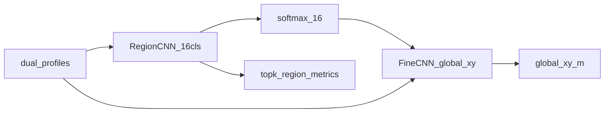
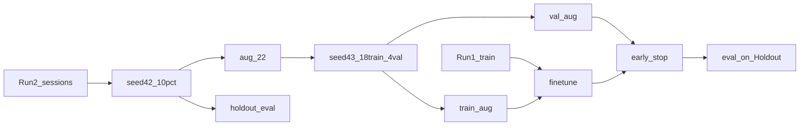

# 协同单基地两阶段定位方案说明

本文档汇总 **Region（子区域分类）+ Fine（格内精定位）** 两阶段管线的架构、训练/评估路径、零样本与 Run2 部分增强实验结论，以及推荐命令。权威实现见 [`src/isac/models/model_design.py`](../src/isac/models/model_design.py) 与 [`src/isac/models/two_stage_decode.py`](../src/isac/models/two_stage_decode.py)。

---

## 1. 概述

### 1.1 职责与定位

两阶段方案将目标平面坐标估计拆成 **串联** 流水线：

1. **RegionCNN**：判别目标落入哪个空间子区域（16 类 logits）
2. **FineCNN**：接收与单阶段 CNN 相同的 `dual_profiles`，并拼接 Region 的 **16 维 softmax 概率**，**单次前向**回归全局 `(x, y)`

统一入口为 [`CooperativeMonostaticTwoStageCNN`](../src/isac/models/model_design.py)：`Region → softmax → Fine(dual, probs) → xy`。该路径与现有单阶段 `(x, y)` CNN **并存**，不替换 [`run_train_cooperative_monostatic_cnn.py`](../script/model_training/run_train_cooperative_monostatic_cnn.py)。

> **注意**：旧版 Fine（`subregion_id` Embedding + 局部偏移 + top-k 多假设加权）已废弃，旧 Fine checkpoint **不兼容**，需用新架构重训。

### 1.2 空间网格

常量定义于 [`record_target_metadata.py`](../src/isac_imp/record_target_metadata.py)：

| 常量 | 值 | 含义 |
|------|-----|------|
| `SUBREGION_CELL_SIZE_M` | 0.5 | 格子边长 (m) |
| `SUBREGION_GRID_N` | 4 | 每轴格数 |
| `SUBREGION_COUNT` | 16 | 总类数 |
| 覆盖范围 | `|x|,|y| ≤ 1 m` | 轴分段 `[-1,-0.5)/[-0.5,0)/[0,0.5)/[0.5,1]` |

### 1.3 数据

| 名称 | HDF5 路径 | 用途 |
|------|-----------|------|
| Run1 | `data/experiment/cooperative_monostatic_measurement0/cooperative_monostatic_dataset.h5` | 默认训练与 early-stop（同分布 val） |
| Run2 | `data/experiment/cooperative_monostatic/cooperative_monostatic_dataset.h5` | 跨次采集评估；零样本时仅评；10% 增强时部分 session 可入训 |

---

## 2. 架构与推理



### 2.1 模型

| 模块 | 类 | 输出 |
|------|-----|------|
| 区域判决 | `CooperativeMonostaticRegionCNN` | `(B, 16)` logits |
| 精定位 | `CooperativeMonostaticFineCNN` | `(B, 2)` 全局坐标，条件于 `region_probs (B,16)` |
| 串联封装 | `CooperativeMonostaticTwoStageCNN` | `(pred_xy, region_logits)` |

Fine head 输入：`concat(pool_dev0, pool_dev1, region_probs)`，与单阶段 late-fusion 骨干一致。

### 2.2 解码

[`decode_xy_topk_region_probs`](../src/isac/models/two_stage_decode.py)：

1. 调用 `two_stage(dual)` 得全局 `xy` 与 `region_logits`（**单次串联前向**）
2. 从 logits 取 top-k ids/probs，**仅作 Region 分类指标**（不参与 xy 融合）
3. Oracle 上界：`two_stage(dual, region_probs_override=one_hot(true_sid))`

评估入口：[`run_cooperative_monostatic_two_stage_eval.py`](../script/experiment/run_cooperative_monostatic_two_stage_eval.py)（支持 `--session-list` / `--exclude-session-list`）。

**输出与单 CNN 对齐**：

| 文件 | 说明 |
|------|------|
| `two_stage_rmse.csv` | 主定位 CSV，**7 列**（与 `cnn_rmse.csv` 相同） |
| `two_stage_rmse_heatmap.png` / `_cdf.png` / `two_stage_xy_scatter.png` | 同口径图表 |
| `two_stage_region_diagnostics.csv` | Region sidecar（top-1、oracle、topk 等） |
| 终端汇总 | `Two-stage localization mean error summary`：global / inner / outer |

Region 诊断终端表仅在加 `--print-region-metrics` 时打印。

---

## 3. 训练路径

三种路径并列存在，按需求选用（联合训练另含热启动 / 直接两种启动方式）。

| 路径 | 脚本 | 说明 |
|------|------|------|
| 分阶段独立 | Region / Fine 各训 | Fine **必填** `--region-checkpoint`（冻结 Region→softmax）；损失 = 全局 RMSE |
| 端到端联合 | [`run_train_cooperative_monostatic_two_stage_joint.py`](../script/model_training/run_train_cooperative_monostatic_two_stage_joint.py) | `TwoStageCNN` 同训；**热启动**或**直接从零**；支持 `--extra-h5` |
| Run2 10% Region | [`run_region_run2_10pct_finetune.py`](../script/experiment/run_region_run2_10pct_finetune.py) | Region-only：~22 session 并入 train，~195 holdout 仅评 |
| Run2 10% 联合微调 | [`run_two_stage_joint_run2_10pct_finetune.py`](../script/experiment/run_two_stage_joint_run2_10pct_finetune.py) | `joint_direct` 热启动后联合微调（Run1 选模） |
| Run2 FT 矩阵 | [`run_two_stage_joint_run2_ft_matrix.py`](../script/experiment/run_two_stage_joint_run2_ft_matrix.py) | val_aug 选模 + freeze/oversample 对照 |

### 3.1 Region 独立训练

脚本：[`run_train_cooperative_monostatic_region_cnn.py`](../script/model_training/run_train_cooperative_monostatic_region_cnn.py)

常用 CLI：

| 参数 | 含义 |
|------|------|
| `--neighbor-smooth α` | 邻域软标签 CE（真值 `1-α`，四邻均分 `α`） |
| `--label-smoothing` | 均匀平滑（与 `--topk-ce` 互斥） |
| `--mixup-alpha` | 特征 mixup |
| `--feature-noise-std` / `--spec-augment-prob` | 特征域增强 |
| `--topk-ce` / `--topk-ce-k` | forced top-k softmax CE（实验表明单独使用效果差） |
| `--resume-checkpoint` | 加载已有 Region 权重再训 |
| `--extra-h5` + `--extra-session-frac` / `--extra-session-list` | 额外 H5 帧 **仅并入 train**，不进 val |

默认 early-stop 看 **Run1 val top-1**；另存 `best_by_topk_hit.pth` 作对照。

### 3.2 Fine 独立训练

脚本：[`run_train_cooperative_monostatic_fine_cnn.py`](../script/model_training/run_train_cooperative_monostatic_fine_cnn.py)

- 标签：全局 `(x, y)` RMSE
- 数据流：**串联** `probs = softmax(region(dual).detach())` → `fine(dual, probs)`
- **`--region-checkpoint` 必填**（冻结 Region）；可选 `--oracle-region-probs` 用真值 one-hot 做上界 ablation
- early-stop：Run1 val **global RMSE**

### 3.3 端到端联合

脚本：[`run_train_cooperative_monostatic_two_stage_joint.py`](../script/model_training/run_train_cooperative_monostatic_two_stage_joint.py)

构造 `CooperativeMonostaticTwoStageCNN(region, fine)`，损失以全局 RMSE 为主（Region 梯度经 softmax→Fine 回传）。

| 模式 | 条件 | 说明 |
|------|------|------|
| **热启动联合** | 提供 `--region-checkpoint` | 加载已训 Region（可选 Fine）；`--region-lr` 默认 `1e-5` |
| **直接联合** | 省略 `--region-checkpoint` | Region+Fine 随机初始化；`--region-lr` 默认等于 `--lr` |

直接联合常用参数：

| 参数 | 含义 |
|------|------|
| `--region-ce-weight` | Region CE 辅助损失权重（建议 `1.0`） |
| `--neighbor-smooth` | Region CE 邻域软标签 α |
| `--region-lr` / `--lr` | 两塔学习率（直接联合常同设为 `1e-4`） |
| `--extra-h5` + `--extra-session-list` / `--extra-session-frac` | 额外 H5 帧 **仅并入 train** |
| `--extra-val-session-list` | extra 验证 session（与 train list 无交） |
| `--early-stop-on {run1_val,extra_val}` | 选模指标（默认 `run1_val`） |
| `--freeze-fine` | 冻结 Fine，仅更新 Region |
| `--extra-oversample N` | extra train 在 Concat 中重复 N 次 |

输出：`best_region.pth` / `best_fine.pth` / `joint_meta.pth`（meta 含 `direct_joint` 标志）。

对照矩阵：[`run_two_stage_joint_compare.py`](../script/experiment/run_two_stage_joint_compare.py)（含 `joint_rmse` / `joint_direct`）。

### 3.4 Run2 10% session 增强



- 固定 `seed=42`，约 **22 aug / 195 holdout** session，无交集；holdout **禁止**进训/选模
- 联合微调进阶：aug 内再拆 **18 train / 4 val**（`seed=43`），early-stop 看 **val_aug RMSE**
- **Region-only**：[`run_region_run2_10pct_finetune.py`](../script/experiment/run_region_run2_10pct_finetune.py)（early-stop 仍看 Run1 val）
- **联合微调（Run1 选模）**：[`run_two_stage_joint_run2_10pct_finetune.py`](../script/experiment/run_two_stage_joint_run2_10pct_finetune.py)
- **联合微调矩阵（val_aug 选模）**：[`run_two_stage_joint_run2_ft_matrix.py`](../script/experiment/run_two_stage_joint_run2_ft_matrix.py)

---

## 4. 推荐 checkpoint 与命令

### 4.1 零样本推荐组合（仅 Run1 训练）

| 角色 | 路径 |
|------|------|
| Region | `models/region_run2_zeroshot/region/aug_neighbor/best_model.pth` |
| Fine | 需用新架构重训（旧 Embedding Fine ckpt 不兼容） |

### 4.2 Region 训练（`aug_neighbor`）

```bash
python script/model_training/run_train_cooperative_monostatic_region_cnn.py \
  --h5-path data/experiment/cooperative_monostatic_measurement0/cooperative_monostatic_dataset.h5 \
  --output-dir models/region_run2_zeroshot/region/aug_neighbor \
  --epochs 100 --batch-size 128 --val-ratio 0.2 --early-stop-patience 12 \
  --feature-mode real_imag --range-roi 0 4 \
  --num-layers 3 --base-channels 64 --lr 5e-5 --dropout 0.1 --pool-mode attention \
  --feature-noise-std 0.02 --spec-augment-prob 0.7 --neighbor-smooth 0.2 \
  --num-workers 4 --device cuda:0
```

### 4.3 Fine 训练（串联 Region）

```bash
python script/model_training/run_train_cooperative_monostatic_fine_cnn.py \
  --region-checkpoint models/region_run2_zeroshot/region/aug_neighbor/best_model.pth \
  --h5-path data/experiment/cooperative_monostatic_measurement0/cooperative_monostatic_dataset.h5 \
  --output-dir models/two_stage_tune/fine/fine_lr1e4 \
  --epochs 100 --batch-size 128 --lr 1e-4 --dropout 0.3 \
  --feature-mode real_imag --range-roi 0 4 --pool-mode attention \
  --device cuda:0
```

### 4.4 完整 Run2 零样本评估

```bash
python script/experiment/run_cooperative_monostatic_two_stage_eval.py \
  --h5-path data/experiment/cooperative_monostatic/cooperative_monostatic_dataset.h5 \
  --region-checkpoint models/region_run2_zeroshot/region/aug_neighbor/best_model.pth \
  --fine-checkpoint models/two_stage_tune/fine/fine_lr1e4/best_model.pth \
  --region-topk 3 --batch-size 128 --device cuda:0 --no-plot
```

### 4.5 直接联合训练（从零）

```bash
python script/model_training/run_train_cooperative_monostatic_two_stage_joint.py \
  --h5-path data/experiment/cooperative_monostatic_measurement0/cooperative_monostatic_dataset.h5 \
  --output-dir models/two_stage_joint/joint_direct \
  --epochs 100 --batch-size 128 --lr 1e-4 --region-lr 1e-4 \
  --region-ce-weight 1.0 --neighbor-smooth 0.2 --dropout 0.1 \
  --feature-mode real_imag --range-roi 0 4 --device cuda:0
```

### 4.6 联合训后 Run2 10% 联合微调

在 `joint_direct` 热启动后并入 Run2 10% session。基线脚本 early-stop 仍看 **Run1 val**；进阶矩阵用 **val_aug** 选模。

**Run1 选模（已跑通，holdout ≈0.559 m）：**

```bash
python script/experiment/run_two_stage_joint_run2_10pct_finetune.py --device cuda:0
```

**val_aug 选模小矩阵（推荐下一步）：**

```bash
# 前置：joint_direct + Region 10% split
python script/experiment/run_two_stage_joint_run2_ft_matrix.py --device cuda:0
python script/experiment/run_two_stage_joint_run2_ft_matrix.py --only ft_valg,ft_valg_reg
```

矩阵行：`zeroshot` / `ft_run1stop` / `ft_valg` / `ft_valg_reg`（冻 Fine）/ `ft_valg_os3`（oversample=3）。

手动 val_aug 示例：

```bash
python script/model_training/run_train_cooperative_monostatic_two_stage_joint.py \
  --region-checkpoint models/two_stage_joint/joint_direct/best_region.pth \
  --fine-checkpoint models/two_stage_joint/joint_direct/best_fine.pth \
  --h5-path data/experiment/cooperative_monostatic_measurement0/cooperative_monostatic_dataset.h5 \
  --extra-h5 data/experiment/cooperative_monostatic/cooperative_monostatic_dataset.h5 \
  --extra-session-list models/two_stage_joint_run2_10pct/matrix/split/run2_aug_train.txt \
  --extra-val-session-list models/two_stage_joint_run2_10pct/matrix/split/run2_aug_val.txt \
  --early-stop-on extra_val \
  --output-dir models/two_stage_joint_run2_10pct/matrix/ft_valg \
  --epochs 30 --early-stop-patience 8 \
  --lr 1e-5 --region-lr 1e-5 \
  --region-ce-weight 1.0 --neighbor-smooth 0.2 --dropout 0.1 \
  --feature-mode real_imag --range-roi 0 4 --device cuda:0
```

汇总：
- [`two_stage_joint_run2_10pct_summary.csv`](../out/cooperative_monostatic/two_stage_joint_run2_10pct_summary.csv)
- [`two_stage_joint_run2_ft_matrix_summary.csv`](../out/cooperative_monostatic/two_stage_joint_run2_ft_matrix_summary.csv)

### 4.7 一键矩阵

```bash
# Region 零样本对照（仅 Run1 训，完整 Run2 评）
python script/experiment/run_region_run2_zeroshot_matrix.py
python script/experiment/run_region_run2_zeroshot_matrix.py --only aug_neighbor
python script/experiment/run_region_run2_zeroshot_matrix.py --skip-train

# Region + Fine 超参扫描
python script/experiment/run_two_stage_tune_matrix.py
python script/experiment/run_two_stage_tune_matrix.py --only region_drop01,fine_lr1e4

# 端到端联合对照（热启动 + 直接联合）
python script/experiment/run_two_stage_joint_compare.py
python script/experiment/run_two_stage_joint_compare.py --only-direct

# Run2 10% session 增强 + holdout 评估（Region-only）
python script/experiment/run_region_run2_10pct_finetune.py

# Run2 10% 联合微调（Run1 选模）
python script/experiment/run_two_stage_joint_run2_10pct_finetune.py

# Run2 10% 联合微调矩阵（val_aug 选模）
python script/experiment/run_two_stage_joint_run2_ft_matrix.py
```

---

## 5. 实验结果摘要

### 5.1 Run2 完整零样本

来源：[`out/cooperative_monostatic/region_run2_zeroshot_summary.csv`](../out/cooperative_monostatic/region_run2_zeroshot_summary.csv)

| 配置 | Run1 val top-1 | Run2 top-1 | Run2 top-3 | RMSE topk (m) |
|------|----------------|------------|------------|---------------|
| baseline_drop01 | 0.60 | 0.25 | 0.56 | 0.602 |
| **aug_neighbor（最佳 top-1）** | **0.72** | **0.27** | 0.57 | 0.606 |
| mixup | 0.64 | 0.25 | **0.59** | **0.587** |
| neighbor_smooth | 0.71 | 0.26 | 0.56 | 0.606 |
| topk_ce3 | 0.05 | 0.05 | 0.32 | 0.937 |

**结论：**

- 同分布（Run1）可学到 ~70%+；跨次采集（Run2）top-1 卡在 ~0.25–0.27，主矛盾是 **域偏移**
- Oracle-region RMSE ≈ **0.20 m**，Fine 不是主瓶颈
- 纯 forced top-k CE（`topk_ce3`）无效，勿单独作为主损失
- `mixup` 更利于 top-3 / 融合 RMSE；`aug_neighbor` 更利于 Run2 top-1

### 5.2 端到端联合训练

来源：[`out/cooperative_monostatic/two_stage_joint_summary.csv`](../out/cooperative_monostatic/two_stage_joint_summary.csv)

| 配置 | Run1 val 全局 RMSE | Run2 top-1 | Run2 top-3 | RMSE topk |
|------|-------------------|------------|------------|-----------|
| tf_fine（冻结 Region + teacher-force Fine） | — | 0.250 | 0.561 | 0.602 |
| joint_rmse | **0.436** | 0.247 | 0.563 | 0.603 |

联合训在 Run1 val 上明显压低融合 RMSE；跨到 Run2 与独立 Fine 基线基本持平。

### 5.3 Run2 10% holdout（Region-only）

来源：[`out/cooperative_monostatic/region_run2_10pct_summary.csv`](../out/cooperative_monostatic/region_run2_10pct_summary.csv)

| 配置 | Holdout top-1 | Holdout top-3 | RMSE topk |
|------|---------------|---------------|-----------|
| r1_only_aug_neighbor | **0.265** | 0.556 | **0.616** |
| r1_plus_run2_10 | 0.260 (−2%） | 0.554 | 0.627 |

当前微调设定（lr=`1e-5`、并入 22 session）未超越零样本基线；协议与脚本已就绪，可再试更小 lr、只微调头、或提高 Run2 比例。

### 5.4 Run2 10% holdout（联合微调）

| 配置 | Holdout RMSE | top-1 |
|------|-------------|-------|
| `joint_direct` 零样本 | 0.643 m | 0.250 |
| `joint_ft`（Run1 early-stop, best=epoch1） | **0.559 m**（−13%） | 0.285 |

协议进阶：复用同一 holdout；aug 内划 val_aug 选模。矩阵汇总：[`two_stage_joint_run2_ft_matrix_summary.csv`](../out/cooperative_monostatic/two_stage_joint_run2_ft_matrix_summary.csv)（跑完后填入）。

---

## 6. 输出产物索引

### 6.1 汇总 CSV

| 文件 | 内容 |
|------|------|
| [`region_run2_zeroshot_summary.csv`](../out/cooperative_monostatic/region_run2_zeroshot_summary.csv) | Region 零样本矩阵 |
| [`two_stage_joint_summary.csv`](../out/cooperative_monostatic/two_stage_joint_summary.csv) | 联合训对照 |
| [`region_run2_10pct_summary.csv`](../out/cooperative_monostatic/region_run2_10pct_summary.csv) | 10% Run2 Region-only 增强 holdout 对照 |
| [`two_stage_joint_run2_10pct_summary.csv`](../out/cooperative_monostatic/two_stage_joint_run2_10pct_summary.csv) | 10% Run2 联合微调 holdout 对照（Run1 选模） |
| [`two_stage_joint_run2_ft_matrix_summary.csv`](../out/cooperative_monostatic/two_stage_joint_run2_ft_matrix_summary.csv) | val_aug 选模小矩阵 |
| [`two_stage_region_tune_summary.csv`](../out/cooperative_monostatic/two_stage_region_tune_summary.csv) | Region 超参扫描 |
| [`two_stage_fine_tune_summary.csv`](../out/cooperative_monostatic/two_stage_fine_tune_summary.csv) | Fine 超参扫描 |

### 6.2 Checkpoint 与划分

| 路径 | 说明 |
|------|------|
| `models/region_run2_zeroshot/region/*/best_model.pth` | 零样本 Region 各实验 |
| `models/two_stage_tune/region/`、`fine/` | 初调矩阵 ckpt |
| `models/two_stage_joint/joint_rmse/` | 联合训 best Region/Fine |
| `models/region_run2_10pct/split/run2_aug_sessions.txt` | 增强用 22 session（Region / 联合共用） |
| `models/region_run2_10pct/split/run2_holdout_sessions.txt` | 评估用 195 session |
| `models/two_stage_joint_run2_10pct/joint_ft/` | 联合 10% 微调 best Region/Fine（Run1 选模） |
| `models/two_stage_joint_run2_10pct/matrix/` | val_aug 选模小矩阵输出 |

### 6.3 逐样本评估

- 主 CSV（7 列，与单 CNN 一致）：`*/two_stage_rmse.csv`
- Region sidecar：`*/two_stage_region_diagnostics.csv`
- 示例路径：
  - `models/region_run2_zeroshot/eval/*/two_stage_rmse.csv`
  - `models/region_run2_10pct/eval/*/two_stage_rmse.csv`
  - `models/two_stage_joint/eval/*/two_stage_rmse.csv`
  - `out/cooperative_monostatic/two_stage/joint_direct_run2/`

---

## 7. 约束与后续方向

### 7.1 硬约束（按实验类型）

| 实验 | 约束 |
|------|------|
| 零样本矩阵 | 训练不得使用 Run2；early-stop / 超参只看 Run1 val |
| 10% 增强（Region-only / 联合） | holdout 90% **不得**用于 early-stop 或超参搜索；extra 仅并入 train；val_aug 可从 aug 内划出 |
| 网格 / Fine 口径 | 本系列实验不改 4×4 与 Fine 标签定义 |

### 7.2 后续（若需大幅抬升 Run2 top-1）

纯 Run1 训练侧已接近天花板（跨域 top-1 ~27%）。若要接近同分布水平，通常需要：

- 更多 Run2 监督（更大 session 比例联合训 / 微调）
- 或显式域适配（特征对齐、校准等）

单阶段 `(x,y) CNN` 仍作为对照基线保留。
