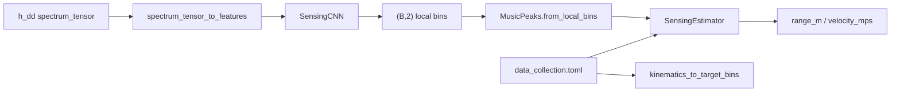

# SensingCNN 模型说明

本文档说明单基地时延–多普勒 CNN（`SensingCNN`）的输入、网络结构、输出、训练/推理链路与 checkpoint 约定。权威实现见 [`src/isac/models/model_design.py`](../src/isac/models/model_design.py)。

---

## 1. 概述

### 模型职责

`SensingCNN` 将 **ROI 裁切后的复数时延–多普勒谱** 回归为 **ROI 局部 bin** 坐标 `[peaks_delay, peaks_doppler]`，与 `MusicPeaks` / `SpectrumMetric` 使用同一坐标系。

- 输入：复数 `spectrum_tensor`（与 MUSIC 估计器相同）
- 输出：可微 `(B, 2)` 张量，**不直接**输出物理距离/速度
- 物理量换算：推理侧 `MusicPeaks.from_local_bins` → `SensingEstimator`

### 与 MUSIC 的关系

| 估计器 | 模块 | 输出 |
|--------|------|------|
| MUSIC | `MUSICEstimator` | `MusicPeaks` |
| CNN（本文） | `SensingCNN` | `(B, 2)` 局部 bin → 转为 `MusicPeaks` |

评估脚本 [`run_sensing_from_dataset.py`](../script/evaluation/run_sensing_from_dataset.py) 通过 `--estimator model` 选用 CNN。

### 感知元数据不在模型内

ROI 上界、距离/速度分辨率、`num_doppler_bins` 等由 **`data_collection.toml` / `System`** 提供，**不**保存在 `SensingCNN` 实例或 checkpoint 中。训练标签与推理时的物理换算均依赖同一份 TOML。

---

## 2. 端到端数据流



**训练路径**：`RTDataset` → `spectrum_tensor` + 运动学 → CNN 预测 vs `kinematics_to_target_bins` 标签 → `MonostaticSensingLoss`。

**推理路径**：`RTDataset.spectrum_tensor` → CNN → `MusicPeaks` → `SensingEstimator` → 与几何真值对比 RMSE。

---

## 3. 模型输入

### 3.1 原始张量

| 项目 | 说明 |
|------|------|
| 名称 | `spectrum_tensor` |
| dtype | `torch.complex64` |
| 形状 | `(H, W)` 单条，或 `(B, H, W)` batch |
| `H` / `W` | ROI 裁切后 DD 谱高/宽，由 `[dd_spectrum_roi]` 与 OFDM 参数决定 |
| 来源 | HDF5 数据集键 `delay_doppler_spectrum`（[`RTDataset`](../src/isac/collection/dataset.py)） |

采集阶段已完成 CFR → LS 估计 → DD 谱 → ROI 裁剪；HDF5 中存的是裁切后的 `h_dd`，**无 MTI**。

### 3.2 内部预处理

`SensingCNN.forward` 内部调用 [`spectrum_tensor_to_features`](../src/isac/models/preprocess.py)，调用方**只需传入复数谱**。

| 步骤 | 函数 | 输出 |
|------|------|------|
| batch 规范 | `normalize_spectrum_batch` | `(B, H, W)` |
| 特征提取 | `dd_spectrum_to_features`（逐样本） | `(B, C, H, W)` float32 |

### 3.3 特征通道（默认 `C = 2`）

| 通道 | 内容 | 处理 |
|------|------|------|
| 0 | 幅度 | `20·log10|h_dd|`，逐样本零均值、单位方差 |
| 1 | 相位 | `angle(h_dd) / π`，映射到约 `[-1, 1]` |

`in_channels` 须与特征通道数一致（默认 2）。

---

## 4. 网络结构

### 4.1 ConvResidualBlock

[`ConvResidualBlock`](../src/isac/models/model_design.py) 为两层 3×3 卷积残差块：

- Conv → BN → ReLU → Conv → BN，再与 shortcut 相加后 ReLU
- `stride > 1` 或输入/输出通道不一致时，shortcut 为 1×1 Conv + BN
- `stride = 1` 且通道相同时，shortcut 为 `Identity`

### 4.2 SensingCNN 主干

默认 `base_channels = 32`、`num_layers = 4`（`c = 32`）时的通道与下采样如下。
`num_layers` 控制残差编码块数量：首块 stride=1、同宽；第 2–N 块逐层通道加倍并 stride=2 下采样。

| 阶段 | 模块 | 输入→输出通道 | stride | 作用 |
|------|------|---------------|--------|------|
| stem | 7×7 Conv + BN + ReLU + MaxPool | 2 → 32 | conv s=2, pool s=2 | 下采样特征提取 |
| layer1 | ConvResidualBlock | 32 → 32 | 1 | 同分辨率残差编码 |
| layer2 | ConvResidualBlock | 32 → 64 | 2 | 下采样 |
| layer3 | ConvResidualBlock | 64 → 128 | 2 | 下采样 |
| layer4 | ConvResidualBlock | 128 → 256 | 2 | 下采样 |
| head | AdaptiveAvgPool2d(1) + Flatten | — | — | 全局池化 |
| head | Linear(256 → 128) + ReLU + Dropout | — | — | 非线性 |
| head | Linear(128 → 2) | — | — | 回归局部 bin |

整体数据流：

```text
spectrum_tensor (B,H,W) complex
  → spectrum_tensor_to_features → (B,2,H,W) float
  → stem → residual × num_layers → head
  → (B, 2)
```

### 4.3 构造超参

| 参数 | 默认值 | 说明 |
|------|--------|------|
| `in_channels` | 2 | 与 `spectrum_tensor_to_features` 输出通道一致 |
| `base_channels` | 32 | stem 与首层残差宽度；后续层依次为 `2c`、`4c`、…、`c·2^(num_layers-1)` |
| `num_layers` | 4 | 残差编码块数量 |
| `dropout` | 0.2 | 回归头中 Dropout 概率 |

---

## 5. 模型输出

| 项目 | 说明 |
|------|------|
| 形状 | `(B, 2)`，`float32`，可微 |
| 列 0 | `peaks_delay`：ROI 局部时延 bin |
| 列 1 | `peaks_doppler`：ROI 局部多普勒 bin |
| 坐标系 | 与 [`SpectrumMetric.physical_to_local_bins`](../src/isac/sensing/metric.py)、[`MusicPeaks`](../src/isac/data_structures/types.py) 一致 |
| 物理量 | 模型**不**输出米/米每秒；须经 `SensingEstimator` 换算 |

训练监督标签由 [`kinematics_to_target_bins`](../src/isac/models/preprocess.py) 从 `target_position` / `target_velocity` / `bs_pos` 生成，与模型输出同一 bin 空间。

---

## 6. 训练

### 脚本与前置条件

- 入口：[`script/model_training/run_train_monostatic_cnn.py`](../script/model_training/run_train_monostatic_cnn.py)
- 须在 **ISAC conda 环境**、仓库根目录运行
- HDF5 同目录须存在 `data_collection.toml`（采集脚本落盘副本）

```bash
python script/model_training/run_train_monostatic_cnn.py \
  --dataset_h5 data/empty_room_mc_sionna_dataset.h5 \
  --device cuda:0
```

### 标签与损失

| 组件 | 模块 | 说明 |
|------|------|------|
| 监督标签 | `kinematics_to_target_bins` | 运动学 → `(B, 2)` 局部 bin |
| `num_doppler_bins` | `sensing_attrs_from_system` | 来自 TOML / `dd_spectrum_roi` |
| 损失 | `MonostaticSensingLoss` | `peaks_delay`、`peaks_doppler` 分维度 MSE，默认等权 |
| 优化器 | Adam | 默认 `lr=1e-3`，`weight_decay=1e-4` |
| 学习率调度 | `ReduceLROnPlateau` | 监控 `val_loss`；`patience=5`，`factor=0.5`，`min_lr=1e-6` |

验证除 bin 空间 `val_loss` 外，脚本内用 `SensingEstimator` 报告物理距离/速度 RMSE（与评估脚本一致）。

### 训练产物

由 `--output`（默认 `models/monostatic_cnn/best_model.pth`）推导：

| 路径 | 说明 |
|------|------|
| `best_model.pth` | `val_loss` 最优权重 |
| `checkpoints/checkpoint_XXX.pth` | 周期性检查点 |
| `checkpoint_final.pth` | 最终 epoch |
| `training_curve.png` | 损失与 RMSE 曲线 |

---

## 7. 推理

### 脚本

[`script/evaluation/run_sensing_from_dataset.py`](../script/evaluation/run_sensing_from_dataset.py)：

```bash
python script/evaluation/run_sensing_from_dataset.py \
  --estimator model \
  --dataset_h5 data/empty_room_mc_sionna_dataset.h5 \
  --model_path models/monostatic_cnn/best_model.pth
```

### 加载与配置

- 权重：`load_sensing_cnn_checkpoint(path, device)`，返回 `eval()` 模式模型
- TOML：从 `--dataset_h5` **同目录**读取 `data_collection.toml`，**不从 checkpoint 读取**
- 感知链：构建 `System` → `SensingEstimator`；CNN 输出 bin → `MusicPeaks` → 物理量

---

## 8. Checkpoint 格式

### 必填字段

| 键 | 类型 | 说明 |
|----|------|------|
| `model_state_dict` | `dict` | `state_dict` 权重 |
| `in_channels` | `int` | 结构超参 |
| `base_channels` | `int` | 结构超参 |
| `num_layers` | `int` | 残差编码块数量（旧 checkpoint 缺省按 4 加载） |
| `dropout` | `float` | 结构超参 |

定义见 [`model_design.py`](../src/isac/models/model_design.py) 中 `_REQUIRED_CKPT_KEYS`。

### 不包含的字段

以下字段**不会**写入当前 checkpoint（旧版含这些字段的 `.pth` **不兼容**）：

- 溯源：`epoch`、`dataset_h5`、`config_file`
- 感知：`range_resolution`、`velocity_resolution`、`max_range_m`、`max_velocity_mps`、`num_doppler_bins`

推理与训练时感知参数须与训练阶段使用**同一份** `data_collection.toml`。

---

## 9. 相关模块索引

| 路径 | 职责 |
|------|------|
| [`src/isac/models/model_design.py`](../src/isac/models/model_design.py) | `SensingCNN`、`ConvResidualBlock`、`load_sensing_cnn_checkpoint` |
| [`src/isac/models/preprocess.py`](../src/isac/models/preprocess.py) | `spectrum_tensor_to_features`、`kinematics_to_target_bins` |
| [`src/isac/models/loss.py`](../src/isac/models/loss.py) | `MonostaticSensingLoss` |
| [`src/isac/collection/sensing_attrs.py`](../src/isac/collection/sensing_attrs.py) | 从 `System` 提取标签/日志用感知属性 |
| [`src/isac/collection/dataset.py`](../src/isac/collection/dataset.py) | `RTDataset` 读取 `spectrum_tensor` |
| [`src/isac/sensing/metric.py`](../src/isac/sensing/metric.py) | bin ↔ 物理量坐标换算 |
| [`src/isac/data_structures/types.py`](../src/isac/data_structures/types.py) | `MusicPeaks` |
| [`script/model_training/run_train_monostatic_cnn.py`](../script/model_training/run_train_monostatic_cnn.py) | 训练入口 |
| [`script/evaluation/run_sensing_from_dataset.py`](../script/evaluation/run_sensing_from_dataset.py) | 推理与 RMSE 评估 |
| [`docs/run_data_collection.md`](run_data_collection.md) | 上游 HDF5 采集说明 |

---

## 10. 代码示例

### 推理（单条谱）

```python
import torch
from isac.data_structures.types import MusicPeaks
from isac.models import load_sensing_cnn_checkpoint

device = "cuda:0"
model = load_sensing_cnn_checkpoint("models/monostatic_cnn/best_model.pth", device)

h_dd = torch.randn(256, 128, dtype=torch.complex64, device=device)  # 示例 ROI 裁切谱
with torch.no_grad():
    bins = model(h_dd)  # (1, 2)

peaks = MusicPeaks.from_local_bins(bins[0, 0], bins[0, 1], device=device)
# 后续：sensing_estimator(peaks, sens_mode="monostatic", ...)
```

### 训练侧标签（脚本内逻辑摘要）

训练脚本不将标签存入模型；每个 batch 在 `kinematics_to_target_bins` 中由运动学生成：

```python
target_bins = kinematics_to_target_bins(
    pos, vel, bs,
    sensing_performance=sensing_performance,
    num_doppler_bins=num_doppler_bins,  # 来自 sensing_attrs_from_system(system)
)
y_bins = model(spectrum)
loss = criterion(y_bins, target_bins)
```

完整循环见 [`run_train_monostatic_cnn.py`](../script/model_training/run_train_monostatic_cnn.py)。
