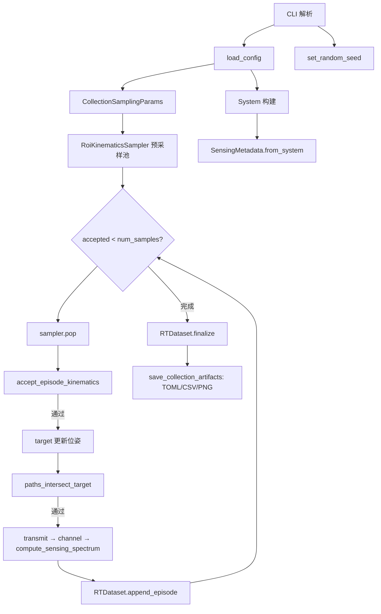

# run_data_collection 运行逻辑说明

本文档说明 [`script/data_collection/run_data_collection.py`](../script/data_collection/run_data_collection.py) 的入口、数据流与输出约定，便于独立运行脚本或对接下游训练管线。

---

## 1. 概述

### 脚本职责

`run_data_collection.py` 是 ISAC 数据集采集入口，主流程为：

**平面 ROI 蒙特卡洛采样 → 更新 Sionna RT 目标位姿 → 单 episode 仿真 → 流式写出 HDF5，事后写出 TOML / CSV / PNG**

- 主数据：ROI 裁剪后的复数时延–多普勒谱 `h_dd`（非 CFR）
- 输出目录：`data/`（常量 `DEFAULT_COLLECTION_OUT_DIR`）
- 逐步 MUSIC 感知与样本质量过滤不在此脚本内；感知评估请使用 [`script/evaluation/run_sensing_from_dataset.py`](../script/evaluation/run_sensing_from_dataset.py) 等独立脚本

### 配置与输出

| 项目 | 说明 |
|------|------|
| 默认配置文件 | `config/data_collection/data_collection.toml`（CLI `--config_file`） |
| 固定输出目录 | `data/` |
| 计算设备 | 默认 `cuda:0`，可用 `--device cpu` |

### 核心依赖

| 模块 | 作用 |
|------|------|
| `System` | 构建 OFDM / RT / 信道 / 感知链 |
| `RTDataset` | 流式写入与读取 HDF5 |
| `RoiKinematicsSampler` | 平面 ROI 内批量采样位置与速度 |
| `CollectionSamplingParams` | 从 TOML `[monte_carlo_sampling]` 解析采样参数 |
| `accept_episode_kinematics` | 场景障碍物过滤 |
| `paths_intersect_target` | RT 路径与目标 mesh 交互检查 |
| `los_truth_from_kinematics` | 几何真值（距离、径向速度） |

---

## 2. 运行方式（CLI）

须在 **ISAC conda 环境**中、从仓库根目录执行。

```bash
# 默认配置（empty_room 场景，采样参数见 data_collection.toml）
python script/data_collection/run_data_collection.py

# 自定义样本数、设备；切换采样策略请编辑 TOML 或使用 --config_file
python script/data_collection/run_data_collection.py \
  --num_samples 1000 \
  --device cpu \
  --seed 42
```

### CLI 参数

| 参数 | 默认值 | 说明 |
|------|--------|------|
| `--config_file` | `config/data_collection/data_collection.toml` | 仿真与采样 TOML |
| `--device` / `-d` | `cuda:0` | `cuda:0` 或 `cpu` |
| `--seed` | `42` | 蒙特卡洛随机种子 |
| `--num_samples` | `20000` | 最终采纳 episode 数 |
| `--sampler_pool_factor` | `5` | 预采样 `num_samples × factor` 条，循环中过滤至 `num_samples` |
| `--h5_compression` | `lzf` | HDF5 `h_dd` 压缩：`lzf` / `gzip` / `none` |

### `[monte_carlo_sampling]` 配置

平面 ROI 与速度采样参数在 TOML 中配置（**不由 CLI 覆盖**），由 `CollectionSamplingParams.from_dict` 解析：

```toml
[monte_carlo_sampling]
roi = [-2.5, 2.5, -4.5, 4.5]   # xmin, xmax, ymin, ymax（m），z 固定为 0
position_sampling_mode = "uniform"  # uniform | gaussian
speed_range = [0.1, 3.0]          # 速度模值范围 (m/s)
speed_sampling_mode = "uniform"   # uniform | gaussian
```

| 键 | 必填 | 说明 |
|----|------|------|
| `roi` | 是 | 平面 ROI 四元组 `[xmin, xmax, ymin, ymax]` |
| `speed_range` | 是 | 速度模值 `[vmin, vmax]` (m/s)，须满足 `0 <= min < max` |
| `position_sampling_mode` | 否 | 默认 `uniform` |
| `speed_sampling_mode` | 否 | 默认 `uniform` |

切换采样策略时修改配置文件，或通过 `--config_file` 指定另一份 TOML。

---

## 3. 采集流程

`main()` 按以下顺序执行：

1. 解析 CLI，`load_config`，从 `[monte_carlo_sampling]` 构建 `RoiKinematicsSampler` 预采样池。
2. 设置随机种子，构建 `System`，提取 `SensingMetadata`。
3. 取 RT 场景与第一个 `rt_target`，打开 HDF5 流式写入器。
4. 循环：采样 → 过滤 → 更新目标位姿 → 仿真 → 追加 episode，直至采纳 `num_samples` 条。
5. `RTDataset.finalize` 写入 HDF5 元数据；`save_collection_artifacts` 写出 TOML / CSV / PNG。



### 蒙特卡洛采样

- `RoiKinematicsSampler` 在 xy 平面 ROI 内采样位置（z=0），速度模值在 `speed_range` 内采样，方向在 xy 平面均匀随机。
- 预采样 `num_samples × sampler_pool_factor` 条，通过 `pop()` 逐条消费。

详见 [`src/isac/collection/roi_sampling.py`](../src/isac/collection/roi_sampling.py)。

### Episode 采纳条件

无独立 CLI，由 TOML 与 RT 场景决定：

1. **`accept_episode_kinematics`**：`scene_filter(pos)` 为真（位置不在障碍物 AABB 内；`safe_margin` 见 `[rt_simulator.scene_filter]`）
2. **`paths_intersect_target`**：RT 路径与目标 mesh 有交互

采样池耗尽时抛出 `RuntimeError`，提示增大 `--sampler_pool_factor` 或调整 `[monte_carlo_sampling]` / 过滤条件。

### 单 episode 仿真链

```text
target(position, velocity, orientation)
  → los_truth_from_kinematics（CSV 真值）
  → system.transmit() → x_rg
  → system.components.channel(x_rg, x_time, domain="frequency") → y_rg
  → system.compute_sensing_spectrum(x_rg, y_rg) → h_dd
  → RTDataset.append_episode(h_dd, pos, vel)
```

采集默认 **不施加 MTI**（`compute_sensing_spectrum` 的 `apply_mti=False`）。

### 几何真值

- **CSV**：`los_truth_from_kinematics` 写入 `true_range_m`、`true_radial_velocity_mps`（`RxTargetTxGeometric` 几何）
- **训练标签**：`RTDataset.__getitem__` 通过 `monostatic_labels_from_kinematics` 从 HDF5 运动学重算

---

## 4. 输出目录与文件

输出根目录：`data/`（[`src/isac/__init__.py`](../src/isac/__init__.py) 中 `DEFAULT_COLLECTION_OUT_DIR`）。

`scene_slug` 来自 RT 场景 `filename`（默认配置为 `empty_room`）。

| 文件 | 说明 |
|------|------|
| `data/{scene_slug}_mc_sionna_dataset.h5` | 主数据集 |
| `data/{scene_slug}_mc_dataset_episodes.csv` | episode 运动学与几何真值 |
| `data/data_collection.toml` | 采集配置副本（保留原文件名） |
| `data/{scene_slug}_scene.png` | RT 场景渲染图 |

以默认 `empty_room` 场景为例：

```text
data/
├── empty_room_mc_sionna_dataset.h5
├── empty_room_mc_dataset_episodes.csv
├── data_collection.toml
└── empty_room_scene.png
```

---

## 5. 数据格式详解

### 5.1 HDF5 Schema

权威定义见 [`src/isac/datasets.py`](../src/isac/datasets.py) 模块 docstring。

**Datasets：**

| 键名 | dtype | shape | 含义 |
|------|-------|-------|------|
| `bs_pos` | float64 | `(3,)` | 参考发射机 `bs1` 位置 |
| `target_position` | float64 | `(N, 3)` | 目标位置 (m) |
| `target_velocity` | float64 | `(N, 3)` | 目标速度 (m/s) |
| `delay_doppler_spectrum` | complex64 | `(N, H, W)` | ROI 裁剪后的复数 DD 谱 `h_dd` |

**根属性 attrs：**

| 前缀 | 字段 | 说明 |
|------|------|------|
| 通用 | `num_slots`, `description` | episode 数与英文描述 |
| `collection_*` | `seed`, `roi`, `position_sampling_mode`, `speed_range`, `speed_sampling_mode` | 采集元数据（`seed` 来自 CLI，其余来自 `[monte_carlo_sampling]`） |
| `sensing_*` | `max_range_m`, `max_velocity_mps`, `range_resolution`, `velocity_resolution` | 感知 ROI 与分辨率（`SensingMetadata`，来自 `[dd_spectrum_roi]`） |

`H × W` 由 TOML `[dd_spectrum_roi]`（默认 `max_range_m=30.0`, `max_velocity_mps=5.0`）与 OFDM 参数共同决定。

**旧格式**：若 HDF5 中存在 `channel_frequency_response` 而非 `delay_doppler_spectrum`，`RTDataset.load` 会报错并提示重新采集。

### 5.2 CSV Schema

文件：`{scene_slug}_mc_dataset_episodes.csv`

列（固定顺序）：

```text
sample_idx, position, velocity, true_range_m, true_radial_velocity_mps
```

- `position` / `velocity`：字符串 `"[x, y, z]"`（两位小数）
- `true_range_m` / `true_radial_velocity_mps`：标量字符串（两位小数）

### 5.3 TOML 配置关系

默认配置：[`config/data_collection/data_collection.toml`](../config/data_collection/data_collection.toml)

以下段影响采集结果，**不由 CLI 覆盖**：

| 段 | 关键项 |
|----|--------|
| 全局 | `carrier_frequency` |
| `[source]` | `type = "zc"`, `root_index`, `normalize` |
| `[ofdm]` | `num_symbols`, `fft_size`, `subcarrier_spacing`, CP 等 |
| `[channel]` | `type = "rt"`, `snr_db` |
| `[rt_simulator]` | `filename`, 收发机 `bs1`, 目标 `cube`, 路径求解器 |
| `[rt_simulator.scene_filter]` | `safe_margin` |
| `[dd_spectrum_roi]` | `max_range_m`, `max_velocity_mps` |
| `[monte_carlo_sampling]` | `roi`, `position_sampling_mode`, `speed_range`, `speed_sampling_mode` |

更完整的仿真参数结构见 [system-params-structure.md](system-params-structure.md)。`[monte_carlo_sampling]` 仅由采集脚本解析，**不**纳入 `SystemParams`。

---

## 6. Python API 调用方式

### 6.1 加载数据集

```python
from isac.collection import RTDataset
from isac import DEFAULT_DATASET_H5

dataset = RTDataset.load(DEFAULT_DATASET_H5)
# 或: RTDataset.load("data/empty_room_mc_sionna_dataset.h5")
```

### 6.2 单条样本（CNN 训练）

`dataset[i]` 返回：

```python
{
    "features": Tensor,      # (C, H, W) float32，幅度 dB ± 可选相位
    "range_m": Tensor,       # 单基地几何标签
    "velocity_mps": Tensor,
    "slot": Tensor,          # episode 索引
}
```

`dataset.spectrum_tensor(i)` 返回单条复数 `h_dd`（评估脚本用）。

### 6.3 元数据访问

```python
dataset.collection_meta  # CollectionMetadata | None
dataset.sensing_meta     # SensingMetadata | None
dataset.bs_pos           # (3,) ndarray
dataset.num_slots        # episode 条数
```

### 6.4 DataLoader 示例

```python
from torch.utils.data import DataLoader

loader = DataLoader(dataset, batch_size=64, shuffle=True)
for batch in loader:
    features = batch["features"]       # (B, C, H, W)
    range_m = batch["range_m"]           # (B,)
    velocity_mps = batch["velocity_mps"] # (B,)
```

---

## 7. 下游脚本

| 脚本 | 用途 | 默认数据路径 |
|------|------|-------------|
| [`script/model_training/run_train_monostatic_cnn.py`](../script/model_training/run_train_monostatic_cnn.py) | CNN 训练 | `--dataset_h5` 默认 `data/empty_room_mc_sionna_dataset.h5` |
| [`script/evaluation/run_sensing_from_dataset.py`](../script/evaluation/run_sensing_from_dataset.py) | MUSIC / CNN 感知评估回放 | 同上；要求同目录存在 `data_collection.toml` |
| [`script/model_training/run_sample_roi_positions.py`](../script/model_training/run_sample_roi_positions.py) | 仅 ROI 采样预览（无 RT 仿真） | 输出 `data/sample_roi_positions.csv` |

训练示例：

```bash
python script/model_training/run_train_monostatic_cnn.py \
  --dataset_h5 data/empty_room_mc_sionna_dataset.h5
```

评估示例：

```bash
python script/evaluation/run_sensing_from_dataset.py \
  --dataset_h5 data/empty_room_mc_sionna_dataset.h5 \
  --estimator music
```

---

## 8. 常见问题

| 现象 | 处理 |
|------|------|
| 采样池耗尽 | 增大 `--sampler_pool_factor`，或调整 `[monte_carlo_sampling]` / `[rt_simulator.scene_filter]` |
| HDF5 报旧 CFR 格式 | 重新运行 `run_data_collection.py` 采集 `h_dd` 数据集 |
| 接受率过低 | 脚本结束会打印 `接受率: X% (accepted/attempts)`；可调整 ROI 或场景配置 |
| 评估脚本找不到配置 | 确保 HDF5 同目录存在 `data_collection.toml`（采集时自动复制） |

---

## 9. 参考源码

| 路径 | 说明 |
|------|------|
| [`script/data_collection/run_data_collection.py`](../script/data_collection/run_data_collection.py) | 采集入口 |
| [`src/isac/data_structures/params/sampling_params.py`](../src/isac/data_structures/params/sampling_params.py) | `[monte_carlo_sampling]` 解析 |
| [`src/isac/datasets.py`](../src/isac/datasets.py) | HDF5 读写、`RTDataset`、`save_collection_artifacts` |
| [`src/isac/collection/roi_sampling.py`](../src/isac/collection/roi_sampling.py) | ROI 位置/速度采样 |
| [`src/isac/collection/episode_filter.py`](../src/isac/collection/episode_filter.py) | episode 运动学过滤 |
| [`src/isac/collection/channel_export.py`](../src/isac/collection/channel_export.py) | 路径交互检查、几何真值、场景 slug |
