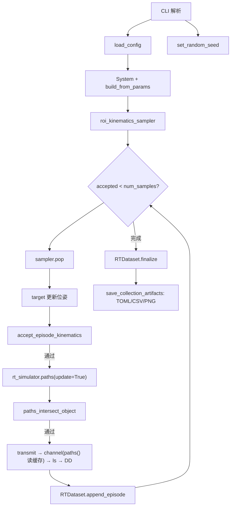

# run_data_collection 运行逻辑说明

本文档说明 [`script/data_collection/run_data_collection.py`](../script/data_collection/run_data_collection.py) 的入口、数据流与输出约定，便于独立运行脚本或对接下游训练管线。

---

## 1. 概述

### 脚本职责

`run_data_collection.py` 是 ISAC 数据集采集入口，主流程为：

**平面 ROI 蒙特卡洛采样 → 更新 Sionna RT 目标位姿 → 单 episode 仿真 → 流式写出 HDF5，事后写出 TOML / CSV / PNG**

- 主数据：ROI 裁剪后的复数时延–多普勒谱 `h_dd`（非 CFR）
- 输出目录：`data/`（常量 `DEFAULT_COLLECTION_OUT_DIR`）
- 逐步 MUSIC 感知与样本质量过滤不在此脚本内；感知评估请使用 [`script/evaluation/run_sensing_from_dataset.py`](../script/evaluation/run_sensing_from_dataset.py) 等独立脚本

### 配置与输出

| 项目         | 说明                                                                     |
| ------------ | ------------------------------------------------------------------------ |
| 默认配置文件 | `config/data_collection/data_collection.toml`（CLI `--config_file`） |
| 固定输出目录 | `data/`                                                                |
| 计算设备     | 默认`cuda:0`，可用 `--device cpu`                                    |

### 核心依赖

| 模块                          | 作用                                                                |
| ----------------------------- | ------------------------------------------------------------------- |
| `System`                    | 构建 OFDM / RT / 信道 / 感知链                                      |
| `RTDataset`                 | 流式写入与读取 HDF5                                                 |
| `RoiKinematicsSampler`      | 平面 ROI 内批量采样位置与速度                                       |
| `CollectionSamplingParams`  | `SystemParams.monte_carlo_sampling`（`[monte_carlo_sampling]`） |
| `accept_episode_kinematics` | 场景障碍物过滤（`scene_filter`）                                      |
| `paths_intersect_target`    | RT 路径与目标 mesh 交互检查（可传入已求解 `paths`）                   |
| `los_truth_from_kinematics` | 几何真值（距离、径向速度）                                          |

---

## 2. 运行方式（CLI）

须在 **ISAC conda 环境**中、从仓库根目录执行。

```bash
# 默认配置（empty_room 场景，采样参数见 data_collection.toml）
python script/data_collection/run_data_collection.py

# 自定义设备与随机种子；样本数等采样参数请编辑 TOML 或使用 --config_file
python script/data_collection/run_data_collection.py \
  --device cpu \
  --seed 42
```

### CLI 参数

| 参数                      | 默认值                                          | 说明                                                             |
| ------------------------- | ----------------------------------------------- | ---------------------------------------------------------------- |
| `--config_file`         | `config/data_collection/data_collection.toml` | 仿真与采样 TOML                                                  |
| `--device` / `-d`     | `cuda:0`                                      | `cuda:0` 或 `cpu`                                            |
| `--seed`                | `42`                                          | 蒙特卡洛随机种子                                                 |
| `--h5_compression`      | `lzf`                                         | HDF5`h_dd` 压缩：`lzf` / `gzip` / `none`                 |

### `[monte_carlo_sampling]` 配置

平面 ROI、速度采样与采集规模在 TOML 中配置（**不由 CLI 覆盖**），由 `SystemParams.from_dict` 解析为 `monte_carlo_sampling`；`SystemComponents.build_from_params` 据此构建 `roi_kinematics_sampler`：

```toml
[monte_carlo_sampling]
num_samples = 20000
sampler_pool_factor = 5
roi = [-2.5, 2.5, -4.5, 4.5]   # xmin, xmax, ymin, ymax（m），z 固定为 0
position_sampling_mode = "uniform"  # uniform | gaussian
speed_range = [0.1, 3.0]          # 速度模值范围 (m/s)
speed_sampling_mode = "uniform"   # uniform | gaussian
```

| 键                         | 必填 | 说明                                                      |
| -------------------------- | ---- | --------------------------------------------------------- |
| `roi`                    | 是   | 平面 ROI 四元组`[xmin, xmax, ymin, ymax]`               |
| `speed_range`            | 是   | 速度模值`[vmin, vmax]` (m/s)，须满足 `0 <= min < max` |
| `num_samples`            | 否   | 最终采纳 episode 数，默认 `20000`                       |
| `sampler_pool_factor`    | 否   | 预采样池倍数，默认 `5`；池大小 = `num_samples × factor`（不可单独配置 `pool_size`） |
| `position_sampling_mode` | 否   | 默认`uniform`                                           |
| `speed_sampling_mode`    | 否   | 默认`uniform`                                           |

切换采样策略时修改配置文件，或通过 `--config_file` 指定另一份 TOML。

---

## 3. 采集流程

`main()` 按以下顺序执行：

1. 解析 CLI，`load_config`，构建 `System`；`SystemComponents.build_from_params` 根据 `[monte_carlo_sampling]` 构建 `roi_kinematics_sampler` 预采样池。
2. 设置随机种子，取 RT 场景与第一个 `rt_target`，打开 HDF5 流式写入器。
3. 循环：采样 → 过滤 → 更新目标位姿 → 仿真 → 追加 episode，直至采纳 TOML 中 `num_samples` 条。
4. `RTDataset.finalize` 写入 HDF5 元数据；`save_collection_artifacts` 写出 TOML / CSV / PNG。



### 蒙特卡洛采样

- `RoiKinematicsSampler` 在 xy 平面 ROI 内采样位置（z=0），速度模值在 `speed_range` 内采样，方向在 xy 平面均匀随机。
- 预采样 `num_samples × sampler_pool_factor` 条，通过 `pop()` 逐条消费。

详见 [`src/isac/collection/roi_sampling.py`](../src/isac/collection/roi_sampling.py)。

### Episode 采纳条件

无独立 CLI，由 TOML 与 RT 场景决定：

1. **`accept_episode_kinematics`**（[`collection/utils.py`](../src/isac/collection/utils.py)）：`scene_filter(pos)` 为真（位置不在障碍物 AABB 内；`safe_margin` 见 `[rt_simulator.scene_filter]`）
2. **`paths_intersect_target`** / `paths_intersect_object`：RT 路径与目标 mesh 有交互；位姿更新后调用 `rt_simulator.paths(update=True)` 重算并缓存，信道侧经 `RTChannel` 绑定 `paths()` 复用缓存

采样池耗尽时抛出 `RuntimeError`，提示增大 `[monte_carlo_sampling].sampler_pool_factor` 或调整过滤条件。

### 单 episode 仿真链

```text
target(position, velocity, orientation)
  → accept_episode_kinematics（scene_filter）
  → rt_simulator.paths(update=True)（重算并缓存）
  → paths_intersect_object
  → los_truth_from_kinematics（CSV 真值）
  → system.transmit() → x_rg
  → comps.channel(...) → y_rg（内部 paths() 读缓存）
  → comps.ls_channel_estimator(x_rg, y_rg) → h_freq
  → comps.delay_doppler_spectrum(h_freq) → h_dd（ROI 裁剪）
  → RTDataset.append_episode(h_dd, pos, vel)
```

采集默认 **不施加 MTI**（不调用 `moving_target_indication`）。

### 几何真值

- **CSV**：`los_truth_from_kinematics` 写入 `true_range_m`、`true_radial_velocity_mps`（`RxTargetTxGeometric` 几何）
- **训练标签**：训练脚本经 `kinematics_to_target_bins` 从 HDF5 运动学生成 ROI 局部 bin 监督

---

## 4. 输出目录与文件

输出根目录：`data/`（[`src/isac/__init__.py`](../src/isac/__init__.py) 中 `DEFAULT_COLLECTION_OUT_DIR`）。

`scene_slug` 来自 RT 场景 `filename`（默认配置为 `empty_room`），脚本内直接取值：`getattr(rt_simulator.rt_simulator_params, "filename", "None")`。

| 文件                                          | 说明                         |
| --------------------------------------------- | ---------------------------- |
| `data/{scene_slug}_mc_sionna_dataset.h5`    | 主数据集                     |
| `data/{scene_slug}_mc_dataset_episodes.csv` | episode 运动学与几何真值     |
| `data/data_collection.toml`                 | 采集配置副本（保留原文件名） |
| `data/{scene_slug}_scene.png`               | RT 场景渲染图                |

以默认 `empty_room` 场景为例：

```text
data/
├── empty_room_mc_sionna_dataset.h5
├── empty_room_mc_dataset_episodes.csv
├── data_collection.toml
└── empty_room_scene.png
```

---

## 5. 数据格式详解

### 5.1 HDF5 Schema

权威定义见 [`src/isac/datasets.py`](../src/isac/datasets.py) 模块 docstring。

**Datasets：**

| 键名                       | dtype     | shape         | 含义                           |
| -------------------------- | --------- | ------------- | ------------------------------ |
| `bs_pos`                 | float64   | `(3,)`      | 参考发射机`bs1` 位置         |
| `target_position`        | float64   | `(N, 3)`    | 目标位置 (m)                   |
| `target_velocity`        | float64   | `(N, 3)`    | 目标速度 (m/s)                 |
| `delay_doppler_spectrum` | complex64 | `(N, H, W)` | ROI 裁剪后的复数 DD 谱`h_dd` |

**根属性 attrs：**

| 字段 | 说明 |
| ---- | ---- |
| `description` | 英文描述（含 episode 数） |
| `seed`, `roi`, `position_sampling_mode`, `speed_range`, `speed_sampling_mode` | 采集元数据（`seed` 来自 CLI，其余来自 `[monte_carlo_sampling]`） |

episode 条数由 `delay_doppler_spectrum.shape[0]` 推断，不单独写入根属性。

`H × W` 由同目录 TOML `[dd_spectrum_roi]`（默认 `max_range_m=30.0`, `max_velocity_mps=5.0`）与 `[ofdm]` 参数共同决定；ROI 与分辨率不写入 HDF5，消费方从 `data_collection.toml` 经 `System` 获取。

**旧格式**：若 HDF5 中存在 `channel_frequency_response` 而非 `delay_doppler_spectrum`，`RTDataset.load` 会报错并提示重新采集。

### 5.2 CSV Schema

文件：`{scene_slug}_mc_dataset_episodes.csv`

列（固定顺序）：

```text
sample_idx, position, velocity, true_range_m, true_radial_velocity_mps
```

- `position` / `velocity`：字符串 `"[x, y, z]"`（两位小数）
- `true_range_m` / `true_radial_velocity_mps`：标量字符串（两位小数）

### 5.3 TOML 配置关系

默认配置：[`config/data_collection/data_collection.toml`](../config/data_collection/data_collection.toml)

以下段影响采集结果，**不由 CLI 覆盖**：

| 段                              | 关键项                                                                        |
| ------------------------------- | ----------------------------------------------------------------------------- |
| 全局                            | `carrier_frequency`                                                         |
| `[source]`                    | `type = "zc"`, `root_index`, `normalize`                                |
| `[ofdm]`                      | `num_symbols`, `fft_size`, `subcarrier_spacing`, CP 等                  |
| `[channel]`                   | `type = "rt"`, `snr_db`                                                   |
| `[rt_simulator]`              | `filename`, 收发机 `bs1`, 目标 `cube`, 路径求解器                       |
| `[rt_simulator.scene_filter]` | `safe_margin`                                                               |
| `[dd_spectrum_roi]`           | `max_range_m`, `max_velocity_mps`                                         |
| `[monte_carlo_sampling]`      | `roi`, `position_sampling_mode`, `speed_range`, `speed_sampling_mode` |

更完整的仿真参数结构见 [system-params-structure.md](system-params-structure.md)。`[monte_carlo_sampling]` 为 `SystemParams` 可选字段，采集脚本要求该段非空。

---

## 6. Python API 调用方式

### 6.1 加载数据集

```python
from isac.collection import RTDataset
from isac import DEFAULT_DATASET_H5

dataset = RTDataset.load(DEFAULT_DATASET_H5)
# 或: RTDataset.load("data/empty_room_mc_sionna_dataset.h5")
```

### 6.2 单条样本（原始谱 + 运动学）

`dataset[i]` 返回原始字段，特征与标签在训练脚本经 `isac.models.preprocess` 生成：

```python
{
    "spectrum_tensor": Tensor,  # (H, W) complex64，ROI 裁切谱
    "target_position": Tensor,  # (3,) float32
    "target_velocity": Tensor,  # (3,) float32
    "bs_pos": Tensor,           # (3,) float32
    "slot": Tensor,             # episode 索引
}
```

CNN / MUSIC 估计器均以 `spectrum_tensor` 为输入、返回 `MusicPeaks`。
训练标签示例：`kinematics_to_target_bins(pos, vel, bs_pos, sensing_performance=sp, ...)`。

`dataset.spectrum_tensor(i)` 返回单条复数 `h_dd`（与 `dataset[i]["spectrum_tensor"]` 一致）。

### 6.3 元数据访问

```python
from isac.collection import RTDataset, sensing_attrs_from_system
from isac.system import System
from isac.utils import load_config
from isac import DEFAULT_DATASET_H5

dataset = RTDataset.load(DEFAULT_DATASET_H5)
config = load_config(DEFAULT_DATASET_H5.parent / "data_collection.toml")
sensing = sensing_attrs_from_system(System(config=config, device="cpu"))
# sensing: max_range_m, max_velocity_mps, range_resolution, velocity_resolution

dataset.collection_meta  # CollectionMetadata
dataset.bs_pos           # (3,) ndarray
len(dataset)             # episode 条数
```

### 6.4 DataLoader 示例

```python
from torch.utils.data import DataLoader
from isac.models import kinematics_to_target_bins

loader = DataLoader(dataset, batch_size=64, shuffle=True)
for batch in loader:
    spectrum = batch["spectrum_tensor"]      # (B, H, W) complex
    target_bins = kinematics_to_target_bins(
        batch["target_position"],
        batch["target_velocity"],
        batch["bs_pos"][0],
        sensing_performance=sp,
        num_doppler_bins=num_doppler_bins,
    )
```

---

## 7. 下游脚本

| 脚本                                                                                                         | 用途                          | 默认数据路径                                                   |
| ------------------------------------------------------------------------------------------------------------ | ----------------------------- | -------------------------------------------------------------- |
| [`script/model_training/run_train_sensing_cnn.py`](../script/model_training/run_train_sensing_cnn.py) | CNN 训练（mono/bistatic） | `--dataset_h5` 默认 `data/empty_room_monostatic_30kHz/...` |
| [`script/evaluation/run_sensing_from_dataset.py`](../script/evaluation/run_sensing_from_dataset.py)         | MUSIC / CNN 感知评估回放      | 同上；要求同目录存在`data_collection.toml`                   |
| [`script/model_training/run_sample_roi_positions.py`](../script/model_training/run_sample_roi_positions.py) | 仅 ROI 采样预览（无 RT 仿真） | 输出`data/sample_roi_positions.csv`                          |

训练示例：

```bash
python script/model_training/run_train_sensing_cnn.py \
  --dataset_h5 data/empty_room_monostatic_30kHz/empty_room_monostatic_mc_sionna_dataset.h5
```

评估示例：

```bash
python script/evaluation/run_sensing_from_dataset.py \
  --dataset_h5 data/empty_room_mc_sionna_dataset.h5 \
  --estimator music
```

---

## 8. 常见问题

| 现象               | 处理                                                                                               |
| ------------------ | -------------------------------------------------------------------------------------------------- |
| 采样池耗尽         | 增大 `[monte_carlo_sampling].sampler_pool_factor`，或调整 `[rt_simulator.scene_filter]` |
| HDF5 报旧 CFR 格式 | 重新运行`run_data_collection.py` 采集 `h_dd` 数据集                                            |
| 接受率过低         | 脚本结束会打印`接受率: X% (accepted/attempts)`；可调整 ROI 或场景配置                            |
| 评估脚本找不到配置 | 确保 HDF5 同目录存在`data_collection.toml`（采集时自动复制）                                     |

---

## 9. 参考源码

| 路径                                                                                                           | 说明                                                    |
| -------------------------------------------------------------------------------------------------------------- | ------------------------------------------------------- |
| [`script/data_collection/run_data_collection.py`](../script/data_collection/run_data_collection.py)           | 采集入口                                                |
| [`src/isac/data_structures/params/sampling_params.py`](../src/isac/data_structures/params/sampling_params.py) | `[monte_carlo_sampling]` 解析                         |
| [`src/isac/datasets.py`](../src/isac/datasets.py)                                                             | HDF5 读写、`RTDataset`、`save_collection_artifacts` |
| [`src/isac/collection/roi_sampling.py`](../src/isac/collection/roi_sampling.py)                               | ROI 位置/速度采样                                       |
| [`src/isac/collection/utils.py`](../src/isac/collection/utils.py)                                             | episode 过滤、路径交互检查、几何真值、场景 slug         |
