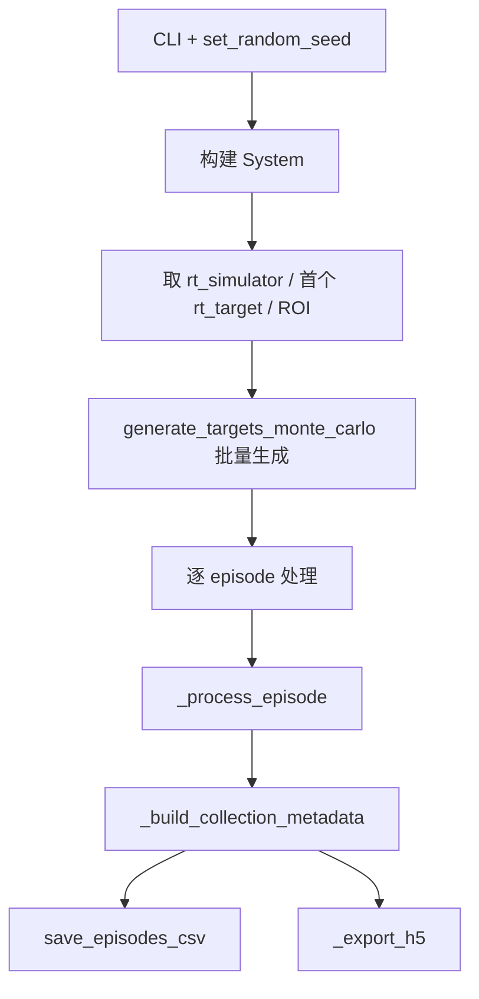
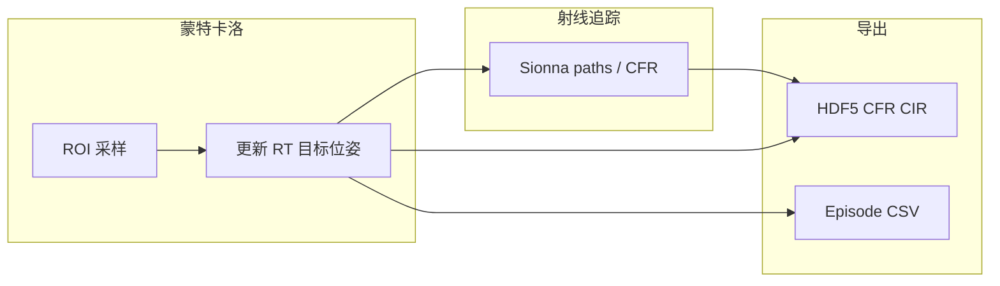

# run_dataset_collection 运行逻辑说明

本文档说明 [`script/model_training/run_dataset_collection.py`](../script/model_training/run_dataset_collection.py) 的入口、数据流与输出约定，便于独立运行脚本或对接下游训练管线。

---

## 1. 概述

### 脚本职责

`run_dataset_collection.py` 是 ISAC 数据集采集入口，主流程为：

**蒙特卡洛 ROI 采样 → 更新 Sionna RT 目标位姿 → 采集 CFR（可选 CIR）→ 写出 CSV / HDF5**

逐步 MUSIC 感知与样本质量过滤已从此脚本移除；感知评估请使用 `script/simulation/sensing/rt/run_sensing_*.py` 等独立脚本。

### 配置与输出

| 项目 | 说明 |
|------|------|
| 默认配置文件 | `config/simulation/sensing/sensing_monostatic_canyon.toml`（CLI `--config_file`） |
| 采集专用配置 | `config/data_collection/data_collection.toml`、`config/data_collection/dataset_collection_cnn.toml` 等 |
| 固定输出目录 | `out/dataset_collection/`（源码常量 `SCRIPT_OUT_DIR`） |
| 计算设备 | 默认 `cuda:0`，可用 `--device cpu` |

### 核心约定

- 几何真值默认取 `RxTargetTxGeometric` 的 `[0, 0, 0]` 切片（单 RX × 单目标 × 单 TX）。
- 蒙特卡洛 ROI：CLI 为 `--roi XMIN XMAX YMIN YMAX` 四元组，`z` 固定为 `0`。
- HDF5 与 CSV 始终写入，无关闭开关。

---

## 2. 整体运行流程

`main()` 按以下顺序执行：

1. 解析 CLI，设置随机种子，解析 ROI。
2. 构建 `System`，创建输出目录。
3. 取 RT 场景与第一个 `rt_target`，解析 ROI，初始化 `EpisodeBuffers`。
4. 调用 `generate_targets_monte_carlo` 批量生成 `(pos, vel)`，逐条 `_process_episode`。
5. 构建 `CollectionMetadata`，写出 CSV / HDF5。



---

## 3. 蒙特卡洛采样

### 采样参数

| 概念 | CLI / 参数 | 默认值 |
|------|-----------|--------|
| ROI（平面） | `--roi XMIN XMAX YMIN YMAX`，z 固定 0 | xy: `(0, 80) × (-40, 40)` |
| 样本数 | `--num_samples` | 10000 |
| 位置分布 | `--sampling_mode`：`uniform` / `gaussian` | `uniform` |
| 速度幅值 | `--speed_range MIN MAX` | 0.1–10 m/s |
| 速度方向 | `--velocity_sampling`：`sphere_uniform` / `axis_box` | `sphere_uniform` |
| 障碍物安全距离 | `--safe_margin` | 1.0 m |
| 位置合法性最大尝试 | `--max_trials_factor` | `num_samples × 20` |

### 采样流程

- 一次性调用 `target_generation.generate_targets_monte_carlo` 得到 `(pos_arr, vel_arr)`。
- 逐条通过 `_update_rt_target_pose_from_velocity` 更新 RT 目标位姿，再 `_process_episode`。

### 目标位姿更新

每条 episode 通过 `_update_rt_target_pose_from_velocity` 驱动 RT 目标：

- 写入三维位置与速度。
- 由速度方向向量推导 yaw / pitch / roll（速度接近零时默认朝向 `[1, 0, 0]`）。
- 随后 Sionna 射线追踪重算路径与 CFR。

---

## 4. 单 episode 处理（`_process_episode`）

对每个有效样本，按固定顺序执行：

### 4.1 几何真值

从 `RxTargetTxGeometric.from_states` 取默认三元组 `(rx=0, target=0, tx=0)`：

- `true_range_m`：径向距离
- `true_radial_velocity_mps`：径向速度

写入 CSV 行的 kinematics 列（位置、速度、上述真值）。

### 4.2 缓冲写入

| 开关 | 缓冲内容 |
|------|---------|
| 默认写 CSV | 追加一行 episode 字典到 `csv_rows` |
| 默认写 HDF5 | `scene.cfr_numpy(rg)` → `h_freq_list`；目标 pos/vel 列表 |
| `--save-cir` | 额外追加 CIR 幅度与时延（ragged，后 stack） |

---

## 5. 输出产物

所有产物默认写入 **`out/dataset_collection/`**，文件名中的 `{scene_slug}` 来自 RT 场景的 `output_slug`。

### 5.1 CSV

由 `save_episodes_csv` 写出 `{scene_slug}_mc_dataset_episodes.csv`：所有列的并集，缺失列填空。

**常见列：**

- `sample_idx`, `pos_x/y/z_m`, `vel_x/y/z_mps`, `true_range_m`, `true_radial_velocity_mps`

### 5.2 HDF5

由 `Dataset.from_export_arrays` 封装，`Dataset.save` 落盘：

| 文件名 |
|--------|
| `{scene_slug}_mc_sionna_dataset.h5` |

**必选数据集：**

- `channel_frequency_response`：CFR，与 OFDM 频率网格一致
- `target_position` / `target_velocity`：目标运动学，shape `(num_slots, 3)`
- 根属性：载频、子载波间隔、子载波数、`num_slots`、`description` 等

**可选：**

- `--save-cir`：追加 `channel_impulse_response_a`、`channel_impulse_response_tau`，根属性 `has_cir=true`
- `collection_*` 根属性：seed、config_file、ROI、采样参数等（`CollectionMetadata`）；`collection_run_sensing=false`

发射机参考位置取场景中 `bs1` 的 position，写入 `bs_pos`。

---

## 6. CLI 速查表

### 系统与随机性

| 参数 | 默认 | 说明 |
|------|------|------|
| `--batch_size` | 1 | 批处理大小（传入 `System`） |
| `--config_file` | `simulation/sensing/sensing_monostatic_canyon.toml` | 须含非空 `[rt_simulator]` |
| `--device` / `-d` | `cuda:0` | `cuda:0` 或 `cpu` |
| `--seed` | 42 | 蒙特卡洛位置/速度采样种子 |

### 导出开关

| 参数 | 默认 | 说明 |
|------|------|------|
| `--save-cir` | 关 | HDF5 额外写入 CIR |

HDF5 与 CSV 始终写入，无关闭开关。

### 蒙特卡洛参数

| 参数 | 默认 | 说明 |
|------|------|------|
| `--roi` | 见第 3 节 | 平面 ROI 四元组 |
| `--num_samples` | 10000 | 目标有效样本数 |
| `--sampling_mode` | `uniform` | 位置采样分布 |
| `--safe_margin` | 1.0 | 障碍物包围盒安全距离 (m) |
| `--max_trials_factor` | 20 | 位置合法性最大尝试倍数 |
| `--speed_range` | 0.1 10.0 | 速度幅值范围 (m/s) |
| `--velocity_sampling` | `sphere_uniform` | 速度采样方式 |

---

## 7. 常用运行示例

```bash
# 默认：HDF5 + CSV
python script/model_training/run_dataset_collection.py

# CNN 训练数据：专用配置、较少样本
python script/model_training/run_dataset_collection.py \
  --config_file config/data_collection/dataset_collection_cnn.toml \
  --num_samples 1000

# 自定义 ROI 与样本数
python script/model_training/run_dataset_collection.py \
  --roi 10 60 -20 20 \
  --num_samples 500 \
  --seed 0

# 带 CIR
python script/model_training/run_dataset_collection.py \
  --save-cir
```

---

## 8. 相关代码索引

| 模块 | 路径 | 作用 |
|------|------|------|
| 采集入口 | [`script/model_training/run_dataset_collection.py`](../script/model_training/run_dataset_collection.py) | 本文档对应脚本 |
| 仿真系统 | [`src/isac/system.py`](../src/isac/system.py) | `System` 构建与组件编排 |
| 几何真值 | [`src/isac/channel/rt/rx_target_tx_geometric.py`](../src/isac/channel/rt/rx_target_tx_geometric.py) | `RxTargetTxGeometric` |
| 蒙特卡洛采样 | [`src/isac/utils/target_generation.py`](../src/isac/utils/target_generation.py) | ROI 位置/速度生成 |
| HDF5 读写 | [`src/isac/datasets.py`](../src/isac/datasets.py) | `Dataset`、`CollectionMetadata` |
| PyTorch 数据集 | [`src/isac/learning/torch_dataset.py`](../src/isac/learning/torch_dataset.py) | 训练侧 `Dataset.load` 消费 |
| 独立感知脚本 | [`script/simulation/sensing/rt/`](../script/simulation/sensing/rt/) | 单步/演示感知评估 |

---

## 9. 数据流简图


