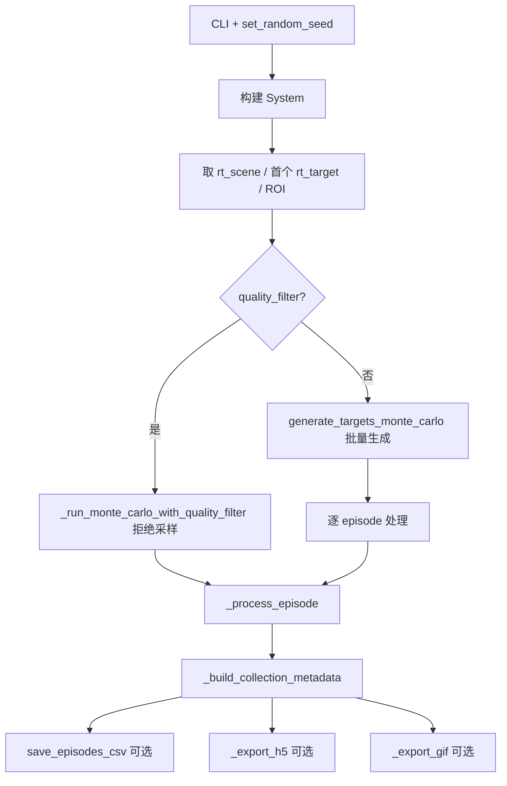
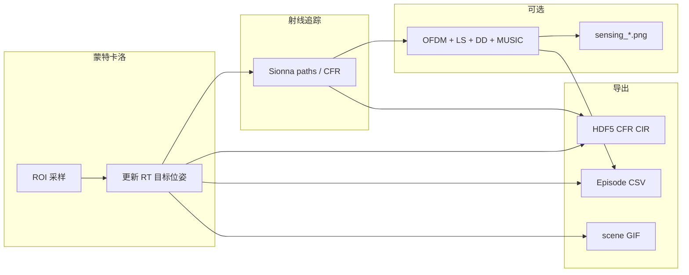

# run_dataset_collection 运行逻辑说明

本文档说明 [`script/model_training/run_dataset_collection.py`](../script/model_training/run_dataset_collection.py) 的入口、数据流、感知链路与输出约定，便于独立运行脚本或对接下游训练管线。

---

## 1. 概述

### 脚本职责

`run_dataset_collection.py` 是 ISAC 数据集采集入口，主流程为：

**蒙特卡洛 ROI 采样 → 更新 Sionna RT 目标位姿 → 采集 CFR（可选 CIR）→ 可选逐步感知 → 写出 CSV / HDF5 / GIF**

### 与独立感知脚本的区别

与 `run_sensing_monostatic.py` 等脚本不同：本脚本将感知评估嵌在数据采集主循环内，并承担批量 episode 的 I/O（CSV、HDF5、GIF），而非仅做单步感知演示。

### 配置与输出

| 项目 | 说明 |
|------|------|
| 默认配置文件 | `config/simulation/sensing/sensing_monostatic_canyon.toml`（CLI `--config_file`） |
| 采集专用配置 | `config/data_collection/data_collection.toml`、`config/data_collection/dataset_collection_cnn.toml` 等 |
| 固定输出目录 | `out/dataset_collection/`（源码常量 `SCRIPT_OUT_DIR`） |
| 计算设备 | 默认 `cuda:0`，可用 `--device cpu` |

### 核心约定

- 几何真值与感知评估默认取 `RxTargetTxGeometric` 的 `[0, 0, 0]` 切片（单 RX × 单目标 × 单 TX）。
- 蒙特卡洛 ROI：CLI 为 `--roi XMIN XMAX YMIN YMAX` 四元组，`z` 固定为 `0`。
- CSV 中逐步 RMSE 为「本 episode 估计 vs 真值」；控制台 `match_peaks_and_compute_radial_rmse` 打印的是匈牙利跨峰 RMSE。
- `--run_sensing` 时，时延–多普勒谱图固定覆盖写入 `sensing_monostatic_delay_doppler_spectrum.png`，便于查看最新一步。

---

## 2. 整体运行流程

`main()` 按以下顺序执行：

1. 解析 CLI，设置随机种子，整理 `CollectionConfig`。
2. 构建 `System`，创建输出目录。
3. 取 RT 场景与第一个 `rt_target`，解析 ROI。
4. 按是否启用质量过滤，走两条蒙特卡洛路径之一（见第 3 节）。
5. 对每个有效 episode 调用 `_process_episode`。
6. 构建 `CollectionMetadata`，写出 CSV / HDF5 / GIF。



**分支说明：**

- **质量过滤默认开启**（`--quality_filter`）。开启时走 `_run_monte_carlo_with_quality_filter`：每次随机采样 `(pos, vel)`，通过质量门控后才计入样本，直至凑满 `num_samples`，或超出 `num_samples × quality_max_trials_factor` 次尝试后报错。
- **关闭质量过滤**（`--no-quality-filter`）时，一次性批量生成全部 `(pos, vel)`，再逐条 `_process_episode`，不再做拒绝采样。

---

## 3. 蒙特卡洛采样

### 采样参数

| 概念 | CLI / 参数 | 默认值 |
|------|-----------|--------|
| ROI（平面） | `--roi XMIN XMAX YMIN YMAX`，z 固定 0 | xy: `(0, 80) × (-40, 40)` |
| 样本数 | `--num_samples` | 10000 |
| 位置分布 | `--sampling_mode`：`uniform` / `gaussian` | `uniform` |
| 速度幅值 | `--speed_range MIN MAX` | 0.1–10 m/s |
| 速度方向 | `--velocity_sampling`：`sphere_uniform` / `axis_box` | `sphere_uniform` |
| 障碍物安全距离 | `--safe_margin` | 1.0 m |
| 位置合法性最大尝试 | `--max_trials_factor` | `num_samples × 20` |
| 质量过滤最大尝试 | `--quality_max_trials_factor` | `num_samples × 50` |

### 两条采样路径

**路径 A：质量过滤 + 拒绝采样**（`quality_filter=True`，默认）

- 循环内调用 `target_generation.generate_monte_carlo_points` 生成 1 个合法位置。
- 调用 `target_generation.sample_monte_carlo_velocities` 生成 1 个速度向量。
- 更新 RT 目标后，用 `evaluate_sample_quality` 判断是否接受；拒绝则重新采样，接受则 `_process_episode`。

**路径 B：批量生成**（`quality_filter=False`）

- 一次性调用 `target_generation.generate_targets_monte_carlo` 得到 `(pos_arr, vel_arr)`。
- 逐条更新目标位姿并 `_process_episode`。

### 目标位姿更新

每条 episode 通过 `_update_rt_target_pose_from_velocity` 驱动 RT 目标：

- 写入三维位置与速度。
- 由速度方向向量推导 yaw / pitch / roll（速度接近零时默认朝向 `[1, 0, 0]`）。
- 随后 Sionna 射线追踪重算路径与 CFR。

---

## 4. 单 episode 处理（`_process_episode`）

对每个有效样本，按固定顺序执行：

### 4.1 几何真值

从 `RxTargetTxGeometric.from_states` 取默认三元组 `(rx=0, target=0, tx=0)`：

- `true_range_m`：径向距离
- `true_radial_velocity_mps`：径向速度

写入 CSV 行的 kinematics 列（位置、速度、上述真值）。

### 4.2 可选感知（`--run_sensing`）

感知链路共用 `_estimate_delay_doppler_spectrum`：

```
OFDM 发射 → 信道施加（frequency 或 time 域）→ LS 信道估计 → 时延–多普勒谱
```

#### 单基地（`--sensing_layout monostatic`，默认）

- MUSIC 估计器：`sens_mode=monostatic`，`metric_mode=delay_doppler`。
- 真值：几何径向距离与径向速度。
- 匈牙利匹配后打印跨峰 RMSE；CSV 追加 `est_range_m`、`est_radial_velocity_mps` 及逐步 RMSE 列。

#### 双基地（`--sensing_layout bistatic`）

- MUSIC 估计器：`sens_mode=bistatic`。
- 真值：LoS 总路径长度 + 从 `paths.tau` 中匹配最近路径读取 `paths.doppler`，再经 `doppler_to_velocity(..., "bistatic")` 换算标量速度。
- CSV 列与 legacy 固定表头不一致；若同时启用 `--run_sensing` 与 `csv_mode=legacy`，脚本会自动改用 `csv_mode=unified`。

#### 谱图预览

每步感知后覆盖写入：

`out/dataset_collection/sensing_monostatic_delay_doppler_spectrum.png`

### 4.3 缓冲写入

| 开关 | 缓冲内容 |
|------|---------|
| `--no-save-csv` 未指定（默认写 CSV） | 追加一行 episode 字典到 `csv_rows` |
| 默认写 HDF5 | `scene.cfr_numpy(rg)` → `h_freq_list`；目标 pos/vel 列表 |
| `--save-cir` | 额外追加 CIR 幅度与时延（ragged，后 stack） |
| `--save_gif` | `scene.render()` 捕获 RGB 帧 → `scene_frames` |

---

## 5. 样本质量过滤

启用 `--quality_filter`（默认）时，采集脚本通过 [`isac.data_collection.quality_filter`](../src/isac/data_collection/quality_filter.py) 编排质量过滤：

- **`run_monte_carlo_with_quality_filter`**：拒绝采样循环，直至凑满 `num_samples` 个可检测样本。
- **`assess_collection_sample`**：单样本评估（几何真值 + CFR → 底层门控）。
- **`QualityFilterConfig`**：CLI 阈值与 `sample_quality_config()` 映射。

底层 LoS / DD 谱峰检测仍由 [`isac.sensing.sample_quality`](../src/isac/sensing/sample_quality.py) 的 `evaluate_sample_quality` 实现。

| 检查项 | 相关 CLI | 默认 |
|--------|---------|------|
| LoS 路径存在且与几何时延一致 | `--require_los` / `--no-require_los` | 要求 LoS |
| 几何最近路径幅度 / 最强路径幅度 | `--min_los_ratio` | 0.3 |
| DD 谱峰相对全局均值的突出度 | `--min_peak_prominence_db` | 6.0 dB |
| 谱峰与几何 bin 偏差 | `--max_bin_offset` | 3 bin |

拒绝原因统计写入 `QualityFilterStats`（定义于 `data_collection.quality_filter`），采集结束后打印摘要，并序列化到 HDF5 根属性 `collection_quality_*`（见 `CollectionMetadata`）。

若过滤后样本不足，脚本报错并提示放宽 ROI、阈值或增大 `--quality_max_trials_factor`。

---

## 6. 输出产物

所有产物默认写入 **`out/dataset_collection/`**，文件名中的 `{scene_slug}` 来自 RT 场景的 `output_slug`。

### 6.1 CSV

由 `save_episodes_csv` 写出：

| 模式 | 文件名 | 说明 |
|------|--------|------|
| `unified`（推荐双基地） | `{scene_slug}_mc_dataset_episodes.csv` | 所有列的并集，缺失列填空 |
| `legacy` + 无感知 | `{scene_slug}_mc_dataset_kinematics.csv` | 仅 kinematics + 几何真值 |
| `legacy` + 感知 | `{scene_slug}_mc_dataset_sensing_metrics.csv` | 单基地感知固定列 |

**unified 模式常见列（随选项变化）：**

- 共有：`sample_idx`, `pos_x/y/z_m`, `vel_x/y/z_mps`, `true_range_m`, `true_radial_velocity_mps`
- 单基地感知：`est_range_m`, `rmse_range_m`, `est_radial_velocity_mps`, `rmse_radial_velocity_mps`
- 双基地感知：`true_los_path_length_m`, `true_velocity_paths_doppler_mps`, `est_los_path_length_m`, `est_velocity_paths_doppler_mps`, `rmse_los_path_m`, `rmse_velocity_paths_doppler_mps`

### 6.2 HDF5

由 `Dataset.from_export_arrays` 封装，`Dataset.save` 落盘：

| 条件 | 文件名 |
|------|--------|
| 默认采集（无 `--run_sensing`） | `{scene_slug}_mc_sionna_dataset.h5` |
| `--run_sensing` | `{scene_slug}_mc_monostatic_sensing.h5` |

**必选数据集：**

- `channel_frequency_response`：CFR，与 OFDM 频率网格一致
- `target_position` / `target_velocity`：目标运动学，shape `(num_slots, 3)`
- 根属性：载频、子载波间隔、子载波数、`num_slots`、`description` 等

**可选：**

- `--save-cir`：追加 `channel_impulse_response_a`、`channel_impulse_response_tau`，根属性 `has_cir=true`
- `collection_*` 根属性：seed、config_file、ROI、采样参数、质量过滤统计等（`CollectionMetadata`）

发射机参考位置取场景中 `bs1` 的 position，写入 `bs_pos`。

### 6.3 GIF

`--save_gif` 时导出：

`out/dataset_collection/scene_image_mc.gif`

由各 episode 的场景渲染帧合成（`time_slot=1`, `speed=5`）。

---

## 7. CLI 速查表

### 系统与随机性

| 参数 | 默认 | 说明 |
|------|------|------|
| `--batch_size` | 1 | 批处理大小（传入 `System`） |
| `--config_file` | `simulation/sensing/sensing_monostatic_canyon.toml` | 须含非空 `[rt_scene]` |
| `--device` / `-d` | `cuda:0` | `cuda:0` 或 `cpu` |
| `--seed` | 42 | 蒙特卡洛位置/速度采样种子 |

### 导出开关

| 参数 | 默认 | 说明 |
|------|------|------|
| （默认） | 写 HDF5 + CSV | — |
| `--no-save-h5` | — | 不写 HDF5 |
| `--no-save-csv` | — | 不写 CSV |
| `--save-cir` | 关 | HDF5 额外写入 CIR |
| `--save_gif` | 关 | 导出场景 GIF |

### 感知选项

| 参数 | 默认 | 说明 |
|------|------|------|
| `--run_sensing` | 关 | 每样本执行感知链 |
| `--sensing_domain` | `frequency` | `frequency` 或 `time` |
| `--sensing_layout` | `monostatic` | `monostatic` 或 `bistatic` |
| `--csv_mode` | `legacy` | `unified` 或 `legacy` |
| `--log_per_step_sensing` | 关 | 每步打印感知一行日志 |
| `--velocity_model` | `monostatic` | 保留 CLI 兼容；双基地真值经 paths.doppler 换算 |

### 蒙特卡洛参数

| 参数 | 默认 | 说明 |
|------|------|------|
| `--roi` | 见第 3 节 | 平面 ROI 四元组 |
| `--num_samples` | 10000 | 目标有效样本数 |
| `--sampling_mode` | `uniform` | 位置采样分布 |
| `--safe_margin` | 1.0 | 障碍物包围盒安全距离 (m) |
| `--max_trials_factor` | 20 | 位置合法性最大尝试倍数 |
| `--speed_range` | 0.1 10.0 | 速度幅值范围 (m/s) |
| `--velocity_sampling` | `sphere_uniform` | 速度采样方式 |

### 质量过滤

| 参数 | 默认 | 说明 |
|------|------|------|
| `--quality_filter` | 开 | 启用 LoS + DD 谱峰质量过滤 |
| `--no-quality-filter` | — | 关闭，保留所有几何合法样本 |
| `--require_los` | 开 | 要求有效 LoS 路径 |
| `--no-require_los` | — | 跳过 LoS 检查 |
| `--min_los_ratio` | 0.3 | LoS 幅度比下限 |
| `--min_peak_prominence_db` | 6.0 | 谱峰突出度下限 (dB) |
| `--max_bin_offset` | 3 | 谱峰与几何 bin 最大偏差 |
| `--quality_max_trials_factor` | 50 | 质量过滤最大尝试倍数 |

---

## 8. 常用运行示例

```bash
# 默认：质量过滤 + HDF5/CSV，无感知
python script/model_training/run_dataset_collection.py

# CNN 训练数据：专用配置、较少样本、关闭质量过滤
python script/model_training/run_dataset_collection.py \
  --config_file config/data_collection/dataset_collection_cnn.toml \
  --num_samples 1000 \
  --no-quality-filter

# 自定义 ROI 与样本数
python script/model_training/run_dataset_collection.py \
  --roi 10 60 -20 20 \
  --num_samples 500 \
  --seed 0

# 带逐步感知 + CIR + GIF + 统一 CSV
python script/model_training/run_dataset_collection.py \
  --run_sensing \
  --save-cir \
  --save_gif \
  --csv_mode unified \
  --log_per_step_sensing

# 双基地感知（建议 unified CSV）
python script/model_training/run_dataset_collection.py \
  --run_sensing \
  --sensing_layout bistatic \
  --csv_mode unified
```

---

## 9. 相关代码索引

| 模块 | 路径 | 作用 |
|------|------|------|
| 采集入口 | [`script/model_training/run_dataset_collection.py`](../script/model_training/run_dataset_collection.py) | 本文档对应脚本 |
| 仿真系统 | [`src/isac/system.py`](../src/isac/system.py) | `System` 构建与组件编排 |
| 几何真值 | [`src/isac/channel/rt/rx_target_tx_geometric.py`](../src/isac/channel/rt/rx_target_tx_geometric.py) | `RxTargetTxGeometric` |
| 蒙特卡洛采样 | [`src/isac/utils/target_generation.py`](../src/isac/utils/target_generation.py) | ROI 位置/速度生成 |
| 质量过滤编排 | [`src/isac/data_collection/quality_filter.py`](../src/isac/data_collection/quality_filter.py) | 拒绝采样、`QualityFilterConfig`、`QualityFilterStats` |
| 样本质量检测 | [`src/isac/sensing/sample_quality.py`](../src/isac/sensing/sample_quality.py) | LoS / DD 谱峰底层门控 |
| HDF5 读写 | [`src/isac/datasets.py`](../src/isac/datasets.py) | `Dataset`、`CollectionMetadata` |
| PyTorch 数据集 | [`src/isac/learning/torch_dataset.py`](../src/isac/learning/torch_dataset.py) | 训练侧 `Dataset.load` 消费 |

---

## 10. 数据流简图


