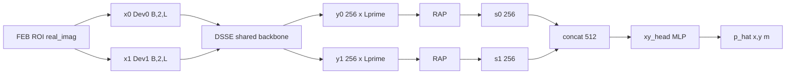

# STP-CNN 架构图说明

本文档对照架构示意图，按模块从左到右说明当前最佳配置下的 **STP-CNN**（实现类 `CooperativeMonostaticCNN`，`late` + `attention`）。训练配方与评测数字见 [`cooperative_monostatic_cnn.md`](cooperative_monostatic_cnn.md)。

图风格对标 Fu *et al.*, IEEE Commun. Lett., 2025（DMISC）**Fig. 2**：左右 Spectral Encoder / Joint Localization Decoder、并行支路、虚线内嵌展开块；记号 `Conv(c,k,s)`，\(\downarrow\) 为距离维下采样（本模型无上采样重建）。


生成命令：`python script/docs/plot_stp_cnn_architecture.py`

---

## 1. 图注与总览

| 项 | 说明 |
| --- | --- |
| 名称 | STP-CNN（`CooperativeMonostaticCNN`） |
| 配置 | `fusion_mode=late`，`pool_mode=attention` |
| 任务 | 双站 ROI 距离谱 → 目标平面坐标 `(x, y)`（单位 m） |
| 编码器 | Spectral Encoder / DSSE（两站共享 \(\theta\)） |
| 解码 / 融合 | Joint Localization Decoder / LFRH（Concat + MLP；无 DeConv） |
| 参数量 | 约 `5.0×10⁵`（503 939） |
| 训练配方标签 | `aug_spec_only` |
| 默认权重 | `models/cnn_improve_next/aug_spec_only/best_model.pth` |
| 与 DMISC Fig.2 对应 | \(\mathrm{CB}\!\to\!\) Stem+ResBlocks；\(\mathrm{SB}\!\to\!\) RAP；无信道 \(w_n\)；Decoder 为定位头而非图像重建 |

图左为 **Spectral Encoder (DSSE)**，图右为 **Joint Localization Decoder (LFRH)**；底部虚线框为 CB₀ / ResBlock / RAP 内部结构。

---

## 2. FEB（Feature Extraction Block）

图中顶部浅色框，**非可学习**预处理。

流程：

```text
profiles_dev0 / profiles_dev1
  → ROI 裁切 0–4 m
  → real_imag 特征
  → (B, 4, L)
  → 拆分：Dev0 (B, 2, L) | Dev1 (B, 2, L)
```

- 每站 2 通道为复数距离谱的实部 / 虚部。
- 不做按站 RMS 归一化（`feature_norm=none`），保留绝对幅度信息。
- 实现见 [`src/isac/models/preprocess.py`](../src/isac/models/preprocess.py)（`dual_roi_to_real_imag_features` 等）。

图中支路输入记为 \(x_0\)（Dev0）、\(x_1\)（Dev1）。

---

## 3. DSSE（Dual-Station Shared Spectral Encoder）

两站各走一条支路，**权重共享**。每站输入 \(x_n \in \mathbb{R}^{2\times L}\)，经共享 1D 骨干得到张量语义特征 \(y_n\)。

实现：[`_build_conv1d_backbone`](../src/isac/models/model_design.py) / `Conv1dResidualBlock`。

### 3.1 Stem（CB₀）

```text
Conv1d(2→64, k=7, stride=2, pad=3) + BN + ReLU
MaxPool1d(k=3, stride=2, pad=1)
```

距离维约下采样 4 倍（\(L \downarrow \approx 4\)）。

### 3.2 ResBlock₁–₃

每个残差块为双路径结构（与架构图左下角内嵌示意图一致；记号 `Conv(c, k, s)` = 输出通道、核长、步长）：

```text
              ┌─ Conv(c_out, 1, s)+BN  或  Identity ─┐
in ───────────┤                                       ⊕ → ReLU → out
              └─ Conv(c_out, 3, s) → BN+ReLU
                   → Conv(c_out, 3, 1) → BN ──────────┘
```

- 主路：两层 `Conv1d(k=3)`，其间 BN+ReLU；第二层步长恒为 1，输出再经 BN。
- 捷径：输入输出同形（同通道且 `s=1`）时为 Identity；否则 `Conv1d(k=1, stride=s)+BN`。
- 两路相加后接 ReLU（实现类 `Conv1dResidualBlock`）。

| 块 | 通道 | 步长 | 捷径 |
| --- | --- | --- | --- |
| ResBlock₁ | 64→64 | \(s=1\) | Identity |
| ResBlock₂ | 64→128 | \(s=2\) | `Conv(128, 1, 2)+BN`（距离维 \(\downarrow 2\)） |
| ResBlock₃ | 128→256 | \(s=2\) | `Conv(256, 1, 2)+BN`（距离维 \(\downarrow 2\)） |

输出（每站）：

\[
y_n \in \mathbb{R}^{256 \times L'},\qquad L' \approx L/16.
\]

---

## 4. RAP（Range Attention Pool）

图中每条支路末端保留紧凑方框 **RAP / Attn Pool**；底部内嵌图为其双分支结构（实现 `RangeAttentionPool1d` / `CooperativeRangePool(pool_mode=attention)`）：

```text
                    ┌─ Conv(1, 1, 1) → Softmax → α ─┐
 y_n (C×L') ────────┤                                ⊙ ──→ Σ_ℓ ──→ s_n (C)
                    └──────── identity (features) ───┘
```

- 上路：可学习打分 `Conv1d(256→1, k=1)`，再沿距离维 Softmax 得注意力权重 \(\alpha\)。
- 下路：特征 \(y_n\) 直通。
- \(\odot\)：按距离 bin 加权（\(\alpha\) broadcast 乘到各通道）。
- \(\sum_\ell\)：沿 range 维求和，得到固定长度语义向量。

两站输出：\(s_0, s_1 \in \mathbb{R}^{256}\)（\(C=256\)）。

---

## 5. LFRH（Late Fusion Regression Head）

图右侧绿色区域：在融合中心对双站语义向量做联合回归，**无**反卷积上采样或谱重建。

### 5.1 Concat

\[
s = [s_0 \,\|\, s_1] \in \mathbb{R}^{512}.
\]

### 5.2 xy_head MLP

```text
Linear(512 → 128)
ReLU
Dropout(p=0.3)
Linear(128 → 2)
```

输出：

\[
\hat{\mathbf{p}} = (x, y) \in \mathbb{R}^{2}\quad\text{（单位：m）}.
\]

---

## 6. 数据流一览



---

## 7. 相关链接

| 用途 | 路径 |
| --- | --- |
| 完整模型 / 训练 / 评测说明 | [`cooperative_monostatic_cnn.md`](cooperative_monostatic_cnn.md) |
| 英文论文 Section III 草稿 | [`paper_draft_stp_cnn.md`](paper_draft_stp_cnn.md) |
| 架构图脚本 | [`script/docs/plot_stp_cnn_architecture.py`](../script/docs/plot_stp_cnn_architecture.py) |
| 架构图产物 | [`figures/stp_cnn_architecture.png`](figures/stp_cnn_architecture.png) |
| 模型实现 | [`src/isac/models/model_design.py`](../src/isac/models/model_design.py) |
| 特征预处理 | [`src/isac/models/preprocess.py`](../src/isac/models/preprocess.py) |
| 默认 checkpoint | `models/cnn_improve_next/aug_spec_only/best_model.pth` |
