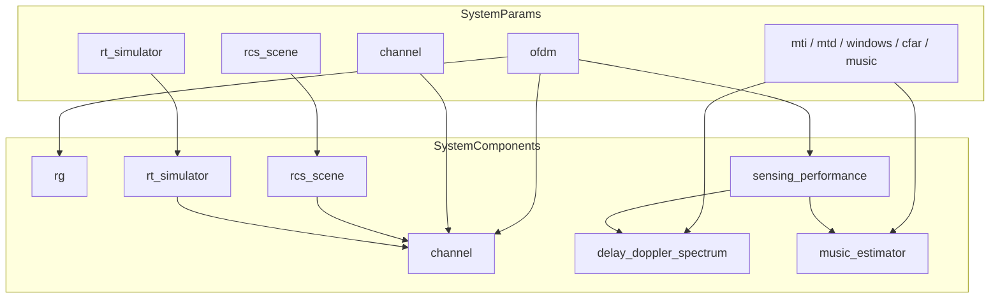

# SystemComponents 组件结构

本文档说明 ISAC 仿真系统的**运行时组件层**：`SystemParams` → `SystemComponents.build_from_params()` → 可调用的 Sionna / ISAC 对象。

源码入口：[`src/isac/data_structures/system_components.py`](../src/isac/data_structures/system_components.py)

## 构建流程

```
SystemParams
    → SystemComponents.build_from_params(params, device="cuda:0")
        → _build_basic（信源 + OFDM）
        → _build_channel（RT / RCS 信道）
        → _build_sensing（感知链）
    → SystemComponents（扁平字段，各 Optional）
    → System.transmit() / channel() / sensing() 等调用
```

**前置条件**：

- 构建 `channel` 需要同时配置 `[ofdm]` 与 `[channel]`（内部需要 `ResourceGrid`）。
- `RCSChannel` 额外需要 `carrier_frequency` 与 `ofdm.samp_rate`。
- 感知组件（`sensing_performance` 及以下）需要 `[ofdm]` 与 `carrier_frequency`；各子组件仍依赖对应 TOML 段非 `None`。

## 字段总览

| 分组 | 字段 | 类型 | 构建条件 |
|------|------|------|----------|
| 信源 | `binary_source` | `BinarySource` | `[source]` 且 `type=binary` |
| | `mapper` | `Mapper` | 同上 |
| | `demapper` | `Demapper` | 同上 |
| | `zc_source` | `ZCSource` | `[source]` 且 `type=zc` |
| OFDM | `rg` | `ResourceGrid` | `[ofdm]` |
| | `rg_mapper` | `ResourceGridMapper` | `[ofdm]` |
| | `modulator` | `OFDMModulator` | `[ofdm]` |
| | `demodulator` | `OFDMDemodulator` | `[ofdm]` |
| | `rg_demapper` | `ResourceGridDemapper` | `[ofdm]` + `[stream_management]` |
| | `ls_channel_estimator` | `LSChannelEstimator` | `[ofdm]`（感知段，依赖 `rg`） |
| 信道 | `rt_simulator` | `RTSimulator` | `[rt_simulator]`（与 channel 段同时存在时） |
| | `rcs_scene` | `RCSScene` | `[rcs_scene]`（`channel.type=rcs` 时） |
| | `channel` | `RTChannel` \| `RCSChannel` | `[channel]` + `[ofdm]` |
| 感知 | `sensing_performance` | `SensingPerformance` | `[ofdm]` + `carrier_frequency` |
| | `moving_target_indication` | `MovingTargetIndication` | + `[mti]` |
| | `moving_target_detection` | `MovingTargetDetection` | + `[mtd]` |
| | `delay_doppler_spectrum` | `DelayDopplerSpectrum` | + `[windows]` |
| | `cfar_detector` | `CFARDetector` | + `[cfar]` |
| | `music_estimator` | `MUSICEstimator` | + `[music]` |

## Params → Components 映射

| SystemParams 字段 | SystemComponents 字段 | 实现类 / 模块 |
|-------------------|-------------------------|---------------|
| `source` (binary) | `binary_source`, `mapper`, `demapper` | Sionna `BinarySource` / `Mapper` / `Demapper` |
| `source` (zc) | `zc_source` | [`ZCSource`](../src/isac/zc_source.py) |
| `ofdm` | `rg`, `rg_mapper`, `rg_demapper`, `modulator`, `demodulator` | Sionna OFDM |
| `[ofdm]`（`rg` 就绪后） | `ls_channel_estimator` | [`LSChannelEstimator`](../src/isac/sensing/ls_channel_estimator.py) |
| `stream_management` | `rg_demapper` | Sionna `ResourceGridDemapper` |
| `rt_simulator` | `rt_simulator` | [`RTSimulator`](../src/isac/channel/rt/rt_simulator.py) |
| `rcs_scene` | `rcs_scene` | [`RCSScene`](../src/isac/channel/rcs/rcs_scene.py) |
| `channel` + `rt_simulator` | `channel` | [`RTChannel`](../src/isac/channel/rt/rt_channel.py) |
| `channel` + `rcs_scene` | `channel` | [`RCSChannel`](../src/isac/channel/rcs/rcs_channel.py) |
| `mti` | `moving_target_indication` | [`MovingTargetIndication`](../src/isac/sensing/clutter_suppression.py) |
| `mtd` | `moving_target_detection` | [`MovingTargetDetection`](../src/isac/sensing/clutter_suppression.py) |
| `windows` | `delay_doppler_spectrum` | [`DelayDopplerSpectrum`](../src/isac/sensing/delay_doppler_spectrum.py) |
| `cfar` | `cfar_detector` | [`CFARDetector`](../src/isac/sensing/cfar.py) |
| `music` | `music_estimator` | [`MUSICEstimator`](../src/isac/sensing/music_estimator.py) |

---

## 信源分支（互斥）

```
source.type == "binary"
    → binary_source + mapper (+ demapper 用于通信解调)
source.type == "zc"
    → zc_source（感知仿真常用）
```

`System.transmit()` 根据 `params.source.type` 选择路径，生成 `(b, x_rg, x_time)`。

---

## 信道分支

### RT 信道（`channel.type = "rt"`）

```
rt_simulator = RTSimulator(
    rt_simulator_params=params.rt_simulator,
    frequency=carrier_frequency,
    bandwidth=rg.bandwidth,
)
channel = RTChannel(rg=rg, paths=lambda: rt_simulator.paths)
```

- 频域 CFR：`domain="freq"`
- 依赖 Sionna 射线追踪路径 `rt_simulator.paths`

### RCS 信道（`channel.type = "rcs"`）

```
rcs_scene = RCSScene.from_params(params.rcs_scene)
channel = RCSChannel(
    rcs_scene=lambda: rcs_scene,
    center_freq=carrier_frequency,
    samp_rate=ofdm.samp_rate,
)
```

- **仅时域**：`domain="time"`
- 场景状态：`rcs_scene()` 返回 ``RCSScene``（含 ``target: RCSTarget``，可运行时 ``update``）
- TOML 配置只读层：``SystemParams.rcs_scene``（``RCSSceneParams``）
- 目标几何：`rcs_scene.target`（`RCSTargetParams`）
- 加噪：`channel(x_rg, x_time, domain="time", snr_db=params.channel.snr_db)`

---

## 感知链

在 `ofdm` 与 `carrier_frequency` 就绪后，按 params 段**独立**构建：

```
SensingPerformance(rg, carrier_frequency)
    ├── MovingTargetIndication      ← [mti]
    ├── MovingTargetDetection       ← [mtd]
    ├── DelayDopplerSpectrum        ← [windows]
    ├── CFARDetector                ← [cfar]
    └── MUSICEstimator              ← [music]
```

`System.sensing()` 典型顺序：时延–多普勒谱 → CFAR → MUSIC → RMSE 评估。

---

## System 调用关系

[`System`](../src/isac/system.py) 持有 `params` 与 `components`：

| 方法 | 主要使用的组件 |
|------|----------------|
| `transmit()` | `zc_source` / `binary_source` + `mapper` + `rg_mapper` + `modulator` |
| `components.channel(x_rg, x_time, domain, snr_db=...)` | `RTChannel` 或 `RCSChannel`；按 `domain` 选用频域或时域输入 |
| `components.demodulator(...)` | `OFDMDemodulator` |
| `sensing(...)` | `delay_doppler_spectrum`, `cfar_detector`, `music_estimator` |

---

## 组件依赖图



---

## 相关文档

- 参数与 TOML 字段：[`system-params-structure.md`](system-params-structure.md)
- RCS 点目标仿真脚本：[`STATIC_TARGET_SIMULATION.md`](STATIC_TARGET_SIMULATION.md)
- 完整 TOML 示例：[`config/system_params_example.toml`](../config/system_params_example.toml)
