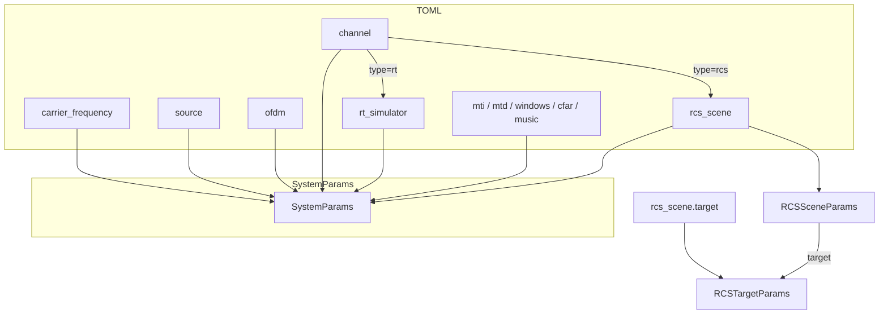

# SystemParams 参数结构

本文档说明 ISAC 仿真系统的**配置参数层**：TOML → `SystemParams` → 各子 `*Params` dataclass。

源码入口：[`src/isac/data_structures/params/system_params.py`](../src/isac/data_structures/params/system_params.py)

## 加载流程

```
TOML 配置文件
    → load_config() 解析为 dict
    → SystemParams.from_dict(config)
    → _validate_channel_dependencies() 校验信道段依赖
    → SystemComponents.build_from_params(params)
```

典型用法见 [`System`](../src/isac/system.py)：`self.params = SystemParams.from_dict(self.config)`。

**解析约定**：

- TOML 段缺失 → 对应 `SystemParams` 字段为 `None`
- TOML 空段（`[windows]` 等无任何键）→ 字段为 `None`（不构建该组件）
- TOML 嵌套子段与 Params 嵌套字段对齐（如 `[rcs_scene.target]` ↔ `RCSSceneParams.target`）

## 顶层结构（SystemParams）

| 字段 | TOML 键 | 类型 | 说明 |
|------|---------|------|------|
| `carrier_frequency` | 顶层 `carrier_frequency` | `float \| None` | 载波频率 (Hz) |
| `source` | `[source]` | `SourceParams \| None` | 信源（binary / zc） |
| `stream_management` | `[stream_management]` | `StreamManagementParams \| None` | 通信解调流管理 |
| `ofdm` | `[ofdm]` | `OFDMParams \| None` | OFDM 网格与调制 |
| `channel` | `[channel]` | `ChannelParams \| None` | 信道类型与 SNR |
| `rt_simulator` | `[rt_simulator]` | `RTSimulatorParams \| None` | 射线追踪场景（`channel.type=rt` 时必填） |
| `rcs_scene` | `[rcs_scene]` | `RCSSceneParams \| None` | RCS 点目标场景（`channel.type=rcs` 时必填） |
| `mti` | `[mti]` | `MTIParams \| None` | 动目标显示 |
| `mtd` | `[mtd]` | `MTDParams \| None` | 动目标检测 |
| `windows` | `[windows]` | `WindowParams \| None` | 时延 / 多普勒窗 |
| `cfar` | `[cfar]` | `CFARParams \| None` | CFAR 检测 |
| `music` | `[music]` | `MusicParams \| None` | MUSIC 估计 |

**约定**：TOML 中未出现的段 → 对应字段为 `None` → `build_from_params` 不构建该组件。空段（如仅写 `[windows]`）仍视为已配置，使用段内默认值。

**派生属性**：`SystemParams.samp_rate` 委托 `ofdm.samp_rate`（`subcarrier_spacing × fft_size`）。

### 信道依赖校验

| `channel.type` | 必须配置的 TOML 段 |
|----------------|-------------------|
| `rt` | `[rt_simulator]` |
| `rcs` | `[rcs_scene]` |

## 模块与文件布局

```
src/isac/data_structures/params/
├── system_params.py          # SystemParams 聚合
├── basic_params.py           # SourceParams, StreamManagementParams, OFDMParams
├── sensing_params.py         # MTI/MTD/Window/CFAR/Music
└── channel_params/
    ├── channel_params.py     # ChannelParams
    ├── rt_simulator_params.py    # RTSimulatorParams 及子结构
    └── rcs_scene_params.py   # RCSTargetParams, RCSSceneParams
```

公共导出：`from isac.data_structures import SystemParams, RCSSceneParams, ...`

**采集专用段**：`config/data_collection/data_collection.toml` 中的 `[monte_carlo_sampling]` 解析为可选字段 `SystemParams.monte_carlo_sampling`（类型 [`CollectionSamplingParams`](../src/isac/data_structures/params/sampling_params.py)）；含 `num_samples`、`sampler_pool_factor`（预采样池 = 二者之积，由 `pool_size` 属性计算）；仿真类 TOML 无此段时为 `None`。

---

## basic_params（[`basic_params.py`](../src/isac/data_structures/params/basic_params.py)）

### SourceParams — `[source]`

| 字段 | 默认 | 说明 |
|------|------|------|
| `type` | `"binary"` | `"binary"` \| `"zc"` |
| `root_index` | `1` | ZC 根索引（`type=zc`） |
| `normalize` | `True` | ZC 是否归一化 |
| `num_bits_per_symbol` | `None` | QAM 每符号比特数（**`type=binary` 时必填**） |

### StreamManagementParams — `[stream_management]`

| 字段 | 默认 | 说明 |
|------|------|------|
| `rx_tx_association` | `[[1]]` | RX–TX 关联矩阵 |
| `num_streams` | `1` | 流数 |

### OFDMParams — `[ofdm]`

| 字段 | 默认 | 说明 |
|------|------|------|
| `num_symbols` | `512` | OFDM 符号数 |
| `fft_size` | `2048` | FFT 点数 |
| `subcarrier_spacing` | `30000.0` | 子载波间隔 (Hz) |
| `cyclic_prefix_length` | `0` | CP 长度 |
| `l_min` | `-6` | OFDM 解调器最小时延抽头 |
| `dc_null` | `False` | 是否 DC 置空 |

---

## channel_params

### ChannelParams — `[channel]`

| 字段 | 默认 | 说明 |
|------|------|------|
| `type` | `"rt"` | `"rt"`（Sionna RT）\| `"rcs"`（gr-radar 风格点目标） |
| `snr_db` | `10.0` | 加噪 SNR (dB)；`None` 时不加 AWGN（由 `Channel.__call__` 控制） |

### RCS 场景 — `[rcs_scene]` / `[rcs_scene.target]`

定义于 [`rcs_scene_params.py`](../src/isac/data_structures/params/channel_params/rcs_scene_params.py)。

TOML 示例：

```toml
[rcs_scene]
self_coupling_db = -10.0
rndm_phaseshift = true
self_coupling = true

[rcs_scene.target]
range_m = 95.0
velocity_mps = 5.0
rcs = 1e25
azimuth_deg = 0.0
position_rx_m = 0.0
```

**RCSTargetParams** — `[rcs_scene.target]`（必填非空）：

| 字段 | 默认 | 说明 |
|------|------|------|
| `range_m` | `100.0` | 目标距离 (m) |
| `velocity_mps` | `0.0` | 径向速度 (m/s) |
| `rcs` | `1e25` | 雷达散射截面 |
| `azimuth_deg` | `0.0` | 方位角 (deg) |
| `position_rx_m` | `0.0` | 接收机位置（方位时延几何） |

**RCSSceneParams** — `[rcs_scene]` 顶层：

| 字段 | 默认 | 说明 |
|------|------|------|
| `target` | `RCSTargetParams()` | 点目标几何/散射 |
| `self_coupling_db` | `-10.0` | 自耦合直通增益 (dB) |
| `rndm_phaseshift` | `True` | 随机初相 |
| `self_coupling` | `True` | 是否启用自耦合 |

访问目标字段：`params.rcs_scene.target.range_m`（无扁平 property 委托）。

运行时对应类：[`RCSTarget`](../src/isac/channel/rcs/rcs_target.py)（channel 层，字段与 `RCSTargetParams` 一致）。

**物理量**：`samp_rate`、`center_freq` 不在 params 中存储，由 `RCSChannel` 构造时从 `ofdm.samp_rate` 与 `carrier_frequency` 注入。

### RT 场景 — `[rt_simulator]`

定义于 [`rt_simulator_params.py`](../src/isac/data_structures/params/channel_params/rt_simulator_params.py)。

**RTSimulatorParams** 顶层：

| 字段 | TOML 子段 | 说明 |
|------|-----------|------|
| `filename` | — | 场景 mesh 文件名 |
| `merge_shapes` | — | 是否合并同材质形状 |
| `camera` | `[rt_simulator.camera]` | `CameraParams` |
| `antenna_arrays` | `[rt_simulator.antenna_arrays.*]` | 命名天线阵列 |
| `transceivers` | `[rt_simulator.transceivers.*]` | 命名收发器 |
| `target_materials` | `[rt_simulator.target_materials.*]` | 目标材质 |
| `targets` | `[rt_simulator.targets.*]` | 目标位姿/速度 |
| `path_solver` | `[rt_simulator.path_solver]` | 路径求解器 |

常用子结构字段见 [`config/simulation/sensing/sensing_monostatic.toml`](../config/simulation/sensing/sensing_monostatic.toml) 示例。

---

## sensing_params（[`sensing_params.py`](../src/isac/data_structures/params/sensing_params.py)）

### MTIParams — `[mti]`

| 字段 | 默认 | 说明 |
|------|------|------|
| `filter_order` | `1` | 滤波阶数 |
| `prf` | `None` | 脉冲重复频率 |

### MTDParams — `[mtd]`

| 字段 | 默认 | 说明 |
|------|------|------|
| `num_filters` | `None` | 多普勒滤波器组数量 |

### WindowParams — `[windows]`

| 字段 | 默认 | 说明 |
|------|------|------|
| `delay_window` | `None` | 时延维窗（字符串或 dict） |
| `doppler_window` | `None` | 多普勒维窗 |

### CFARParams — `[cfar]`

| 字段 | 默认 | 说明 |
|------|------|------|
| `type` | `"ca"` | `"ca"` \| `"os"` |
| `k` | `None` | OS-CFAR 秩（`type=os` 时必填） |
| `guard` | `2` | 保护单元 |
| `trailing` | `20` | 参考单元 |
| `pfa` | `1e-4` | 虚警率 |
| `detector` | `"linear"` | `"linear"` \| `"squarelaw"` |
| `offset` | `None` | 检测偏移 |

### MusicParams — `[music]`

| 字段 | 默认 | 说明 |
|------|------|------|
| `threshold` | `0.1` | 谱峰阈值 |

---

## 配置示例对照

| 场景 | 配置文件 | `channel.type` | 场景段 |
|------|----------|----------------|--------|
| RT 单基地感知 | `config/simulation/sensing/sensing_monostatic.toml` | `rt` | `[rt_simulator]` |
| RCS 点目标感知 | `config/simulation/sensing/static_target_simulation.toml` | `rcs` | `[rcs_scene]` |
| 完整字段参考 | `config/system_params_example.toml` | 默认 `rt` | 含注释示例 |

## 参数关系图


