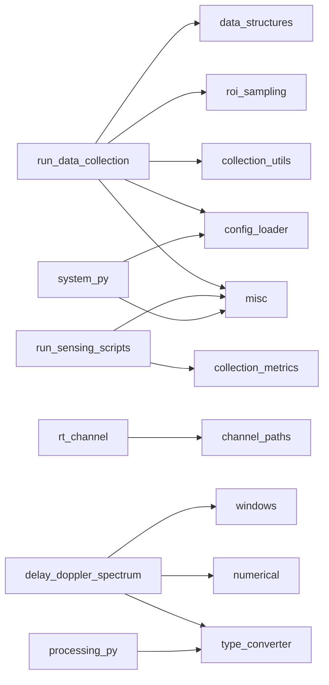

# `src/isac/utils` 功能说明

模块职责：配置加载、射线追踪信道路径抽取、蒙特卡洛/轨迹目标采样、类型/张量工具、窗函数、可视化与数值换算。各子模块经 [`src/isac/utils/__init__.py`](src/isac/utils/__init__.py) 聚合导出，典型用法为 `from isac.utils import ...`。MUSIC 感知 RMSE 评估见 [`MusicSensingEvaluator.evaluate`](src/isac/sensing/detection/music_sensing.py) 与 [`match_peaks_and_compute_radial_rmse`](src/isac/sensing/detection/music_sensing.py)。

---

## 按脚本归纳

以下为仓库内**直接** `from isac.utils`（或 `from isac.utils import target_generation`）的入口脚本；库内间接调用见下一节。

### [`script/data_collection/run_data_collection.py`](script/data_collection/run_data_collection.py)

数据集采集主入口：平面 ROI 蒙特卡洛采样 → RT 目标位姿驱动 → 单 episode 仿真 → 流式写 HDF5，事后写 TOML / CSV / PNG。

| 函数 / 模块 | 在流水线中的角色 |
| ----------- | ---------------- |
| `set_random_seed` | CLI 解析后固定 NumPy / PyTorch / Sionna 随机性，保证可复现采集。 |
| `load_config` | 加载 TOML 配置，构建 `System`。 |
| `RoiKinematicsSampler` | 批量预采样 `(位置, 速度, 姿态)`，循环中 `pop()` 消费。 |
| `getattr(rt_simulator.rt_simulator_params, "filename", "None")` | 输出文件前缀（HDF5、CSV、PNG），直接取自 RT 场景 `filename`。 |
| `paths_intersect_target` | 判断 RT 路径是否与目标 mesh 有交互。 |
| `los_truth_from_kinematics` | 计算几何真值（距离、径向速度），写入 CSV。 |
| `csv_vec3` / `csv_float2_scalar` | CSV 中位置/速度与标量真值的格式化。 |

### 感知仿真脚本（[`run_sensing_monostatic.py`](script/simulation/run_sensing_monostatic.py)、[`run_sensing_bistatic.py`](script/simulation/run_sensing_bistatic.py)、[`run_sensing_cooperative.py`](script/simulation/run_sensing_cooperative.py)）

单次场景端到端感知评估：信道 → 时延–多普勒谱 → MUSIC → 与几何真值对齐。

| 函数 | 在流水线中的角色 |
| ---- | ---------------- |
| `set_random_seed` | 固定随机种子。 |

RMSE 评估：`music_estimator(h_dd)` → `comps.music_evaluator.evaluate(peaks_*, ...)`；CNN 等非 MUSIC 路径可用 `from isac.sensing import match_peaks_and_compute_radial_rmse`。

### [`script/simulation/run_static_target_simulation.py`](script/simulation/run_static_target_simulation.py)

静态目标（无 RT 几何真值张量）感知演示：真值来自 CLI `--range_m` / `--velocity_mps`。

| 函数 | 在流水线中的角色 |
| ---- | ---------------- |
| `set_random_seed` | 固定随机种子。 |

RMSE 匹配见 `isac.sensing.detection.music_sensing`。

### 基线脚本

| 脚本 | 函数 | 在流水线中的角色 |
| ---- | ---- | ---------------- |
| [`run_communication_baseline.py`](script/simulation/run_communication_baseline.py) | `set_random_seed` | 通信基线可复现。 |
| [`run_sensing_baseline.py`](script/simulation/run_sensing_baseline.py) | `set_random_seed` | 感知基线可复现。 |

### GNU Radio 与配置

| 脚本 | 函数 | 在流水线中的角色 |
| ---- | ---- | ---------------- |
| [`gnuradio/sionna_tx.py`](gnuradio/sionna_tx.py)、[`gnuradio/sionna_rx.py`](gnuradio/sionna_rx.py) | `load_config`、`set_random_seed` | 从 `config/` 读 TOML 构建链路与随机种子。 |
| [`gnuradio/gr_config.py`](gnuradio/gr_config.py) | `load_config` | 解析 GNU Radio 侧配置字典。 |

### 库内间接调用（非 `script/`）

| 模块 | 用到的 utils | 作用 |
| ---- | ------------ | ---- |
| [`src/isac/system.py`](src/isac/system.py) | `load_config`、`cartesian_direction_to_yaw_pitch_roll`、`convert`（经 `csv_float2_scalar`） | 加载 TOML；按笛卡尔方向设目标姿态；CSV 标量格式化。 |
| [`src/isac/channel/rt_channel.py`](src/isac/channel/rt_channel.py) | `paths_cfr_per_tx_torch` | 按发射机切片 RT CFR，供多 TX 频域信道接口。 |
| [`src/isac/sensing/spectrum/delay_doppler_spectrum.py`](src/isac/sensing/spectrum/delay_doppler_spectrum.py) | `convert`、`linear_to_db`、`apply_window` | CFR 转 torch；时延/多普勒维加窗；谱图 dB 显示。 |
| [`src/isac/sensing/detection/music_estimator.py`](src/isac/sensing/detection/music_estimator.py) | `linear_to_db` | 伪谱功率转 dB 日志。 |
| [`src/isac/sensing/processing.py`](src/isac/sensing/processing.py) | `convert` | DOA/MUSIC 等处理中 numpy ↔ torch 与标量提取。 |
| [`src/isac/learning/torch_dataset.py`](src/isac/learning/torch_dataset.py) | `load_config` | 数据集类按配置名加载 TOML。 |

---

## 调用关系示意

---

## 按模块速查（附录）

仅列主要**公开**函数；不展开 `_to_numpy` 等私有符号。

### [`config_loader.py`](src/isac/utils/config_loader.py)

| 函数 | 功能概要 |
| ---- | -------- |
| `load_config` | 从 `config/` 目录读取指定 TOML 文件，返回配置字典。 |

### [`channel_paths.py`](src/isac/channel/channel_paths.py)

| 函数 | 功能概要 |
| ---- | -------- |
| `paths_cfr_numpy` | 在 OFDM 子载波频率网格上调用 RT `paths.cfr`，返回 numpy CFR。 |
| `paths_cir_numpy` | 与 OFDM 符号对齐的 CIR；`cir_a` 末维 `[Re, Im]`，`tau` 为时延 (s)。 |
| `paths_cfr_per_tx_torch` | 按 TX 切片 6D CFR，得到各发射机到 RX 的 `(S, F)` torch 张量字典。 |
| `stack_ragged_cir_samples` | 变长 CIR 样本按维取上界零填充后堆叠为 `(N, …)`。 |

### [`target_generation.py`](src/isac/utils/target_generation.py)

| 函数 | 功能概要 |
| ---- | -------- |
| `random_unit_vector_3d` | 单位球均匀方向 `(3,)`。 |
| `roi_uniform_scalar` | ROI 单轴采样：`low==high` 为定值，否则均匀。 |
| `sample_monte_carlo_velocities` | 蒙特卡洛速度：`sphere_uniform` 或 `axis_box`，可传入预置 `velocities`。 |
| `generate_monte_carlo_points` | ROI 内 `uniform`/`gaussian` 采样，经 `scene.is_position_valid` 剔除无效点。 |
| `generate_targets_monte_carlo` | ROI + 速度策略批量采样位置与速度。 |

### [`misc.py`](src/isac/utils/misc.py)

| 函数 | 功能概要 |
| ---- | -------- |
| `set_random_seed` | 同步 NumPy、PyTorch（含 CUDA）、Sionna 随机种子。 |
| `write_txt` | 将数组写入空格分隔的 `.txt`。**当前无项目内外部调用。** |
| `create_progress_bar` | 封装 `tqdm` 进度条。**当前无项目内外部调用。** |
| `cartesian_direction_to_yaw_pitch_roll` | 笛卡尔方向向量 → yaw/pitch/roll（度），用于 RT 目标朝向。 |

### [`type_converter.py`](src/isac/utils/type_converter.py)

| 函数 | 功能概要 |
| ---- | -------- |
| `convert` | numpy / torch / Python 标量 / list / tuple 互转；项目内广泛用于 `delay_doppler_spectrum`、`processing`、`misc`、`system`、`music_sensing` 等。 |
| `str_to_bool` | 字符串 → 布尔。**当前无项目内外部调用。** |
| `to_tuple` | 输入 → 元组。**当前无项目内外部调用。** |
| `image_to_bits` / `bits_to_image` | 图像与比特互转。**当前无项目内外部调用。** |

### [`tensors.py`](src/isac/utils/tensors.py)

| 函数 | 功能概要 |
| ---- | -------- |
| `is_bits_sequence` | 判断两张量是否为比特序列形状。**暂无外部引用。** |
| `serial_to_parallel` / `parallel_to_serial` | 串行比特流与并行块互转（内部用 `pad_to_length`）。**暂无外部引用。** |
| `pad_to_length` | 沿末维填充到指定长度。 |
| `insert_dims` | 在指定轴插入新维度。 |
| `expand_to_rank` | 将张量扩展到目标秩（与末维广播配合）。**暂无外部引用**（`awgn.py` 使用 Sionna 同名函数）。 |
| `expand_to_dimension` | 沿轴扩展到目标形状。 |
| `pad_last_dimension` | 末维填充。 |
| `normalize_energy` | 按能量归一化张量。 |
| `last_dim_real_to_complex` / `last_dim_complex_to_real` | 末维 `[Re, Im]` ↔ 复数互转。 |

### [`numerical.py`](src/isac/utils/numerical.py)

| 函数 | 功能概要 |
| ---- | -------- |
| `next_pow2` | ≥ n 的最小 2 的幂。 |
| `approx_quantile` | 随机采样近似分位数（大张量加速）。 |
| `degree_to_radian` / `radian_to_degree` | 角度与弧度互转。 |
| `linear_to_db` / `db_to_linear` | 线性幅度/功率与 dB 互转（`is_power` 控制 10/20 因子）；默认 `return_type="numpy"`，经 `convert` 输出；`dtype`/`device` 在 torch 目标时转发。 |
| `quantize` / `dequantize` | 连续值与定长比特量化互转。 |

### [`windows.py`](src/isac/utils/windows.py)

| 函数 / 类型 | 功能概要 |
| ----------- | -------- |
| `apply_window` | 沿指定维对张量加窗；``window`` 为 ``None`` / ``str`` / ``tuple`` / TOML 配置 ``dict``；``periodic`` 控制周期/对称窗。 |

### [`render.py`](src/isac/utils/render.py)

| 函数 | 功能概要 |
| ---- | -------- |
| `images_to_gif` | 图像序列写 GIF（数据集采集场景预览）。 |
| `add_text_to_image` | 在图像上绘制文字。**当前无项目内外部调用。** |
| `draw_line_to_image` | 在图像上绘制线段。**当前无项目内外部调用。** |

---

*文档根据仓库 `grep from isac.utils` 与 `src/isac/utils` 当前实现整理；若增删函数或调用点，请以源码为准。*
