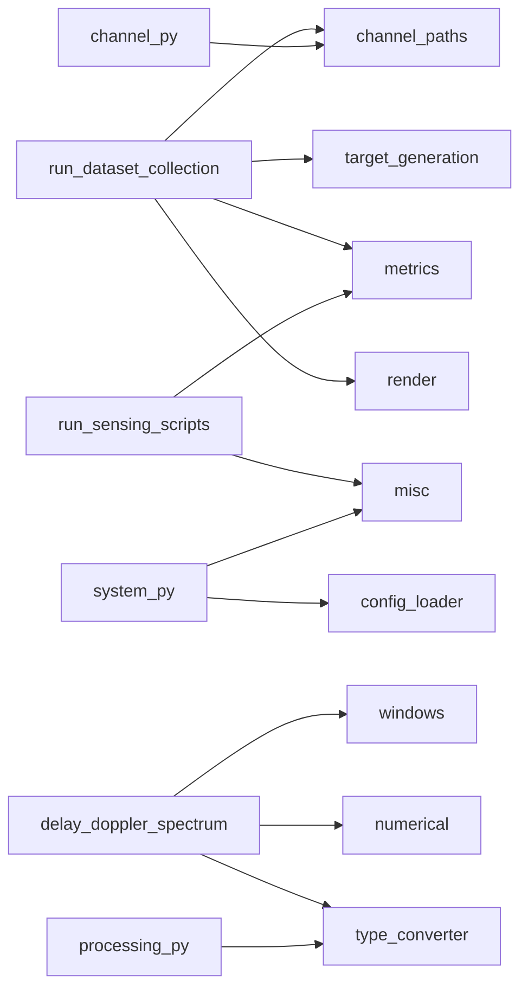

# `src/isac/utils` 功能说明

模块职责：配置加载、射线追踪信道路径抽取、蒙特卡洛/轨迹目标采样、感知评估指标、类型/张量工具、窗函数、可视化与数值换算。各子模块经 [`src/isac/utils/__init__.py`](src/isac/utils/__init__.py) 聚合导出，典型用法为 `from isac.utils import ...`。

---

## 按脚本归纳

以下为仓库内**直接** `from isac.utils`（或 `from isac.utils import target_generation`）的入口脚本；库内间接调用见下一节。

### [`script/model_training/run_dataset_collection.py`](script/model_training/run_dataset_collection.py)

数据集采集主入口：蒙特卡洛 ROI 采样生成 episode，可选逐步感知，写出 CSV / HDF5 / GIF。

| 函数 / 模块 | 在流水线中的角色 |
| ----------- | ---------------- |
| `set_random_seed` | CLI 解析后固定 NumPy / PyTorch / Sionna 随机性，保证可复现采集。 |
| `scene_slug_from_rt_scene` | 从 RT 场景文件名生成输出文件 slug（HDF5、CSV、GIF 前缀）。 |
| `target_generation.generate_targets_monte_carlo` | 批量生成全部 episode 的 `(位置, 速度)` 数组。 |
| `target_generation.generate_monte_carlo_points` | 质量过滤循环中单样本 ROI 位置采样（与 `scene.is_position_valid` 配合）。 |
| `target_generation.sample_monte_carlo_velocities` | 质量过滤循环中单样本速度采样。 |
| `paths_cfr_numpy` | 每步从 RT `paths.cfr` 取 OFDM 网格上的 CFR，写入 HDF5 缓冲。 |
| `paths_cir_numpy` | `--save-cir` 时取 CIR（`cir_a` 末维 `[Re, Im]`，`tau` 为秒）。 |
| `stack_ragged_cir_samples` | 各样本路径条数不一致时零填充堆叠为 `(N, …)` 再落盘 HDF5。 |
| `match_peaks_and_compute_radial_rmse` | `--run_sensing` 时匈牙利匹配 MUSIC 峰与几何真值，打印聚合径向 RMSE。 |
| `compute_rmse` | 逐步感知 CSV 中「本 episode 估计 vs 真值」的 RMSE（与匈牙利打印的跨峰 RMSE 不同）。 |
| `images_to_gif` | 将 RT 场景帧序列合成为预览 GIF。 |

### 感知仿真脚本（[`run_sensing_monostatic.py`](script/simulation/run_sensing_monostatic.py)、[`run_sensing_bistatic.py`](script/simulation/run_sensing_bistatic.py)、[`run_sensing_cooperative.py`](script/simulation/run_sensing_cooperative.py)）

单次场景端到端感知评估：信道 → 时延–多普勒谱 → MUSIC → 与几何真值对齐。

| 函数 | 在流水线中的角色 |
| ---- | ---------------- |
| `set_random_seed` | 固定随机种子。 |
| `match_peaks_and_compute_radial_rmse` | 将 MUSIC 峰与 `rx_target_tx_geometric` 真值格点一对一匹配并输出/打印径向距离、速度 RMSE。 |

### [`script/simulation/run_static_target_simulation.py`](script/simulation/run_static_target_simulation.py)

静态目标（无 RT 几何真值张量）感知演示：真值来自 CLI `--range_m` / `--velocity_mps`。

| 函数 | 在流水线中的角色 |
| ---- | ---------------- |
| `set_random_seed` | 固定随机种子。 |
| `match_peaks_and_compute_radial_rmse` | MUSIC 峰与 CLI 标量真值匹配并计算 RMSE。 |

### 基线脚本

| 脚本 | 函数 | 在流水线中的角色 |
| ---- | ---- | ---------------- |
| [`run_communication_baseline.py`](script/simulation/run_communication_baseline.py) | `set_random_seed` | 通信基线可复现。 |
| [`run_sensing_baseline.py`](script/simulation/run_sensing_baseline.py) | `set_random_seed` | 感知基线可复现。 |

### GNU Radio 与配置

| 脚本 | 函数 | 在流水线中的角色 |
| ---- | ---- | ---------------- |
| [`gnuradio/sionna_tx.py`](gnuradio/sionna_tx.py)、[`gnuradio/sionna_rx.py`](gnuradio/sionna_rx.py) | `load_config`、`set_random_seed` | 从 `config/` 读 TOML 构建链路与随机种子。 |
| [`gnuradio/gr_config.py`](gnuradio/gr_config.py) | `load_config` | 解析 GNU Radio 侧配置字典。 |

### 库内间接调用（非 `script/`）

| 模块 | 用到的 utils | 作用 |
| ---- | ------------ | ---- |
| [`src/isac/system.py`](src/isac/system.py) | `load_config`、`cartesian_direction_to_yaw_pitch_roll`、`convert`（经 `csv_float2_scalar`） | 加载 TOML；按笛卡尔方向设目标姿态；CSV 标量格式化。 |
| [`src/isac/channel/channel.py`](src/isac/channel/channel.py) | `paths_cfr_per_tx_torch` | 按发射机切片 RT CFR，供多 TX 频域信道接口。 |
| [`src/isac/sensing/delay_doppler_spectrum.py`](src/isac/sensing/delay_doppler_spectrum.py) | `convert`、`linear_to_db`、`apply_window`（及 `WindowSpec`） | CFR 转 torch；时延/多普勒维加窗；谱图 dB 显示。 |
| [`src/isac/sensing/music_estimator.py`](src/isac/sensing/music_estimator.py) | `linear_to_db` | 伪谱功率转 dB 日志。 |
| [`src/isac/sensing/processing.py`](src/isac/sensing/processing.py) | `convert` | DOA/MUSIC 等处理中 numpy ↔ torch 与标量提取。 |
| [`src/isac/learning/torch_dataset.py`](src/isac/learning/torch_dataset.py) | `load_config` | 数据集类按配置名加载 TOML。 |
| [`src/isac/utils/metrics.py`](src/isac/utils/metrics.py) | `convert`（内部） | 匈牙利匹配前后统一张量类型与打印格式。 |

---

## 调用关系示意

---

## 按模块速查（附录）

仅列主要**公开**函数；不展开 `_to_numpy` 等私有符号。

### [`config_loader.py`](src/isac/utils/config_loader.py)

| 函数 | 功能概要 |
| ---- | -------- |
| `load_config` | 从 `config/` 目录读取指定 TOML 文件，返回配置字典。 |

### [`channel_paths.py`](src/isac/utils/channel_paths.py)

| 函数 | 功能概要 |
| ---- | -------- |
| `scene_slug_from_rt_scene` | 将 `scene_params.filename` 规范为输出文件名片段（空/`none` → `scene`）。 |
| `paths_cfr_numpy` | 在 OFDM 子载波频率网格上调用 RT `paths.cfr`，返回 numpy CFR。 |
| `paths_cir_numpy` | 与 OFDM 符号对齐的 CIR；`cir_a` 末维 `[Re, Im]`，`tau` 为时延 (s)。 |
| `paths_cfr_per_tx_torch` | 按 TX 切片 6D CFR，得到各发射机到 RX 的 `(S, F)` torch 张量字典。 |
| `stack_ragged_cir_samples` | 变长 CIR 样本按维取上界零填充后堆叠为 `(N, …)`。 |

### [`target_generation.py`](src/isac/utils/target_generation.py)

| 函数 | 功能概要 |
| ---- | -------- |
| `random_unit_vector_3d` | 单位球均匀方向 `(3,)`。 |
| `roi_uniform_scalar` | ROI 单轴采样：`low==high` 为定值，否则均匀。 |
| `sample_monte_carlo_velocities` | 蒙特卡洛速度：`sphere_uniform` 或 `axis_box`，可传入预置 `velocities`。 |
| `generate_monte_carlo_points` | ROI 内 `uniform`/`gaussian` 采样，经 `scene.is_position_valid` 剔除无效点。 |
| `generate_targets_monte_carlo` | ROI + 速度策略批量采样位置与速度。 |

### [`metrics.py`](src/isac/utils/metrics.py)

| 函数 | 功能概要 |
| ---- | -------- |
| `match_peaks_and_compute_radial_rmse` | 匈牙利算法匹配估计峰与真值格点，计算径向距离/速度 RMSE 并打印。 |
| `compute_rmse` | 逐元素 RMSE（`torch` 上 `sqrt(mean((est-target)²))`）。 |
| `compute_mse` | 逐元素 MSE。 |

### [`misc.py`](src/isac/utils/misc.py)

| 函数 | 功能概要 |
| ---- | -------- |
| `set_random_seed` | 同步 NumPy、PyTorch（含 CUDA）、Sionna 随机种子。 |
| `write_txt` | 将数组写入空格分隔的 `.txt`。**当前无项目内外部调用。** |
| `create_progress_bar` | 封装 `tqdm` 进度条。**当前无项目内外部调用。** |
| `cartesian_direction_to_yaw_pitch_roll` | 笛卡尔方向向量 → yaw/pitch/roll（度），用于 RT 目标朝向。 |

### [`type_converter.py`](src/isac/utils/type_converter.py)

| 函数 | 功能概要 |
| ---- | -------- |
| `convert` | numpy / torch / Python 标量 / list / tuple / bytes 互转；项目内广泛用于 `metrics`、`delay_doppler_spectrum`、`processing`、`misc`、`system` 等。 |
| `str_to_bool` | 字符串 → 布尔。**当前无项目内外部调用。** |
| `to_tuple` | 输入 → 元组。**当前无项目内外部调用。** |
| `bytes_to_bits` / `bits_to_bytes` | 字节与比特序列互转。**当前无项目内外部调用。** |
| `image_to_bits` / `bits_to_image` | 图像与比特互转。**当前无项目内外部调用。** |

### [`tensors.py`](src/isac/utils/tensors.py)

| 函数 | 功能概要 |
| ---- | -------- |
| `is_bits_sequence` | 判断两张量是否为比特序列形状。**暂无外部引用。** |
| `serial_to_parallel` / `parallel_to_serial` | 串行比特流与并行块互转（内部用 `pad_to_length`）。**暂无外部引用。** |
| `pad_to_length` | 沿末维填充到指定长度。 |
| `insert_dims` | 在指定轴插入新维度。 |
| `expand_to_rank` | 将张量扩展到目标秩（与末维广播配合）。**暂无外部引用**（`awgn.py` 使用 Sionna 同名函数）。 |
| `expand_to_dimension` | 沿轴扩展到目标形状。 |
| `pad_last_dimension` | 末维填充。 |
| `normalize_energy` | 按能量归一化张量。 |
| `last_dim_real_to_complex` / `last_dim_complex_to_real` | 末维 `[Re, Im]` ↔ 复数互转。 |

### [`numerical.py`](src/isac/utils/numerical.py)

| 函数 | 功能概要 |
| ---- | -------- |
| `next_pow2` | ≥ n 的最小 2 的幂。 |
| `approx_quantile` | 随机采样近似分位数（大张量加速）。 |
| `degree_to_radian` / `radian_to_degree` | 角度与弧度互转。 |
| `linear_to_db` / `db_to_linear` | 线性幅度/功率与 dB 互转（`is_power` 控制 10/20 因子）。 |
| `quantize` / `dequantize` | 连续值与定长比特量化互转。 |

### [`windows.py`](src/isac/utils/windows.py)

| 函数 / 类型 | 功能概要 |
| ----------- | -------- |
| `WindowSpec` | 窗名、长度、对称性等规格。 |
| `window_spec_from_config` | 从 `WindowConfig` 解析为 `WindowSpec`。 |
| `get_window_tensor` | SciPy / `torch.signal.windows` 生成 1D 窗张量。 |
| `apply_window` | 沿指定维对复数/实数张量加窗；支持 `WindowSpec` 或配置 dict。 |
| `numpy_window_to_torch` / `get_named_window_tensor_1d` / `window_callable_to_tensor` | 窗函数与张量格式转换辅助。 |

### [`render.py`](src/isac/utils/render.py)

| 函数 | 功能概要 |
| ---- | -------- |
| `images_to_gif` | 图像序列写 GIF（数据集采集场景预览）。 |
| `add_text_to_image` | 在图像上绘制文字。**当前无项目内外部调用。** |
| `draw_line_to_image` | 在图像上绘制线段。**当前无项目内外部调用。** |

---

*文档根据仓库 `grep from isac.utils` 与 `src/isac/utils` 当前实现整理；若增删函数或调用点，请以源码为准。*
