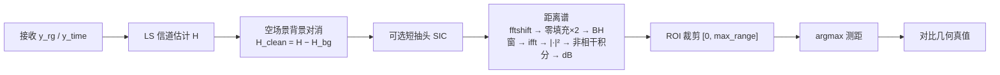

# 协作单基地感知：接收端信号处理流程

对应脚本：[`script/simulation/sensing/rt/run_sensing_cooperative_monostatic.py`](script/simulation/sensing/rt/run_sensing_cooperative_monostatic.py)

配置默认：[`config/simulation/sensing/sensing_cooperative_monostatic.toml`](config/simulation/sensing/sensing_cooperative_monostatic.toml)

本文只描述**接收端**从收到资源网格信号到距离估计的处理链；发射侧仅说明与接收共用的一次 `x_rg`。

---

## 总览



设计约束：

- 保持 `los = true`（不靠关直射消 SI）
- 不用 MTI（静止目标会与杂波一起被消掉）
- 不以近距 blank 作为主手段

---

## 1. 输入与信道观测

| 步骤 | 内容 |
|------|------|
| 发射复用 | `system.transmit()` 得到 `x_rg`、`x_time`；背景估计与有目标估计共用同一发射 |
| 信道施加 | `comps.channel(x_rg, x_time, domain=..., snr_db=...)` |
| 域选择 | CLI `--domain`：`frequency`（默认，用 `x_rg`）或 `time`（用 `x_time`） |

有目标时：`snr_db` 取配置 `[channel].snr_db`。  
背景模板时：强制 `snr_db=None`，避免噪声写入 `H_bg`。

---

## 2. LS 信道估计

```text
H = LS(x_rg, y)
```

- 输入：已知导频/ZC 资源网格 `x_rg` 与接收 `y`
- 输出：频域信道 `h_freq`，形状约 `(S, F)`（OFDM 符号 × 子载波）
- 后续杂波抑制与距离谱均在该 CFR 上操作

---

## 3. 空场景背景对消（默认开）

对应 `estimate_h_background` + `subtract_background_cfr`。  
CLI：`--no-background-cancel` 可关闭。

### 3.1 估计背景 `H_bg`

1. 快照并移除全部 `rt_targets`（`remove_targets_from_scene`）
2. `rt.paths(update=True)` 重算无目标路径
3. 同一 `x_rg` 经信道（**无噪**）→ LS → `H_bg`
4. `finally` 中恢复目标位姿（`restore_targets_to_scene`）并再次 `paths(update=True)`

`H_bg` 主要含：直射 / 墙面等多径静态分量，**不含目标**。

### 3.2 频域相减

\[
H_{\mathrm{clean}} = H - H_{\mathrm{bg}}
\]

意图：削弱墙面等静态杂波，并顺带压低共址直射 SI，使目标增量占主导。

日志会打印对消前后 **0 m bin** 的 dB 与抑制量。

---

## 4. 短抽头数字 SIC（默认开）

对应 `cancel_short_tap_si`。  
CLI：`--no-sic` 关闭；`--sic-taps N` 指定抽头数。

| 项 | 说明 |
|----|------|
| 目的 | 压制背景相减后仍残留的近零时延自干扰 |
| 时延约定 | 子载波维 `fftshift` → `ifft`；零时延在 tap 0（与 DD 谱一致） |
| 抽头数 | 未指定时由 TX–RX 间距 + 时延分辨率 `suggest_si_num_taps` 自动估计 |
| 操作 | 估计前 `L` 个抽头重建 `H_si`，再 `H ← H − H_si` |

同样打印 SIC 前后 0 m bin 抑制量。

---

## 5. 零多普勒距离谱

对应 `compute_range_profile_db_from_h_freq`（对齐 GRC 距离谱思路，时延轴与 SIC/DD 约定一致）。

对每个 OFDM 符号 \(s\)：

1. 取频域切片 `H[s, :]`
2. **`fftshift`**（正时延落到低编号抽头）
3. **零填充 ×2**（`ZEROPADDING_FAC = 2`）
4. 乘 **Blackman–Harris** 窗
5. **`ifft`** → 时延/距离域复谱
6. 取 **\(|\cdot|^2\)**

再对全部符号做**非相干积分**（功率相加），最后转 **dB**：

\[
P_{\mathrm{dB}} = 10\log_{10}\big(\max(P, \varepsilon)\big)
\]

### 距离轴

`range_axis_from_ofdm`：

\[
R_{\max} = \frac{c}{2\cdot f_s}\cdot N_{\mathrm{FFT}},\quad
\Delta R = \frac{R_{\max}}{N_{\mathrm{FFT}}\cdot Z},\quad
f_s = N_{\mathrm{FFT}}\cdot\Delta f
\]

其中 \(Z=2\) 为零填充因子。典型 bin 间距约 **0.61 m**（当前 OFDM 参数下）。

---

## 6. ROI 测距与评估

1. 按 `[dd_spectrum_roi].max_range_m`（缺省 30 m）裁剪 `[0, max_range]`
2. ROI 内 **`argmax`** → 估计距离 `est_range_m`
3. 几何真值：`rx_target_tx_geometric.range_tensor`（须在**恢复目标之后**读取）
4. 打印真值邻域幅度、估计/真值/误差
5. 保存距离谱图：`out/sensing_cooperative_monostatic/sensing_cooperative_monostatic_range_spectrum.png`

---

## 模块与开关对照

| 处理块 | 代码入口 | 默认 | 关闭方式 |
|--------|----------|------|----------|
| 背景对消 | `estimate_h_background` / `subtract_background_cfr` | 开 | `--no-background-cancel` |
| 短抽头 SIC | `cancel_short_tap_si` | 开 | `--no-sic` |
| 距离谱 | `compute_range_profile_db_from_h_freq` | 始终 | — |
| ROI 测距 | `slice_range_roi` + `argmax` | 始终 | — |

杂波相关实现目录：`src/isac/sensing/clutter/`（`background_cancellation.py`、`self_interference_cancellation.py`）。

---

## 一句话流水线

**接收 → LS 得 \(H\) →（空场景）\(H-H_{\mathrm{bg}}\) →（可选）短抽头 SIC → fftshift / 零填充 / BH / ifft 距离谱 → ROI 检峰测距。**
