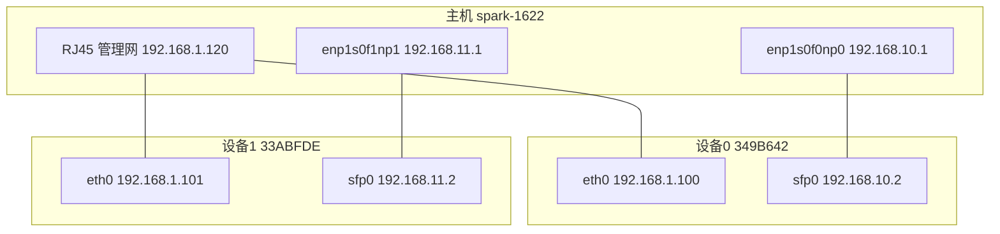

# 演示样机配置

本文档说明 ISAC 演示样机的硬件配置与操作流程。第 1 章介绍 USRP X410 固件（filesystem / MPM / FPGA）的检查与升级；第 2 章说明主机与 USRP 的 IP 配置；第 3～4 章说明 GNU Radio 流图中 USRP Source/Sink 与 Echotimer 块的参数配置。

---

## 1. USRP 固件配置流程

### 1.1 概述与术语

演示样机使用两台 **USRP X410**（`type=x4xx`）。X410 并非传统 USRP 的 MCU 固件模型，而是由以下三层组成：

| 组件                 | 作用                                                     | 查看方式                                                                  |
| -------------------- | -------------------------------------------------------- | ------------------------------------------------------------------------- |
| **MPM**        | 设备 ARM Linux 上的控制守护进程，负责 RPC 配置、设备管理 | `uhd_usrp_probe` → `MPM Version`                                     |
| **FPGA 镜像**  | 采样数据面逻辑，承载 IQ 流传输（CHDR）                   | `uhd_usrp_probe` → `FPGA Version`；`uhd_find_devices` → `fpga:` |
| **Filesystem** | 含 MPM 与 FPGA 的整体系统镜像，通过 Mender 管理          | 离线`.mender` 包升级                                                    |

**版本一致性原则**：主机 UHD 与设备 MPM 的 compat 号必须匹配。不匹配时会出现：

```
MPM major/minor compat number mismatch. Expected: X.X Actual: Y.Y
```

此时需升级设备 filesystem，或切换到与设备 MPM 匹配的主机 UHD 环境。文档中 UHD 版本号以 `{UHD_TAG}` 表示，请替换为与主机实际安装版本对应的 Git tag（如 `v4.8.0.0`）。

#### mgmt_addr 与 addr

X410 具备两条独立以太网链路：

| 字段                    | 接口             | 典型 IP（演示样机）                   | 用途                               |
| ----------------------- | ---------------- | ------------------------------------- | ---------------------------------- |
| **`mgmt_addr`** | 1GbE RJ45 管理口 | `192.168.1.100` / `192.168.1.101` | MPM RPC 控制、SSH、filesystem 升级 |
| **`addr`**      | SFP+ 数据口      | `192.168.10.2` / `192.168.11.2`   | 高速 IQ 采样流传输（CHDR 数据面）  |

默认情况下 `mgmt_addr` 等于 `addr`；演示样机将管理网与数据网分离。使用 DPDK（`use_dpdk=1`）时，SFP+ 口被 DPDK 独占，**必须**通过独立管理口指定 `mgmt_addr`。

GNU Radio 流图中的设备参数字符串示例（见 [`gnuradio/examples/usrp_ofdm_echotimer_baseline/usrp_ofdm_echotimer_dd.grc`](../gnuradio/examples/usrp_ofdm_echotimer_baseline/usrp_ofdm_echotimer_dd.grc)）：

```
type=x4xx,mgmt_addr=192.168.1.100,addr=192.168.10.2
```

---

### 1.2 演示样机设备清单

当前演示主机 `spark-1622` 连接两台 X410，通过双路 10GbE SFP+ 分别接入数据面，1GbE 管理口接入控制面。

| 字段                       | 设备 0                                 | 设备 1                                 |
| -------------------------- | -------------------------------------- | -------------------------------------- |
| **serial**           | `349B642`                            | `33ABFDE`                            |
| **name**             | `ni-x4xx-349B642`                    | `ni-x4xx-33ABFDE`                    |
| **管理口 mgmt_addr** | `192.168.1.100`                      | `192.168.1.101`                      |
| **数据口 addr**      | `192.168.10.2`                       | `192.168.11.2`                       |
| **主机 SFP+ 网口**   | `enp1s0f0np0` → `192.168.10.1/24` | `enp1s0f1np1` → `192.168.11.1/24` |
| **FPGA 类型**        | `X4_200`                             | `X4_200`                             |

按 serial 区分双机的 `uhd_dev_args`：

```
type=x4xx,serial=349B642,mgmt_addr=192.168.1.100,addr=192.168.10.2
type=x4xx,serial=33ABFDE,mgmt_addr=192.168.1.101,addr=192.168.11.2
```

---

### 1.3 版本一致性与检查

#### 确认主机 UHD 路径

不同 conda / 系统环境可能加载不同 UHD 版本。运行硬件相关命令前，先确认使用的是预期环境：

```bash
which uhd_find_devices
uhd_config_info --version
```

若 `which` 指向 `/usr/bin/uhd_find_devices` 而实际需要在 conda 环境中操作，请先 `conda activate <env>` 再执行。

#### 设备发现

```bash
uhd_find_devices
```

正常双机输出示例：

```
--------------------------------------------------
-- UHD Device 0
--------------------------------------------------
Device Address:
    serial: 33ABFDE
    addr: 192.168.11.2
    claimed: False
    fpga: X4_200
    mgmt_addr: 192.168.1.101
    mgmt_addr: 192.168.11.2
    name: ni-x4xx-33ABFDE
    product: x410
    type: x4xx

--------------------------------------------------
-- UHD Device 1
--------------------------------------------------
Device Address:
    serial: 349B642
    addr: 192.168.10.2
    claimed: False
    fpga: X4_200
    mgmt_addr: 192.168.1.100
    mgmt_addr: 192.168.10.2
    name: ni-x4xx-349B642
    product: x410
    type: x4xx
```

`uhd_find_devices` 字段说明：

| 字段          | 含义                                              |
| ------------- | ------------------------------------------------- |
| `serial`    | 设备唯一序列号，多机环境下用于区分                |
| `addr`      | SFP+ 数据口 IP                                    |
| `mgmt_addr` | MPM 控制口 IP（可出现多个，表示多条管理路径可达） |
| `fpga`      | 当前 FPGA 镜像类型（如`X4_200`）                |
| `claimed`   | 是否已被其他进程占用                              |
| `reachable` | 数据面是否可达；若为`No`，需检查 SFP+ 网络配置  |

#### 详细版本探测

```bash
# 设备 0
uhd_usrp_probe --args="type=x4xx,serial=349B642,mgmt_addr=192.168.1.100"

# 设备 1
uhd_usrp_probe --args="type=x4xx,serial=33ABFDE,mgmt_addr=192.168.1.101"
```

成功时应输出 `MPM Version`、`FPGA Version`、`FPGA git hash` 等信息，且无 compat 报错。仅关心版本时可过滤：

```bash
uhd_usrp_probe --args="type=x4xx,serial=349B642,mgmt_addr=192.168.1.100" \
  | grep -E "MPM Version|FPGA Version|FPGA git"
```

---

### 1.4 离线升级 Filesystem（Mender）

演示样机管理网通常**无外网**。在设备上直接运行 `usrp_update_fs` 会因 DNS 解析失败而报错：

```
Temporary failure in name resolution
```

推荐流程：**主机下载 → scp 到设备 → mender install**。


#### 步骤 1：在主机下载 mender 包

`{UHD_TAG}` 须与主机 `uhd_config_info --version` 对应（例如主机为 UHD 4.8.0 则用 `v4.8.0.0`）。

**方式 A：通过 manifest + uhd_images_downloader**

```bash
wget -O /tmp/manifest.txt \
  https://raw.githubusercontent.com/EttusResearch/uhd/{UHD_TAG}/images/manifest.txt

sudo uhd_images_downloader \
  -m /tmp/manifest.txt \
  -t "x4xx_common_mender_default" \
  --yes
```

> 注意：`-t mender -t x4xx` 可能匹配不到 target，应使用 manifest 中的完整名称 `x4xx_common_mender_default`。

**方式 B：直接 wget zip 并解压**

```bash
wget -c https://files.ettus.com/binaries/cache/x4xx/meta-ettus-{UHD_TAG}/x4xx_common_mender_default-{UHD_TAG}.zip
unzip x4xx_common_mender_default-{UHD_TAG}.zip
ls *.mender
```

解压后的 `.mender` 文件名因版本而异（如 `x4xx_usrp_x4xx_fs.mender`），以 `ls` 结果为准。

#### 步骤 2：拷贝到设备并安装

两台设备需**分别升级**（mgmt IP 不同）。以设备 0（`349B642`，`192.168.1.100`）为例：

```bash
scp /path/to/*.mender root@192.168.1.100:/tmp/

ssh root@192.168.1.100
mender install /tmp/*.mender
reboot
```

设备 1 将 IP 换为 `192.168.1.101`，重复上述步骤。

#### 步骤 3：重启后固化

升级重启后 SSH 可能因主机密钥变更而失败（见 1.6）。清除旧密钥后重新登录：

```bash
ssh-keygen -f ~/.ssh/known_hosts -R '192.168.1.100'

ssh root@192.168.1.100
mender commit
```

设备 1 同理，对 `192.168.1.101` 执行 `ssh-keygen -R` 与 `mender commit`。

#### 步骤 4：在线升级（可选，需设备能访问外网）

若管理网已配置网关且 DNS 正常，可在设备上直接升级：

```bash
ssh root@192.168.1.100
usrp_update_fs -t {UHD_TAG}
reboot
# 重启后
mender commit
```

---

### 1.5 升级后验证

#### 数据面连通性

```bash
ping -c 2 192.168.10.2   # 设备 0 数据口
ping -c 2 192.168.11.2   # 设备 1 数据口
```

#### UHD 设备发现

```bash
uhd_find_devices
```

成功标准：

- 两台设备均显示 `addr` 与 `fpga: X4_200`
- 无 `reachable: No`
- `mgmt_addr` 与 1.2 节表格一致

#### 详细探测

```bash
uhd_usrp_probe --args="type=x4xx,serial=349B642,mgmt_addr=192.168.1.100"
uhd_usrp_probe --args="type=x4xx,serial=33ABFDE,mgmt_addr=192.168.1.101"
```

成功标准：

- 无 `MPM major/minor compat number mismatch` 报错
- 输出 `MPM Version`、`FPGA Version` 等字段
- 主机 `uhd_config_info --version` 与设备 MPM 版本匹配

---

### 1.6 常见问题排查

| 现象                                                | 可能原因                         | 处理                                                                                     |
| --------------------------------------------------- | -------------------------------- | ---------------------------------------------------------------------------------------- |
| `MPM major/minor compat number mismatch`          | 主机 UHD 与设备 MPM 版本不一致   | 按 1.4 节升级设备 filesystem，或切换至匹配的主机 UHD 环境                                |
| `reachable: No`                                   | SFP+ 数据网未通或未配置          | 检查主机 SFP+ IP（`192.168.10.1` / `192.168.11.1`）与 ping 数据口                    |
| `WARNING: REMOTE HOST IDENTIFICATION HAS CHANGED` | filesystem 升级后 SSH 密钥重生   | `ssh-keygen -f ~/.ssh/known_hosts -R '192.168.1.100'`（设备 1 换 `.101`）后重连      |
| `usrp_update_fs` DNS 失败                         | 设备管理网无外网                 | 改走 1.4 节 Mender 离线安装                                                              |
| `No targets matching ['mender', 'x4xx']`          | manifest 或 target 名不匹配      | 使用`-m /tmp/manifest.txt` 指定版本 manifest，target 用 `x4xx_common_mender_default` |
| `scp: No such file or directory`                  | 本地`.mender` 路径或文件名错误 | 先`ls *.mender` 确认文件名再 scp                                                       |
| 两台设备`addr` 相同                               | 仅通过发现广播看到，未接数据网   | 以`serial` 区分设备，并分别配置对应 SFP+ 网段                                          |
| `which uhd_find_devices` 指向非预期路径           | conda / 系统环境混用             | 激活目标环境后再运行 UHD 命令                                                            |

---

## 2. 设备 IP 配置

本章说明演示样机 **主机** 与 **两台 USRP X410** 的 IP 规划、配置方法、验证步骤及重启后的持久化。设备清单与 IP 分配见 [1.2 演示样机设备清单](#12-演示样机设备清单)。

### 2.1 网络拓扑与 IP 规划

演示样机采用 **管理网与数据网分离** 的双链路架构：RJ45 负责 MPM 控制与 SSH，SFP+ 负责高速 IQ 采样流（CHDR）。



#### IP 地址总表

| 角色      | 接口 / 字段              | 设备 0（349B642）    | 设备 1（33ABFDE）    | 主机 spark-1622                           |
| --------- | ------------------------ | -------------------- | -------------------- | ----------------------------------------- |
| 管理口    | `eth0` / `mgmt_addr` | `192.168.1.100/24` | `192.168.1.101/24` | `192.168.1.120/24`（示例）              |
| 数据口    | `sfp0` / `addr`      | `192.168.10.2/24`  | `192.168.11.2/24`  | —                                        |
| 主机 SFP+ | —                       | 接`enp1s0f0np0`    | 接`enp1s0f1np1`    | `192.168.10.1/24` / `192.168.11.1/24` |

**设计要点**：

- 两台 USRP 的 **管理口 IP 必须不同**（`.100` / `.101`）。
- 两条 QSFP 点对点链路使用 **不同网段**（`10.x` / `11.x`），避免主机路由冲突。
- GNU Radio 中 `mgmt_addr` 填 RJ45 地址，`addr` 填 SFP+ 地址（见 [1.1 mgmt_addr 与 addr](#mgmt_addr-与-addr)）。

双机 loopback 流图（[`ofdm_two_devices_loopback.grc`](../gnuradio/tests/ofdm_two_devices_loopback/ofdm_two_devices_loopback.grc)）中的设备参数字符串：

```
address0 = type=x4xx,mgmt_addr=192.168.1.101,addr=192.168.11.2   # 设备 1，主机 QSFP1
address1 = type=x4xx,mgmt_addr=192.168.1.100,addr=192.168.10.2   # 设备 0，主机 QSFP0
```

---

### 2.2 USRP IP 配置

USRP X410 的网络配置保存在设备内部 `/data/network/` 目录，重启后自动生效，**本身即为持久化存储**。

#### 2.2.1 配置文件说明

| 文件                           | 对应接口    | 用途                  |
| ------------------------------ | ----------- | --------------------- |
| `/data/network/eth0.network` | RJ45 管理口 | `mgmt_addr`、SSH    |
| `/data/network/sfp0.network` | QSFP 数据口 | `addr`、CHDR 数据流 |

> 一般无需修改 `sfp0_1`～`sfp0_3`、`sfp1*` 等文件，除非使用多 lane 特殊 FPGA 镜像。

#### 2.2.2 配置步骤

**重要**：修改 IP 时 **每次只保留一台 USRP 在线**（或至少确认 SSH 登录的 hostname 与目标设备一致），避免两台同 IP 时改错设备。

```bash
# 登录后务必确认设备身份
ssh root@192.168.1.100
hostname    # 应显示 ni-x4xx-349B642 或 ni-x4xx-33ABFDE
```

**设备 0（349B642）— 管理口 `192.168.1.100`**

编辑 `/data/network/eth0.network`（建议使用静态 IP，避免 DHCP 冲突）：

```ini
[Match]
Name=eth0
KernelCommandLine=!nfsroot

[Network]
Address=192.168.1.100/24
```

编辑 `/data/network/sfp0.network`：

```ini
[Match]
Name=sfp0

[Network]
Address=192.168.10.2/24

[Link]
MTUBytes=9000
```

**设备 1（33ABFDE）— 管理口 `192.168.1.101`**

`/data/network/eth0.network`：

```ini
[Match]
Name=eth0
KernelCommandLine=!nfsroot

[Network]
Address=192.168.1.101/24
```

`/data/network/sfp0.network`：

```ini
[Match]
Name=sfp0

[Network]
Address=192.168.11.2/24

[Link]
MTUBytes=9000
```

保存后重启设备：

```bash
reboot
```

#### 2.2.3 使用 heredoc 快速写入（可选）

确认 `hostname` 无误后，以设备 1 为例：

```bash
cat > /data/network/eth0.network << 'EOF'
[Match]
Name=eth0
KernelCommandLine=!nfsroot

[Network]
Address=192.168.1.101/24
EOF

cat > /data/network/sfp0.network << 'EOF'
[Match]
Name=sfp0

[Network]
Address=192.168.11.2/24

[Link]
MTUBytes=9000
EOF

reboot
```

---

### 2.3 主机 IP 配置

主机 `spark-1622` 使用 **NetworkManager** 管理网络（系统存在 `/etc/netplan/90-NM-*.yaml`）。QSFP 口需配置两类参数：

| 类型         | 工具                        | 说明                     |
| ------------ | --------------------------- | ------------------------ |
| 静态 IP      | NetworkManager（`nmcli`） | 重启后自动恢复地址       |
| 10G 链路模式 | systemd 服务                | 关闭自协商、固定 10 Gbps |

#### 2.3.1 确认网卡名称

```bash
ip link show | grep -E 'enp1s0f'
```

演示样机对应关系：

| 主机网口        | 连接        | 用途                      |
| --------------- | ----------- | ------------------------- |
| `enp1s0f0np0` | 设备 0 SFP+ | 数据网`192.168.10.0/24` |
| `enp1s0f1np1` | 设备 1 SFP+ | 数据网`192.168.11.0/24` |

> 注意：第二口为 **`enp1s0f1np1`**（`f1`），不存在 `enp1s0f0np1`。

#### 2.3.2 临时配置（当前会话有效）

```bash
# QSFP0 → 设备 0
sudo ip link set enp1s0f0np0 up
sudo ethtool -s enp1s0f0np0 autoneg off speed 10000 duplex full
sudo ip addr flush dev enp1s0f0np0
sudo ip addr add 192.168.10.1/24 dev enp1s0f0np0

# QSFP1 → 设备 1
sudo ip link set enp1s0f1np1 up
sudo ethtool -s enp1s0f1np1 autoneg off speed 10000 duplex full
sudo ip addr flush dev enp1s0f1np1
sudo ip addr add 192.168.11.1/24 dev enp1s0f1np1
```

#### 2.3.3 持久化：NetworkManager 静态 IP

```bash
# QSFP0
sudo nmcli connection add \
  type ethernet \
  ifname enp1s0f0np0 \
  con-name qsfp0-usrp0 \
  ipv4.method manual \
  ipv4.addresses 192.168.10.1/24 \
  ipv6.method ignore \
  connection.autoconnect yes

sudo nmcli connection modify qsfp0-usrp0 ethernet.mtu 9000
sudo nmcli connection up qsfp0-usrp0

# QSFP1
sudo nmcli connection add \
  type ethernet \
  ifname enp1s0f1np1 \
  con-name qsfp1-usrp1 \
  ipv4.method manual \
  ipv4.addresses 192.168.11.1/24 \
  ipv6.method ignore \
  connection.autoconnect yes

sudo nmcli connection modify qsfp1-usrp1 ethernet.mtu 9000
sudo nmcli connection up qsfp1-usrp1
```

**管理网（可选）**：若 RJ45 管理口需固定 IP（如 `192.168.1.120/24`），对对应管理网卡执行类似 `nmcli connection add`，确保与 USRP 管理口（`.100` / `.101`）同网段。

#### 2.3.4 持久化：QSFP 链路模式（ethtool）

NetworkManager 无法可靠保存 `autoneg off speed 10000`，需用 systemd 服务：

```bash
sudo tee /etc/systemd/system/qsfp-link-setup.service << 'EOF'
[Unit]
Description=Configure QSFP 10G link settings
After=network-pre.target
Before=network-online.target
Wants=network-pre.target

[Service]
Type=oneshot
RemainAfterExit=yes
ExecStart=/usr/sbin/ip link set enp1s0f0np0 up
ExecStart=/usr/sbin/ethtool -s enp1s0f0np0 autoneg off speed 10000 duplex full
ExecStart=/usr/sbin/ip link set enp1s0f1np1 up
ExecStart=/usr/sbin/ethtool -s enp1s0f1np1 autoneg off speed 10000 duplex full

[Install]
WantedBy=multi-user.target
EOF

sudo systemctl daemon-reload
sudo systemctl enable qsfp-link-setup.service
sudo systemctl start qsfp-link-setup.service
```

---

### 2.4 验证方法

配置完成后，按 **链路 → 网络 → UHD** 三层验证。

#### 2.4.1 物理链路（L1）

```bash
sudo ethtool enp1s0f0np0 | grep -E 'Speed|Duplex|Auto-negotiation|Link detected'
sudo ethtool enp1s0f1np1 | grep -E 'Speed|Duplex|Auto-negotiation|Link detected'
```

成功标准（两口一致）：

```
Speed: 10000Mb/s
Duplex: Full
Auto-negotiation: off
Link detected: yes
```

若 `Link detected: no (No partner detected)`，优先检查线缆、光模块、USRP 是否上电及是否接在 **sfp0** 口，而非 IP 配置问题。

#### 2.4.2 网络连通（L3）

```bash
# 管理口
ping -c 3 192.168.1.100
ping -c 3 192.168.1.101

# 数据口
ping -c 3 192.168.10.2
ping -c 3 192.168.11.2
```

#### 2.4.3 UHD 设备发现

```bash
uhd_find_devices
```

成功标准：

- 两台设备 `serial` 分别为 `349B642`、`33ABFDE`
- `addr` 为数据口 IP（`192.168.10.2` / `192.168.11.2`），**不等于** `mgmt_addr`
- 无 `reachable: No`

#### 2.4.4 UHD 详细探测（含 CHDR 数据面）

```bash
uhd_usrp_probe --args="type=x4xx,serial=349B642,mgmt_addr=192.168.1.100,addr=192.168.10.2"
uhd_usrp_probe --args="type=x4xx,serial=33ABFDE,mgmt_addr=192.168.1.101,addr=192.168.11.2"
```

成功标准：无 `No CHDR connection available!`，正常输出 MPM / FPGA 信息。

#### 2.4.5 重启后回归测试

```bash
sudo reboot

# 重启后执行 2.4.1～2.4.4 全部检查
```

---

### 2.5 持久化一览

| 配置项             | 存储位置                                        | 是否重启持久 | 配置方式                      |
| ------------------ | ----------------------------------------------- | ------------ | ----------------------------- |
| USRP 管理口 IP     | 设备`/data/network/eth0.network`              | 是           | SSH 编辑                      |
| USRP 数据口 IP     | 设备`/data/network/sfp0.network`              | 是           | SSH 编辑                      |
| 主机 QSFP 静态 IP  | NetworkManager 连接配置                         | 是           | `nmcli`                     |
| 主机 QSFP 10G 链路 | `/etc/systemd/system/qsfp-link-setup.service` | 是           | systemd enable                |
| 临时 IP / ethtool  | 内存                                            | 否           | `ip` / `ethtool` 直接命令 |

---

### 2.6 常见问题排查

| 现象                                      | 可能原因                          | 处理                                                                           |
| ----------------------------------------- | --------------------------------- | ------------------------------------------------------------------------------ |
| 两台 USRP`mgmt_addr` 相同               | 出厂默认或复制配置                | 逐台 SSH 修改`eth0.network`，确保 `.100` / `.101` 唯一                   |
| `addr` 等于 `mgmt_addr`               | 未配置`sfp0.network`            | 按 2.2 节配置 SFP+ 地址并 reboot                                               |
| `ping 10.2/11.2` 不通                   | QSFP 链路未 up                    | 查`ethtool`、线缆、USRP sfp0 配置                                            |
| `enp1s0f1np1` Link detected: no         | 未接线或 autoneg 不匹配           | 接好设备 1 的 QSFP；执行`ethtool -s ... autoneg off speed 10000 duplex full` |
| `No CHDR connection available!`         | `addr` 写错或主机无对应 SFP+ IP | 确认 dev args 中`addr` 为 SFP+ IP；主机配 `10.1` / `11.1`                |
| 改 IP 改错设备                            | 两台同 IP 同时在线                | 每次只留一台在线；SSH 后先`hostname`                                         |
| 重启后 IP 丢失                            | 未做 NM / systemd 持久化          | 按 2.3.3、2.3.4 节配置                                                         |
| `ethtool enp1s0f0np1` 报 No such device | 网卡名错误                        | 使用`enp1s0f1np1`                                                            |

---

## 3. USRP Source 与 USRP Sink 参数配置

本章说明演示样机 GNU Radio 流图中 **UHD: USRP Source**（`uhd_usrp_source`）与 **UHD: USRP Sink**（`uhd_usrp_sink`）的参数设置。更完整的通用说明见 [`GNU_Radio_USRP_Source_Sink_总结.md`](GNU_Radio_USRP_Source_Sink_总结.md)。

### 3.1 概述与选用场景

| 块 | GRC 名称 | 角色 |
|----|----------|------|
| **USRP Source** | `uhd_usrp_source` | 从 USRP 接收 IQ，输出到流图 |
| **USRP Sink** | `uhd_usrp_sink` | 从流图读取 IQ，经 USRP 发射 |

演示样机中的典型用法：

| 场景 | 流图 | 设备绑定 |
|------|------|----------|
| 单机 OFDM 自环 | [`ofdm_loopback.grc`](../gnuradio/tests/ofdm_loopback/ofdm_loopback.grc) | Source 与 Sink 共用同一 `address` 变量 |
| 双机 loopback | [`ofdm_two_devices_loopback.grc`](../gnuradio/tests/ofdm_two_devices_loopback/ofdm_two_devices_loopback.grc) | Source → `address0`；Sink → `address1` |

> **与 Echotimer 的区别**：Source/Sink 为两个独立 UHD 会话，**不保证** TX/RX 之间的恒定相位关系。通信 loopback 验证适用 Source/Sink；OFDM 雷达 / ISAC 感知应使用第 4 章 **USRP Echotimer**。

---

### 3.2 演示样机推荐参数总表

以下取值来自 [`ofdm_loopback.grc`](../gnuradio/tests/ofdm_loopback/ofdm_loopback.grc) 及生成的 `ofdm_loopback_example.py`：

| 参数 | Source（GRC 字段） | Sink（GRC 字段） | 演示样机典型值 |
|------|-------------------|------------------|----------------|
| Device Address | `dev_addr` | `dev_addr` | 变量 `address`；格式见 [2.1](#21-网络拓扑与-ip-规划) |
| Sample Rate | `samp_rate` | `samp_rate` | `5e6`（X410 实际约 **5.016 MHz**） |
| Center Frequency | `center_freq0` | `center_freq0` | `6.0e9`（变量 `freq`） |
| Gain | `gain0` | `gain0` | 变量 `RX_gain` / `TX_gain`（10～30 dB，滑块可调） |
| Antenna | `ant0` | `ant0` | Source: **`RX1`**；Sink: **`TX/RX`** |
| Stream Args | `stream_args` | `stream_args` | Source: `num_recv_frames=512,recv_buff_size=25000000`；Sink: `num_send_frames=512,send_buff_size=25000000` |
| Sync | `sync` | `sync` | **`pc_clock`** |
| Output/Input Type | `type` | `type` | **`fc32`**（Complex float32） |
| Wire Format | `otw` / wire | 同左 | **`Automatic`** |
| Num Channels | `nchan` | `nchan` | **`1`** |
| Min Output Buffer | `minoutbuf` | — | Source: **`262144`**（防 overflow） |
| TSB Tag Name | — | `tsb_tag_name` | **留空**（连续发射，非突发模式） |

---

### 3.3 Device Address 写法（X410）

Device Address 对应 GRC 中的 **Device Address**（`dev_addr`），须同时指定管理口与数据口（见 [1.1 mgmt_addr 与 addr](#mgmt_addr-与-addr)）：

**单机（设备 0 示例）：**

```
type=x4xx,serial=349B642,mgmt_addr=192.168.1.100,addr=192.168.10.2
```

**双机 loopback（[`ofdm_two_devices_loopback.grc`](../gnuradio/tests/ofdm_two_devices_loopback/ofdm_two_devices_loopback.grc)）：**

```
address0 = type=x4xx,mgmt_addr=192.168.1.101,addr=192.168.11.2   # USRP Source
address1 = type=x4xx,mgmt_addr=192.168.1.100,addr=192.168.10.2   # USRP Sink
```

> 多机环境下建议始终加 `serial=`，避免 IP 发现歧义。

---

### 3.4 分参数说明

#### 3.4.1 General（设备与采样）

| 参数 | 说明 | 演示样机建议 |
|------|------|--------------|
| **Device Address** | UHD 设备定位字符串 | 见 3.3；留空则使用第一个发现的设备 |
| **Device Arguments** | 附加设备参数 | 演示流图留空 `""` |
| **Sample Rate (Sps)** | 采样率（Hz） | loopback 用 `5e6`；UHD 可能设为 5.016 MHz |
| **Num Channels** | 通道数 | `1` |
| **Output/Input Type** | GNU Radio 流格式 | `fc32` |

#### 3.4.2 RF Options（每通道 Ch0）

| 参数 | 说明 | 演示样机建议 |
|------|------|--------------|
| **Center Frequency (Hz)** | RF 中心频率 | `freq` = 6 GHz |
| **Gain Value** | 增益（dB） | RX/TX 各 10～30 dB，可从 GRC 滑块实时调整 |
| **Gain Type** | 增益模式 | `Absolute (dB)` |
| **Antenna** | 天线端口 | Source: `RX1`；Sink: `TX/RX` |
| **Bandwidth (Hz)** | 抗混叠滤波带宽 | `0`（默认） |

#### 3.4.3 Advanced（同步与缓冲）

| 参数 | 说明 | 演示样机建议 |
|------|------|--------------|
| **Stream Args** | UHD streamer 键值对 | 见 3.2 表；增大 recv/send buffer 应对高吞吐 |
| **Sync** | 初始时间同步方式 | `pc_clock`（设为 PC 系统时间） |
| **Clock Source** | 参考时钟 | X410 默认 **`internal`**（留空即默认） |
| **Time Source** | PPS 时间源 | **`internal`** |
| **Min Output Buffer**（Source 独有） | 最小输出缓冲样本数 | **`262144`**，减轻终端 `O`（overflow） |

#### 3.4.4 Sink 独有：TSB Tag Name

| 参数 | 说明 | 演示样机建议 |
|------|------|--------------|
| **TSB tag name** | 非空时进入 Tagged Stream 突发模式 | **留空**；loopback 为连续发射 |

#### 3.4.5 Source 独有：AGC 与前端校正

| 参数 | 说明 | 演示样机建议 |
|------|------|--------------|
| **Ch0: AGC** | 自动增益控制 | **`Disabled`**（使用手动 Gain） |
| **Ch0: DC Offset / IQ Imbalance** | 前端校正 | **`Default`** 或 **`Automatic`** |

---

### 3.5 Source 与 Sink 对比速查

| 特性 | USRP Source | USRP Sink |
|------|-------------|-----------|
| 数据方向 | USRP → 流图（输出） | 流图 → USRP（输入） |
| GRC 数据类型参数 | Output Type | Input Type |
| AGC | 支持 | 无 |
| Min Output Buffer | 支持 | 无 |
| 突发模式 | `issue_stream_cmd` | SOB/EOB 标签 或 TSB |
| 终端告警 | `O`（overflow，消费太慢） | `U`（underflow，供数太慢） |
| 构造函数第三参数 | `issue_stream_cmd_on_start` | `tsb_tag_name` |

---

### 3.6 演示样机注意事项

1. **禁止使用 Throttle**：含 USRP Source/Sink 的流图由硬件采样率驱动，Throttle 会导致速率不匹配（GRC 会警告）。
2. **采样率误差**：请求 5 MHz 时 UHD 可能报 `Actual rate is 5.016 MHz`（245.76 MHz / 49），一般可接受；若 OFDM 解调敏感，将 `samp_rate` 改为 `5.016e6`。
3. **Overflow / Underflow**：
   - `O`：下游处理过慢 → 增大 Source `minoutbuf`、降低采样率或简化流图。
   - `U`：上游供数不足 → 检查突发标签或上游块速率。
4. **与第 2 章联动**：若报 `No CHDR connection available!`，检查 `dev_addr` 中 `addr=` 是否为 SFP+ IP，以及主机 QSFP 网口配置（[2.4](#24-验证方法)）。

---

### 3.7 参考流图与运行

| 流图 | 路径 | 说明 |
|------|------|------|
| OFDM loopback | [`gnuradio/tests/ofdm_loopback/ofdm_loopback.grc`](../gnuradio/tests/ofdm_loopback/ofdm_loopback.grc) | 单机 Source+Sink |
| 双机 loopback | [`gnuradio/tests/ofdm_two_devices_loopback/ofdm_two_devices_loopback.grc`](../gnuradio/tests/ofdm_two_devices_loopback/ofdm_two_devices_loopback.grc) | address0/address1 分机 |

**命令行运行示例（单机）：**

```bash
conda activate ISAC
cd ~/Desktop/isac/gnuradio/tests/ofdm_loopback
python -u ofdm_loopback_example.py \
  --address "type=x4xx,serial=349B642,mgmt_addr=192.168.1.100,addr=192.168.10.2"
```

**双机示例：**

```bash
cd ~/Desktop/isac/gnuradio/tests/ofdm_two_devices_loopback
python -u ofdm_loopback_example.py \
  --address0 "type=x4xx,mgmt_addr=192.168.1.101,addr=192.168.11.2" \
  --address1 "type=x4xx,mgmt_addr=192.168.1.100,addr=192.168.10.2"
```

---

## 4. USRP Echotimer 参数配置

本章说明 gr-radar 块 **USRP Echotimer**（GRC: `radar_usrp_echotimer_cc`）的参数。该块在单块内集成 **同步 TX/RX**，保证测量间恒定相位关系，是演示样机 OFDM 雷达 / ISAC 流图的核心硬件接口。

### 4.1 概述

| 项目 | 说明 |
|------|------|
| 块 ID | `radar_usrp_echotimer_cc` |
| Python 模块 | `from gnuradio import radar` → `radar.usrp_echotimer_cc(...)` |
| 输入 | 待发射 IQ 流（complex） |
| 输出 | 与 TX 同步的 RX IQ 流；附带 `len_key` 指定的 stream tag |
| 依赖 | gr-radar OOT 模块（见 [ryanvolz/gnuradio-radar](https://anaconda.org/ryanvolz/gnuradio-radar)） |

**典型流图：**

- [`usrp_ofdm_echotimer_baseline/usrp_ofdm_echotimer_dd.grc`](../gnuradio/examples/usrp_ofdm_echotimer_baseline/usrp_ofdm_echotimer_dd.grc) — OFDM 零多普勒距离像
- [`tests/usrp_sync_pulse/usrp_sync_pulse.grc`](../gnuradio/tests/usrp_sync_pulse/usrp_sync_pulse.grc) — 同步脉冲 + Echotimer

---

### 4.2 参数总表

以下取自 [`usrp_ofdm_echotimer_dd.grc`](../gnuradio/examples/usrp_ofdm_echotimer_baseline/usrp_ofdm_echotimer_dd.grc) 中 `radar_usrp_echotimer_cc_0` 块：

| 参数（GRC） | 说明 | 演示样机典型值 |
|-------------|------|----------------|
| `args_tx` | TX 侧 UHD 设备地址 | 变量 `uhd_dev_args` |
| `args_rx` | RX 侧 UHD 设备地址 | 同上（单机雷达 TX/RX 同一 USRP） |
| `samp_rate` | 采样率（Hz） | `int(fft_len * subcarrier_spacing)` = **122.88 MHz**（`fft_len=2048`, `subcarrier_spacing=60e3`） |
| `center_freq` | 中心频率（Hz） | `6.0e9`（变量 `freq`） |
| `gain_tx` / `gain_rx` | 发射 / 接收增益（dB） | 变量 `TX_gain` / `RX_gain`（滑块，默认约 30 dB） |
| `antenna_tx` | 发射天线 | **`TX/RX`** |
| `antenna_rx` | 接收天线 | **`RX1`** |
| `clock_source_tx` / `clock_source_rx` | 参考时钟 | **`internal`** |
| `time_source_tx` / `time_source_rx` | 时间 / PPS 源 | **`internal`** |
| `channel_tx` / `channel_rx` | RF 通道索引 | **`0`** |
| `num_delay_samps` | RX 相对 TX 的延迟采样数 | 变量 `num_delay_samp`，默认 **162**（滑块 0～`packet_len`） |
| `len_key` | 包长度 stream tag 键名 | **`"packet_len"`** |
| `wait_tx` / `wait_rx` | 流图启动后等待时间（秒） | 变量 `wait_to_start` = **0.03** |
| `timeout_tx` / `timeout_rx` | UHD RPC 超时（秒） | **0.2**（baseline）；sync_pulse 流图为 0.1 |
| `lo_offset_tx` / `lo_offset_rx` | LO 偏移（Hz） | **0** |
| `wire_tx` / `wire_rx` | 总线传输格式 | **留空**（自动） |
| `minoutbuf` | 最小输出缓冲 | 变量 `min_out_buf_val` = **`packet_len * 2`** |

---

### 4.3 关键参数详解

#### `args_tx` / `args_rx`

UHD 设备参数字符串，语法与 Source/Sink 的 Device Address 相同（见 [3.3](#33-device-address-写法x410)）。

- **单机 ISAC 雷达**：`args_tx` 与 `args_rx` 设为同一 `uhd_dev_args`。
- **双 USRP 扩展**：可分别指向不同 serial / IP（TX 一台、RX 另一台）。

演示样机示例：

```
type=x4xx,serial=349B642,mgmt_addr=192.168.1.100,addr=192.168.10.2
```

#### `num_delay_samps`

Echotimer 核心参数：控制 RX 采集窗口相对 TX 发射起点的 **固定延迟（样本数）**。

- 影响距离像零点与 loopback 峰值位置。
- 更改 `fft_len`、采样率或线缆延迟后需重新校准（baseline 注释：*Recalibrate after fft_len/rate change*）。
- 通过 GRC 滑块 **Number of delayed samples** 实时调整。

#### `len_key`

必须与上游 OFDM 包化块一致（变量 `length_tag_key` = `"packet_len"`）。Echotimer 在 RX 输出上传递该 tag，供下游 `radar_ofdm_cyclic_prefix_remover_cvc` 等块使用。

#### `wait_tx` / `wait_rx`

流图 `start()` 后、正式收发前等待 USRP 就绪的时间（秒）。过短可能导致首包丢失；演示样机默认 30 ms。

#### `timeout_tx` / `timeout_rx`

UHD 管理口 RPC 调用超时。管理网延迟较大或设备负载高时可适当增大（如 0.2→0.5）。

---

### 4.4 与 Source/Sink 的组合与选型

[`usrp_sync_pulse.grc`](../gnuradio/tests/usrp_sync_pulse/usrp_sync_pulse.grc) 中同时存在 **Echotimer** 与独立 **USRP Sink**：Echotimer 负责同步收发路径，Sink 用于辅助发射场景。一般 ISAC 雷达流图 **仅使用 Echotimer**，无需再配 Source/Sink。

| 需求 | 推荐块 |
|------|--------|
| OFDM / MIMO 通信 loopback | USRP Source + USRP Sink（第 3 章） |
| 双机 TX→RX 分机实验 | Source 绑 `address0`，Sink 绑 `address1` |
| OFDM 雷达、同步脉冲、距离像 | **USRP Echotimer** |
| 需恒定 TX/RX 相位关系的测量 | **USRP Echotimer** |

---

### 4.5 Python 实例化参考

由 GRC 生成的调用形式（[`usrp_ofdm_echotimer_dd.py`](../gnuradio/examples/usrp_ofdm_echotimer_dd/usrp_ofdm_echotimer_dd.py) 逻辑摘要）：

```python
radar.usrp_echotimer_cc(
    int(samp_rate), freq, int(num_delay_samp),
    uhd_dev_args, 0, '', 'internal', 'internal', 'TX/RX', TX_gain, 0.2, wait_to_start, 0,
    uhd_dev_args, 0, '', 'internal', 'internal', 'RX1', RX_gain, 0.2, wait_to_start, 0,
    "packet_len"
)
```

参数顺序：`samp_rate, center_freq, num_delay_samps, args_tx, channel_tx, wire_tx, clock_tx, time_tx, antenna_tx, gain_tx, timeout_tx, wait_tx, lo_offset_tx, args_rx, channel_rx, wire_rx, clock_rx, time_rx, antenna_rx, gain_rx, timeout_rx, wait_rx, lo_offset_rx, len_key`。

---

### 4.6 常见问题排查

| 现象 | 可能原因 | 处理 |
|------|----------|------|
| 下游无 `packet_len` tag | `len_key` 与上游不一致 | 统一为 `"packet_len"` |
| 距离像零点偏移 | `num_delay_samps` 未校准 | 调整滑块，对齐 loopback 峰值至 0 m |
| `MPM.RPCServer timeout` | 管理网延迟或设备忙 | 增大 `timeout_tx/rx`；查 RJ45 连通 |
| `No CHDR connection available!` | 数据口未配置或 `addr` 错误 | 见 [第 2 章](#2-设备-ip-配置) |
| `ModuleNotFoundError: radar` | 未安装 gr-radar | `mamba install -c ryanvolz gnuradio-radar` |
| 实际采样率与 OFDM 参数不符 | X410 整数抽取限制 | 用 UHD 实际 rate 更新 `samp_rate` 与 OFDM 参数 |

---

### 4.7 参考流图与运行

| 流图 | 路径 |
|------|------|
| OFDM 雷达 baseline | [`gnuradio/examples/usrp_ofdm_echotimer_baseline/usrp_ofdm_echotimer_dd.grc`](../gnuradio/examples/usrp_ofdm_echotimer_baseline/usrp_ofdm_echotimer_dd.grc) |
| 同步脉冲 | [`gnuradio/tests/usrp_sync_pulse/usrp_sync_pulse.grc`](../gnuradio/tests/usrp_sync_pulse/usrp_sync_pulse.grc) |

在 GRC 中打开流图，确认变量 `uhd_dev_args` 与 [1.2](#12-演示样机设备清单) 中目标设备一致，生成并运行 Python 脚本即可。

---

> **后续章节预告**：conda 环境配置（GNU Radio / gr-radar / UHD 版本对齐）、双机 loopback 实验流程、Qt GUI 环境排查等，见本文档后续章节。
