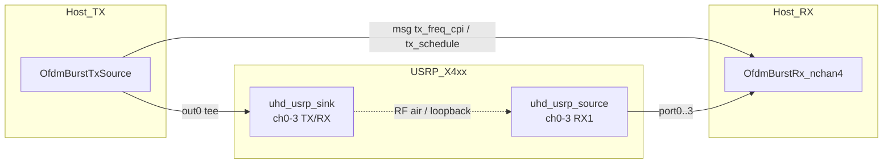
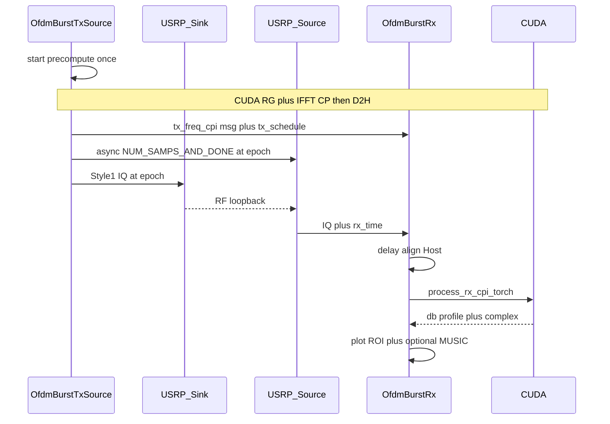

# OFDM Burst 信号处理流程

本文档描述测试流图 `usrp_ofdm_sink_source_dd` 的端到端信号处理：Style1 定时突发发射、同 epoch 定点收样、Torch CUDA 距离谱，以及内嵌 Range Profile / MUSIC。

对应文件：

- [`usrp_ofdm_sink_source_dd.grc`](usrp_ofdm_sink_source_dd.grc) / [`usrp_ofdm_sink_source_dd.py`](usrp_ofdm_sink_source_dd.py)
- TX：[`src/isac_imp/ofdm_burst_tx_source.py`](../../../../src/isac_imp/ofdm_burst_tx_source.py)
- RX：[`src/isac_imp/ofdm_burst_rx.py`](../../../../src/isac_imp/ofdm_burst_rx.py)

---

## 1. 概述

本流图实现**零多普勒 OFDM 单站雷达**（环回 / 近距目标），**ch0–ch3 同波四发 / 四收**，OFDM 为 **2048 子载波 × 120 kHz → 245.76 MHz**（对齐 **X4_200** + 单条 10GbE）：

1. **启动时**在 CUDA 上一次性预计算一整 CPI 的频域网格与时域 IQ，拷回 Host。
2. **运行期** Host 仅 memcpy 重放时域突发，打 Style1 时间标签；同一 `out0` **一分四**接到 Sink 流口 0–3；并向 USRP Source **异步**下发 `NUM_SAMPS_AND_DONE`（一次命令覆盖多通道流）。
3. **同 `tx_epoch`** 时刻 ch0–ch3 同时发射与接收各 `8704` 个样点。
4. **单个** `OfdmBurstRx`（`num_channels=4`）分路找 `rx_time`/拼 CPI/delay；**四路就绪后一次批 CUDA** 距离谱，四窗独立显示。

核心块：`OfdmBurstTxSource`（单口）+ 一个四输入 `OfdmBurstRx`；UHD `channels=[0, 1, 2, 3]`。

**硬件注意**：当前 FPGA 为 `X4_200`，数据面为单条 **10GbE**。相对 4096 配置，本设置将突发长度减半（8704 vs 17408），降低链路与主机压力；`samp_rate` 仍为 245.76 MHz。

---

## 2. 流图拓扑



连接关系（与生成代码一致）：

| 源                                | 目的                          | 类型                                         |
| --------------------------------- | ----------------------------- | -------------------------------------------- |
| `OfdmBurstTxSource.out0`        | `uhd_usrp_sink_0:0..3`      | 同一突发 IQ 一分四（Style1 标签随流复制）    |
| `OfdmBurstTxSource.tx_freq_cpi` | `ofdm_burst_rx_0`           | PMT（首 CPI 一次；粘性复用）                 |
| `OfdmBurstTxSource.tx_schedule` | `ofdm_burst_rx_0`           | PMT（每 CPI）                                |
| `uhd_usrp_source_0:0..3`        | `ofdm_burst_rx_0:0..3`      | 四路接收 IQ → 单块四输入                     |

**RF / 通道约定**：

| 项 | 值 |
|----|-----|
| UHD `channels` / `nchan` | `[0, 1, 2, 3]` / `4` |
| Sink 天线（流 0–3） | `TX/RX` |
| Source 天线（流 0–3） | `RX1` |
| `freq` / `TX_gain` / `RX_gain` | 四路相同 |
| RX 块 | `num_channels=4` 批 CUDA |

**反压 / 吞吐说明**：

1. TX 块仍为单流口；四发靠 GR tee，不扩展 TX API。
2. 频域参考在 `start()` 预缓存 PMT，仅首 CPI `pub` 一次；RX 用 `_tx_cpi_latest` 粘性复用。
3. `idle_ms` 只进入 `burst_period` / `tx_time` 网格，主机侧不做 `return 0` idle。
4. 后续 CPI command lead=`20ms`；`host_gap_ms` 与 `epoch_dt_ms` 用于验收。
5. 四路 IQ 分路采集，**凑齐后一次** `OFDMDemodulator`+距离谱，减轻四独立 DSP 抢 GPU。
---

## 3. 关键参数

摘自当前 flowgraph 默认值（GUI 可调项已注明）。

| 参数                                | 默认值                                    | 含义                                            |
| ----------------------------------- | ----------------------------------------- | ----------------------------------------------- |
| `fft_len`                         | **2048**                                | OFDM FFT 长度                                   |
| `cp_len`                          | **128**                                 | 循环前缀（约可罩 ~78 m 往返 @ 245.76 MHz）      |
| `num_symbols` | 4                                         | 每 CPI OFDM 符号数                              |
| `subcarrier_spacing`              | **120 kHz**                               | 子载波间隔                                      |
| `samp_rate`                       | `fft_len × scs` = **245.76 MHz** | IQ 采样率                                       |
| `burst_len_samples`               | 4×(2048+128) = **8704**            | 一 CPI 时域样点数（约 35.4 µs）                |
| `idle_ms`                         | **50**                                    | 计入 `burst_period` / `tx_time` 的突发间隙（非主机 `return 0` idle） |
| `time_lead_s` / `wait_to_start` | 0.5                                       | **首 CPI** 发射提前量（后续 CPI ≤20 ms） |
| `freq`                            | 6 GHz                                     | RF 中心频率                                     |
| `factor`                          | 0.008                                     | TX 幅度缩放（GUI）                              |
| `TX_gain` / `RX_gain`           | 20                                        | USRP 增益（GUI；同时写 ch0–ch3）              |
| `num_delay_samp`                  | **277**                                 | RX 环回延迟补偿样点（GUI）                      |
| `zeropadding_fac`                 | 4                                         | 距离 FFT 零填充 →`vlen_out=8192`             |
| `range_bin_step`                  | `c/(2·fs·zp)` ≈ 0.153 m              | 距离 bin                                        |
| `range_roi`                       | (0.0, 3.5) m                              | 显示 / MUSIC ROI                                |
| `music_enable`                    | False                                     | 异步 1D MUSIC（GUI 复选框）                     |
| `device`                          | `'cuda'`                                | TX 预计算与 RX 每 CPI DSP                       |
| `length_tag_key`                  | `packet_len`                            | 频域参考 CPI 边界 tag                           |

理论 CPI 率（忽略调度抖动）：

$$
\frac{1}{\mathtt{idle\_ms}/1000 + \mathtt{burst\_len}/\mathtt{samp\_rate}} \approx 20.0\,\mathrm{Hz}
$$

---

## 4. 启动与绑定

| 时机   | 函数 / Snippet                     | 作用                                                                     | 设备         |
| ------ | ---------------------------------- | ------------------------------------------------------------------------ | ------------ |
| 建块前 | `patch_usrp_source_factory()`    | USRP Source 以`issue_stream_cmd_on_start=False` 创建，禁止启动即连续收 | Host         |
| 建块后 | `set_time_now`（Sink + Source）  | 同机 TX/RX 绝对时间对齐                                                  | Host → USRP |
| 建块后 | `set_max_noutput_items(max(16384, burst_len))` + `min_output_buffer≥2·burst` | 允许一次 `work` 拉满一 CPI（8704），避免默认分块卡死 | Host / GR |
| 建块后 | `bind_scheduled_rx(usrp_source)` | TX 持有 Source 句柄；每突发异步 `issue_stream_cmd` | Host         |

实现位置：流图 snippet；调度补丁见 [`scheduled_usrp_source.py`](../../../../src/isac_imp/scheduled_usrp_source.py)。

---

## 5. TX 路径

### 5.1 `start()`：一次性 CUDA 预计算

入口：`OfdmBurstTxSourceBlock.start()` → `_precompute_cpi_torch()`。

| 步骤 | 模块 / 函数                                                  | 做什么                                                   | 设备           | 数据                                        |
| ---- | ------------------------------------------------------------ | -------------------------------------------------------- | -------------- | ------------------------------------------- |
| A    | `_build_freq_grid_torch`（`sionna_resource_grid_tx.py`） | BinarySource → QAM → ResourceGridMapper →`fftshift` | **CUDA** | `(4, 2048) complex64` 频域 CPI            |
| B    | `OFDMModulator` + \(\sqrt{N}\)                         | Sionna ortho IFFT+CP，再 ×√fft_len 对齐 GR forward | **CUDA** | flatten `(8704,)`                       |
| C    | `× factor`                                                | 幅度缩放                                                 | CUDA           | `td_cpi`                                  |
| D    | `cuda.synchronize` + `.cpu().numpy()`                    | **一次 D2H**                                       | Host           | `freq_cpi`、`td_cpi` 驻留 **CPU** |

运行期**不再上 GPU**：只 Host memcpy 重放，避免 USRP underflow。

调制：`sionna.phy.ofdm.OFDMModulator`（ortho）×√`fft_len`，对齐 GNU Radio `fft_vcc`(IFFT, shift) + `ofdm_cyclic_prefixer`(rolloff=0)。独立 GR 块 `SionnaResourceGridTx` / `SionnaOfdmModulator` 逻辑已内联，本图不连接。

### 5.2 `general_work()`：CPI 重放 + Style1 调度

每个 CPI：

1. **首 CPI**：`message_port_pub(tx_freq_cpi, 缓存 PMT)`（仅一次）；后续 CPI 跳过。
2. **`_begin_burst`**：
   - 首 CPI：`epoch = max(now + time_lead_s, next)`（约 +0.5 s 给硬件上臂）。
   - 后续 CPI：command lead **20 ms**；落后则按 `burst_period_s` 整周期追赶。
   - `add_style1_sob_time` → tags `tx_sob` + `tx_time`。
   - `message_port_pub(tx_schedule, make_tx_schedule_msg(epoch))`。
   - `_issue_scheduled_recv(epoch)`：将 `NUM_SAMPS_AND_DONE` **入异步队列**（单 worker），不阻塞 TX work / pacing。
   - `_next_tx_epoch += burst_period_s`。
3. **out0**：拷贝 `td_cpi`；末样点 `add_style1_eob`。
4. CPI 间隙仅由 `tx_time` / `_next_tx_epoch`（`burst_period_s`）表达；主机侧不做 `return 0` idle（否则 GR 源会被反压挂起、自锁到 ~4 CPI/s）。

| 输出              | 形状 / 类型                         | 下游                  |
| ----------------- | ----------------------------------- | --------------------- |
| out0              | `complex64` 标量流，CPI=8704      | Sink:0..3（tee 同波） |
| `tx_freq_cpi`   | PMT `(dict meta, c32vector)`          | RX（首 CPI 一次）     |
| `tx_schedule`   | PMT`(uint64 sec, double frac)`    | RX 每 CPI             |

诊断：`epoch_dt_ms` / `host_gap_ms` / `write_ms` / `cmd_q` / `cmd_drop` 节流打印；稳态 `host_gap≈period`，`write_ms` 应远小于 period。

Style1（[`burst_pack.py`](../../../../src/isac_imp/burst_pack.py)）：Sink 的 `len_tag_name=''`，靠 `tx_sob` / `tx_time` / `tx_eob` 界定突发，**不是** length-tag 突发。

### 5.3 `uhd_usrp_sink_0`

| 项   | 值                                               |
| ---- | ------------------------------------------------ |
| 设备 | USRP X4xx FPGA / RF                              |
| 通道 | `channels=[0, 1, 2, 3]`                                 |
| 格式 | `cpu_format=fc32`                              |
| 天线 | `TX/RX`                                        |
| 缓冲 | `num_send_frames=512`, `send_buff_size=25e6` |
| 行为 | 按`tx_time` 在计划绝对时刻发射                 |

---

## 6. 空口 / 环回

TX RF →（环回电缆或近距目标散射）→ RX RF。

同机调度下 RX 与 TX **共享同一 `tx_epoch`**：Source 仅在该时刻收 **恰好 8704** 样点（每通道），突发起点带 UHD `rx_time` tag。

---

## 7. RX 路径

### 7.1 `uhd_usrp_source_0`

| 项   | 值                                                 |
| ---- | -------------------------------------------------- |
| 设备 | USRP FPGA/RF → Host                               |
| 通道 | `channels=[0, 1, 2, 3]` → 四流口                  |
| 格式 | `fc32`                                           |
| 天线 | 各流 `RX1`                                       |
| 启动 | 已 patch：不连续流；由 TX **异步** `issue_stream_cmd` 驱动 |
| 其它 | `max_noutput ≥ max(16384, burst_len)`；`min_output_buffer ≥ 2·burst` |

### 7.2 `OfdmBurstRxBlock`（`num_channels=4`，四窗 `Range Profile chN`）

`out_sig=None`：无流输出。分路 ingest；四路就绪后批 DSP；内嵌四个 `_RangeProfileDisplay`。

| 步骤 | 方法                     | 做什么                                                                                 | 设备            | 数据                   |
| ---- | ------------------------ | -------------------------------------------------------------------------------------- | --------------- | ---------------------- |
| 1    | `_on_tx_schedule`      | 收到计划 epoch（轻量 ack）                                                            | Host            | msg                    |
| 2    | `_on_tx_freq_cpi`      | 解析一次 → `_tx_cpi_latest`（粘性复用）                                               | Host            | TX 参考 CPI            |
| 3    | `_ingest_iq_ch`        | 每路找`rx_time` → memcpy 满 `burst_len`                                               | Host            | 每路 `(8704,)`         |
| 4    | `_apply_delay`         | 每路左移`num_delay_samp`（默认 277）                                                  | Host            | 原地                   |
| 5    | `_try_flush_ready`     | 四路就绪 → stack `(4,8704)` 入 DSP 队列                                               | Host            | batch                  |
| 6    | 异步 `process_rx_cpi_torch` | 批 `OFDMDemodulator`+√N + 距离谱（不阻塞 GR `work`） | **CUDA** | 见下 |
| 7    | `_emit_plot_and_music` | 四窗 ROI 刷新；MUSIC 用 ch0 复数谱 | Host / Qt + CPU | — |

### 7.3 CUDA 距离谱（`process_rx_cpi_torch`，可批）

1. 输入时域 `(4, 8704)`（或单通道 `(8704,)`）。
2. `OFDMDemodulator`（`l_min=0`）+ ×√`fft_len` → `(4, 4, 2048)`。
3. 共享 `tx_freq` broadcast：`H = tx / rx`。
4. 零填充到 `8192`，× Blackman–Harris 窗。
5. 距离维 FFT；每通道功率跨符号求和 → dB / 复数谱 `(4, 8192)`。

### 7.4 显示与 MUSIC（内嵌，非独立 GR 块）

- **Plot**：`_RangeProfileDisplay`（`range_profile_plot.py`）；`compute_range_roi` 裁 `(0, 3.5) m`；节流约 0.10 s。
- **MUSIC**：`RangeMusicEstimator`（`isac/sensing/detection/range_music_estimator.py`）；`ThreadPoolExecutor` 异步；默认 `num_sources=1`，`subarray_size=16`；结果画竖线。输入为全谱复数 `cx`，估计器内部再按 ROI 切片。

---

## 8. 单 CPI 时序

```text
t ≈ epoch − 0.5 s（首帧）/ epoch − 几十 ms（后续）
  TX work: tx_freq_cpi(once) + Style1 + tx_schedule + enqueue stream_cmd
  Host memcpy out0 → USRP Sink DMA（tee 到 ch0–ch3）

t = epoch
  USRP TX ch0–ch3 同发 8704 samp（~35.4 µs @ 245.76 MHz）
  USRP RX ch0–ch3 同刻各收 8704 samp（NUM_SAMPS_AND_DONE）

t > epoch
  各 RX: delay(277) → CUDA 距离谱 → plot（± MUSIC）
  下一 CPI 尽快写入；epoch 间隔 ≈ idle_ms + burst_s
```



---

## 9. 设备与数据类型总表

| 阶段                       | 设备            | 典型类型 / 形状                       |
| -------------------------- | --------------- | ------------------------------------- |
| Sionna RG + IFFT/CP 预计算 | CUDA → Host    | `(4,2048) c64`，`(8704,) c64`    |
| GR TX 重放 / Style1        | Host CPU        | 同上 memcpy                           |
| USRP Sink / Source         | FPGA/RF ↔ Host | `fc32` 标量 IQ                      |
| RX 对齐 / delay            | Host            | `(8704,) c64`                      |
| 去 CP / FFT / 距离谱       | CUDA → Host    | dB`(8192,) f32`；cx `(8192,) c64` |
| Plot                       | Qt 主线程       | ROI 子集                              |
| MUSIC                      | Host 线程池     | `peak_ranges_m` 列表                |

**结论**：DSP 与可视化已收进 `OfdmBurstRx`；TX 侧 CUDA 仅用于 `start()` 预计算，运行期全 Host 重放以保证实时。

---

## 10. 距离谱录制

与协作采集类似的会话语义；落盘内容为本流图 4ch 相干复数距离谱 `cx`（文件名仍用 `divide_profiles_NNN`）。

| 项 | 说明 |
| --- | --- |
| GUI | **Record Enable**；**Target X/Y (cm)**；写满后自动停并取消勾选 |
| 帧数 | 每次固定 **`record_max_frames=55`**（约 `idle_ms=20` 时 ~1.1 s） |
| 目录 | `data/experiment/usrp_ofdm_sink_source_dd/`（`repo_data_dir`） |
| 会话文件 | 递增 `divide_profiles_001`、`002`…（不覆盖旧文件） |
| 元数据 | 同目录 `target_positions.csv`：`recorded_at_utc,target_x_cm,target_y_cm,data_file,record_max_frames` |
| 内容 | 相干积分复数距离谱 `cx`（非 dB；非 Divide `H(f)`） |
| 帧布局 | 每 CPI 写入 `(4, 8192)` `complex64`、C 序通道优先；每文件满录 `55*4*8192*8` 字节 |
| 读回 | `np.fromfile(path, dtype=np.complex64).reshape(-1, 4, 8192)` |

安装钩子：`install_usrp_ofdm_4ch_record_flow`（分配路径 + 写 CSV + 录满停）。


---

## 11. 相关源码索引

### 本流图直接使用

| 模块              | 路径                                                    | 角色                                                 |
| ----------------- | ------------------------------------------------------- | ---------------------------------------------------- |
| Flowgraph         | `usrp_ofdm_sink_source_dd.py` / `.grc`              | 拓扑与参数                                           |
| TX 统一源         | `src/isac_imp/ofdm_burst_tx_source.py`                | 预计算 + Style1 + 定点收样命令                       |
| RX 统一 sink      | `src/isac_imp/ofdm_burst_rx.py`                       | IQ/参考对齐 + CUDA 距离谱 + plot/MUSIC + 录制        |
| 频域网格          | `src/isac_imp/sionna_resource_grid_tx.py`             | `_build_freq_grid_torch`（被 TX `start()` 调用） |
| Style1 / 调度消息 | `src/isac_imp/burst_pack.py`                          | `tx_sob`/`tx_time`/`tx_eob`、`tx_schedule`/`tx_freq_cpi` |
| Source 工厂补丁   | `src/isac_imp/scheduled_usrp_source.py`               | 禁止启动连续收                                       |
| ROI               | `src/isac_imp/range_profile_roi_slice.py`             | `compute_range_roi`                                |
| 显示类            | `src/isac_imp/range_profile_plot.py`                  | `_RangeProfileDisplay`（被 RX 实例化）             |
| MUSIC 估计器      | `src/isac/sensing/detection/range_music_estimator.py` | 异步测距                                             |

### 本流图未接入（遗留 / 旧多块链）

| 模块                         | 说明                                 |
| ---------------------------- | ------------------------------------ |
| `sionna_ofdm_modulator.py` | 逻辑已并入 TX：`OFDMModulator`+√N          |
| `ofdm_range_profile.py`    | 旧多块距离谱；算法由 RX Torch 复现   |
| `RangeProfilePlotBlock`    | 独立 GR 块未连；显示类仍被 RX 使用   |
| `range_music_block.py`     | 独立 GR 块未连；估计器由 RX 直接调用 |
